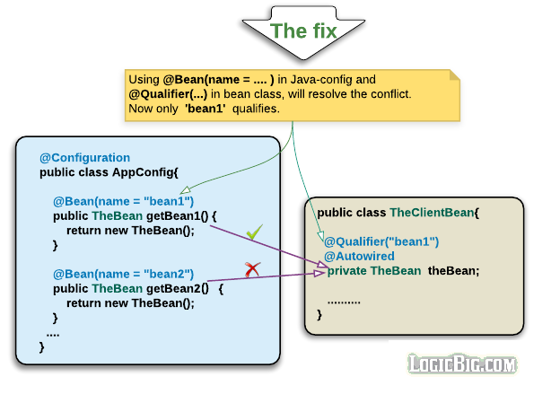

# Bean Configuration, Dependency, and Wiring

[01 Configuration Metadata](#01)

[02 Java-based Configuration: Using @Configuration](#02)

[03 Using @Import](#03)

[04 Using @Bean](#04)

[05 Beans Auto-wiring](#05)

[06 Inject Bean by Name and Using @Qualifier](#06)

[07 Inject Bean by Name and Using @Resource](#07)

[08 Different Ways of Injecting Dependencies](#08)

[09 Initialization and destruction lifecycle callbacks](#09)

[10 Lazy Initialization, using @Lazy](#10)

[11 Using @Lazy at Injection points](#11)

[12 Controlling Beans Loading Order, using @DependsOn](#12)

[13 Bean Scopes](#13)

[14 JavaConfig with Component Scan](#14)

[15 Registering Beans within @Component classes](#15)

[16 @ComponentScan Custom Filtering](#16)

[17 Implicit Constructor Injection](#17)

[18 Dependency Injection in @Bean Method Parameters](#18)

[19 Injecting Arrays and Collections](#19)

[20 Circular Dependencies](#20)

[21 Using @Primary Annotation](#21)

[22 Java Generics as Autowiring Qualifiers](#22)

[23 Required Dependency Checking](#23)

[24 Spring Support for Java 8 Default Methods](#24)

## <a id="01"></a>01 Configuration Metadata

Spring configuration metadata is to tell Spring container how to initiate, configure, wire and assemble the application specific objects. Since it's first release in 2002 to the latest release, spring has provided three ways of configurations:

1. **XML-based Configuration**: All configurations are in one or multiple XML files. This is the most verbose way of configuration. Huge projects require tedious amount of XML which is difficult to manage.

2. **Annotation-based configuration**: Spring 2.5 introduces annotation-based configuration. We still have to write XML files but just to indicate "component-scan" on the packages of annotated classes.

3. **Java-based configuration (JavaConfig)**: Starting with Spring 3.0, a pure-Java means of configuring container was provided. We don't need any XML with this method of configuration. JavaConfig provides a truly object-oriented mechanism for dependency injection, meaning we can take full advantage of reusability, inheritance and polymorphism in the configuration code. Application developer has complete control over instantiation and dependency injection here.

In these tutorials we will mainly focus only on JavaConfig. Learning only one method is good enough to understand key concepts and features of Spring container.


Regardless of what method we use, we mainly have to use configuration metadata at three places:

1. Injection Points: The places where dependencies have to be injected. The Injection Points typically are fields/setters/constructors in a bean class. Spring framework populates/inserts the injection points with the required instances. That happens during the bean loading time.

2. Service Providers: The concrete implementation of the services, whose instances are meant to be injected at injection Points. These classes themselves are registered as spring beans and can have injection points themselves.

3. The Configuration: This can be a Java class annotated with @Configuration or it can be XML if we are using old way of configuration. This is where we wire the injection points with dependencies.

## <a id="02"></a>02 Java-based configuration: Using @Configuration

### @Configuration

This is a class level annotation. The class annotated with this annotation may consist of methods annotated with @Bean. Spring container invokes such methods to get the object instances, so that the container can register them as beans.

```java
 package spring.example

   @Configuration
   public class MyAppConfig {
     @Bean
     public SomeBean someBean() {
    // instantiate, configure and return bean instance ...
     return new SomeBeanImpl();
     }
   }
```

The equivalent XML configuration will look like this:

```xml
<bean name="someBean" class="spring.example.SomeBeanImpl"/>
```

@Configuration classes are in fact nothing but spring managed factories to create and register bean instances.


### Bootstrapping Spring Container

In Java-based spring configuration, the container can be bootstrapped using either AnnotationConfigApplicationContext or for web application: AnnotationConfigWebApplicationContext.

```java
 new AnnotationConfigApplicationContext(MyAppConfig.class);
```

We can also specify the qualified package name containing @Configuration annotated classes:

```java
 new AnnotationConfigApplicationContext("spring.example");
```

By using above overloaded variant, we can have multiple configuration classes in a single package

### Using multiple Configuration Classes

To separate the concerns or to achieve modularization, we can define multiple configuration classes. During container initialization we can use one of the following overloaded constructors.

1. By passing multiple configs to AnnotationConfigApplicationContext. For example

```java
 new AnnotationConfigApplicationContext( AppConfig.class, DataSourceConfig.class )
```

2. By passing one or multiple package names for the container to scan the classes having @Configuration. For example

```java
 new AnnotationConfigApplicationContext("example.spring.app","example.spring.datasource")
```

### DI in Configuration Classes

The configuration classes themselves are registered as beans to the Spring container. That means, we can do whatever we do with a normal spring bean. For example we can use @Autowire to have Spring to perform DI in them. In the following example we are going to inject a configuration class to another one.

```java
package spring.example.di;

import org.springframework.beans.factory.annotation.Autowired;
import org.springframework.context.annotation.AnnotationConfigApplicationContext;
import org.springframework.context.annotation.Bean;
import org.springframework.context.annotation.Configuration;


@Configuration
public class AppConfig {
    @Autowired
    private DataSourceConfig dataSourceConfig;

    @Bean
    Client clientBean() {
        return new Client(dataSourceConfig.dataSourceBean());
    }

    public static void main(String[] args) {
        AnnotationConfigApplicationContext context =
          new AnnotationConfigApplicationContext(AppConfig.class, DataSourceConfig.class);
        context.getBean(Client.class).showData();
    }
}

@Configuration
class DataSourceConfig {

    @Bean
    DataSourceBean dataSourceBean() {
        return new DataSourceBean();
    }
}

class Client {
    private DataSourceBean dataSourceBean;

    Client(DataSourceBean dataSourceBean){
        this.dataSourceBean = dataSourceBean;
    }

    public void showData() {
        System.out.println(dataSourceBean.getData());
    }
}

class DataSourceBean {

    public String getData() {
        return "some data";
    }
}
```

We can also inject  DataSourceBean directly to  AppConfig, rather than injecting  DataSourceConfig class:

```java
package spring.example.di;

import org.springframework.beans.factory.annotation.Autowired;
import org.springframework.context.annotation.AnnotationConfigApplicationContext;
import org.springframework.context.annotation.Bean;
import org.springframework.context.annotation.Configuration;


@Configuration
public class AppConfig {
    @Autowired
    private DataSourceBean dataSourceBean;

    @Bean
    Client clientBean() {
        return new Client(dataSourceBean);
    }

    public static void main(String[] args) {
        AnnotationConfigApplicationContext context =
                  new AnnotationConfigApplicationContext(AppConfig.class, DataSourceConfig.class);
        context.getBean(Client.class).showData();
    }
}

@Configuration
class DataSourceConfig {

    @Bean
    DataSourceBean dataSourceBean() {
        return new DataSourceBean();
    }
}

class Client {
    private DataSourceBean dataSourceBean;

    Client(DataSourceBean dataSourceBean){
        this.dataSourceBean = dataSourceBean;
    }

    public void showData() {
        System.out.println(dataSourceBean.getData());
    }
}

class DataSourceBean {

    public String getData() {
        return "some data";
    }
}
```

### Constructor-base DI in the configuration class

#### @Configuration Classes are Subclassed by CGLIB

All @Configuration classes are subclassed at startup-time with CGLIB. In the subclass, the child method checks the container first for any cached (scoped) beans before it calls the parent method and creates a new instance.

CGLIB proxying is the means by which invoking methods or fields within @Bean methods in @Configuration classes creates bean metadata references to collaborating objects; such methods are not invoked with normal Java semantics but rather go through the container in order to provide the usual lifecycle management and proxying of Spring beans even when referring to other beans via programmatic calls to @Bean methods.

That's why all methods will return the same instance at multiple calls (if they are singleton scoped which is the default scope).

There has to be @Configuration annotation, otherwise this runtime manipulation won't be done.

Run the following code, you will see the same output both times. Also try it without @Configuration and see the difference.

```java
@Configuration
public class SpringConfig {

    @Bean
    public String something(){
        return new String(System.nanoTime());
    }

        public static void main(String... strings) {
            AnnotationConfigApplicationContext context =
                    new AnnotationConfigApplicationContext(SpringConfig.class);
            System.out.println("Spring container started and is ready");
            SpringConfig bean = context.getBean(SpringConfig.class);
            System.out.println(bean.something());
            System.out.println(bean.something());
        }
}
```

Notice we retrieved the SpringConfig instance as bean, that's because it's also registered as a bean.

#### @ComponentScan

So far we saw JavaConfig using factory methods (annotated with @Bean) to provide bean implementation. Using this approach, we have to create the bean implementation instances ourselves. Instead of this factory approach, we can have spring to scan the provided packages and create all implementation automatically and then inject the dependencies. We can do that by using @ComponentScan along with @Configuration. We still don't have to use any XML. Please see an [example](#14) here.

#### Constructor-base DI in the configuration class

Starting from Spring 4.3, configuration classes also support constructor DI, please see an example [here](#17) to see in what kind of scenarios we should use that feature.

## <a id="03"></a>03 Using @Import

We saw how to use multiple classes by providing all @Configuration classes to the constructor of AnnotationConfigApplicationContext. That approach may not always be ideal. Often it is preferable to use an aggregation approach, where one @Configuration class logically imports the bean definitions defined by another.

The @Import annotation provides this kind of support. It is the equivalent to the  <import/> element in a bean XML file.

Multiple configurations may be imported by supplying an array of classes to the @Import annotation.


```java
import org.springframework.beans.factory.annotation.Autowired;
import org.springframework.context.annotation.AnnotationConfigApplicationContext;
import org.springframework.context.annotation.Bean;
import org.springframework.context.annotation.Configuration;
import org.springframework.context.annotation.Import;

@Configuration
@Import(DataSourceConfig.class)
public class AppConfig {

    @Bean
    Client clientBean() {
        return new Client();
    }

    public static void main(String[] args) {
        AnnotationConfigApplicationContext context =
              new AnnotationConfigApplicationContext(AppConfig.class);
        context.getBean(Client.class).showData();
    }
}

@Configuration
class DataSourceConfig {

    @Bean
    DataSourceBean dataSourceBean() {
        return new DataSourceBean();
    }
}

class Client {
    @Autowired
    private DataSourceBean dataSourceBean;

    public void showData() {
        System.out.println(dataSourceBean.getData());
    }
}

class DataSourceBean {

    public String getData() {
        return "some data";
    }
}
```

## <a id="04"></a>04 Using @Bean


The @Bean annotation is used on Java based configuration method. It has following elements:

1. **name**:

The optional bean name.

```java
@Configuration
public class AppConfig {

    @Bean(name = "myBean")
    public MyBean createBean() {
       ......
    }
}
```

By default Spring container associate the bean with method name.

A bean can be associated with multiple names, the extra ones are considered aliases.

Specifying a unique meaningful name to a bean is necessary if the configuration provides more than one implementations for a bean. In that case, we have to use @Qualifier at the injection point which has an option to specify the bean name. An example [here](#6).

2. **autowire**:

The autowiring mode.

```java
@Configuration
public class AppConfig {

    @Bean(autowire = Autowire.BY_TYPE)
    public MyBean createBean(){
      ....
    }
}
```

Autowire.NO : This is the default. In this case, we have to explicitly use @Autowired at injection point.

Autowire.BY_TYPE : we don't need @Autowired at the injection point, given that there is only one bean available for the injection. In this mode of autowiring, the field injection doesn't work. There must be a setter.

Autowire.BY_NAME : If this mode of autowiring is specified and injection provider bean has specified name element with the some value in it's @Bean annotation, we have to use @Qualifier along with @Autowired at injection point. An example [here](#5).


3. **initMethod/destroyMethod**:

Optional initialization and destruction callback method names.

```java
@Configuration
public class AppConfig {

    @Bean(initMethod = "init", destroyMethod = "destroy")
    public MyBean createBean() {
     ......
    }
}
```

The destroy method will only be called for singletons but not for other scoped as Spring does not manage complete life cycle of the other beans.

In case of singleton this method is called upon closing the application context.

Since Spring also supports Java SE Common Annotations (JSR-250), we can annotate bean's methods with @PostConstruct and @PreDestroy instead of these elements. Please see an example [here](#jsr250).

There's one more annotation from JSR-250 that Spring supports, @Resource. Please see an example [here](#7).

## <a id="05"></a>05 Beans Auto-wiring

Spring container can autowire dependencies implicitly. We can specify a mode of autowiring (other than the default one) using @Bean annotation.

```java
 @Configuration
 public class Config{
    @Bean(autowire == <xyz>)
     public ABean aBean(){
        return new ABean();
    }
   .....
 }
```

In above code snippet, we are specifying a autowiring mode xyz, which Spring will be apply to the ABean class while injecting other beans in the same class.

The valid values of autowiring modes are: Autowire.NO, Autowire.BY_NAME and Autowire.BY_TYPE


### Autowire.NO

This is the default. We have to explicitly use @Autowired at injection point. That means Spring doesn't do automatic wiring in this mode. We have to tell Spring that at what points bean wiring should happen by specifying @Autowired annotation at those points.

On finding @Autowired annotation Spring attempts to match injection point type with other registered beans type for a successful injection.


There shouldn't be any conflict (ambiguity), which means there should be no more than one bean instance of the same type registered for a given injection point, otherwise we will have NoUniqueBeanDefinitionException.


To avoid exception, we have to [use @Qualifier](#6).

### Autowire.BY_TYPE

In this autowiring mode, Spring walks through type of each 'property' (the standard Java Bean property) of a given bean to match other registered beans type. If there's a match then the dependency injection happens. So basically this mode is entirely based on matching types.

In this mode, We don't need @Autowired at the injection point as Spring doesn't search for places which are annotated with @Autowired.

In this mode of autowiring, the field injection doesn't work. There must be a setter. Spring scans all setters of a bean and if the type of property matches and there is no ambiguity then injects the target property.


In case of ambiguity, we have to [use @Qualifier](#6) at both places.

### Autowire.BY_NAME

In this mode, beans are matched by names. Names are nothing but the identifier of the beans.

We have to use @Autowired at the injection point in this mode.

In the following example, even though there are two beans of same type, there will still be a valid match for the injection point field Service serviceBean1; That's because by default, the beans are registered as the 'method name' annotated with @Bean unless we use the 'name' element of @Bean.


We can also specify an explicit bean name using 'name' element of the @Bean


We would typically want to use this mode of wiring, if there are multiple beans of same type which likely to cause NoUniqueBeanDefinitionException (for both Autowire.NO and Autowire.BY_TYPE modes). Using bean's name (the identifier) is a way to resolve ambiguity.

We can also [use @Qualifier](#6) instead of matching by 'name'. There, we have to use the same qualifier at the injection point. In that case using the mode Autowire.By_NAME won't be significant any more because we will be matching by a qualifier not by name.

Note that in Autowire.NO mode too (in fact, in all autowiring modes), Spring framework first tries to match by type then by name. In example project below, please see AutowireNoExample2 on that.

## <a id="06"></a>06 Inject Bean by Name and Using @Qualifier

Specifying an unique name for @Bean annotation is necessary if

1. the configuration provides more than one implementations for a bean

2. or if we want to inject bean instances by name rather than by type.

To match a named bean to an injection point (or in other words to qualify a bean to an injection point), the bean's property name (at the injection point) should match with the bean definition name.

### Matching bean by using @Qualifier

Alternative to the way of matching and injecting beans by property names, we can use annotation @Qualifier at injection point.

We can also choose to use @Qualifier at bean definition instead of defining/using a bean's name.

@Qualifer can be specified at field or parameter.




Fixing by using @Qualifier at both places:


### NoUniqueBeanDefinitionException

The @Autowired annotation tells Spring where the Injection Point is (i.e. where an injection needs to occur). On finding such injection point, Spring tries to find a configured bean (configured via  @Bean) of the same type, if it finds such bean, it injects it to the injection point. If it finds two or more such beans, we will get an NoUniqueBeanDefinitionException. To avoid the exception, we have to use the @Qualifier annotation as we have seen in the above example.

In above example if we remove name element from both methods annotated with  @Bean and remove the @Qualifier annotation from the injection point in  OrderServiceClient, we will have following exception:

```shell

org.springframework.beans.factory.NoUniqueBeanDefinitionException:
No qualifying bean of type  [com.logicbig.example.service.OrderService] is defined:
expected single matching bean but found 2:
orderServiceByProvider1,orderServiceByProvider2
```

### Use of a qualifier shouldn't tie to an implementation specific 'name'

Some people may argue the usage of a Qualifier. The point could be, why we have to put a qualifier name to the application code (which seems to be tied to a particular implementation)? Well, qualifier should not be tied to implementation details if we use it wisely.

Let's consider our above example again. Assume the Qualifier with name OrderServiceA is meant to show some extended details about each orders. Whereas, OrderServiceB just shows the order summary. In that sense the application code should be in full control, whether it wants to show extended details or just summary. So the name of the Qualifier should be assigned in a business logic sense but not in implementation sense. There might still be multiple implementations of summary or extended order details available by some other providers which are not wired yet, but can be used anytime we want to. In that case, our qualifier will stay the same without affecting application logic, we just have to wire a different bean per our needs.

Based on above explanation, we should also rename our example qualifiers appropriately to something like OrderExtendedService and OrderSummaryService.

## <a id="07"></a>07 Inject Bean by Name Using @Resource

Spring supports Java SE Common Annotations (JSR-250). That means, we can use @Resource instead of using the combination of @Autowire and @Qualifier.


Our OrderServiceClient from previous example can be rewritten as:

```java
package com.logicbig.example.client;

import com.logicbig.example.service.OrderService;
import org.springframework.beans.factory.annotation.Autowired;
import org.springframework.beans.factory.annotation.Qualifier;

import javax.annotation.Resource;
import java.util.Arrays;


public class OrderServiceClient {

     @Bean(name = "OrderServiceA")
    private OrderService orderService;

    public void showPendingOrderDetails() {
        for (String orderId : Arrays.asList("100", "200", "300")) {
            System.out.println(orderService.getOrderDetails(orderId));
        }
    }
}
```

Note that @Resource can also be used without specifying any name (the qualifier) parameter. If no name is specified explicitly, the default name is derived from the field name or setter method. One of the situation where this name is used is: in matching and injecting beans if we are using Autowire.BY_NAME

## <a id="08"></a>08 Different Ways of Injecting Dependencies

There are three possible ways of DI in Spring

1. **Constructor-based**: should be used for mandatory dependencies. In constructor, we should assign constructor args to final member fields.

2. **Setter-based:** Should be used for optional dependencies.

3. **Field-based**: Spring discourages the use of this because it would possibly hide mandatory fields from outside which would otherwise be assigned in the constructor. This would take away the advantage of properly initialized POJO, specially if intended to use outside of Spring container. Even though, we are mostly using field based injection in this series of tutorials to simplify the concept we want to deliver, we suggest the developers to always avoid using field-based DI in real project scenarios.


Notice in class **ConstructorBasedDI.java** we don't have to use @Autowired on the constructor. That's because in the configuration class, we are directly invoking the constructor along with a straight call to orderServiceByProvider1(). We shouldn't worry about calling methods like that in the @Configuration class and thinking that every time a new instance in the calling method will be created, no it won't. As mentioned here all methods annotated with @Bean are proxied so they are not called multiple times because of the default singleton scope.

Also in **ConstBasedDIWireByType.java** above, we are using @ComponentScan, in that case we have to use @Autowired on the constructor. Also in case of multiple instances of the target bean, we have to use @Qualifier to resolve the conflict.

## <a id="09"></a>09 Initialization and destruction lifecycle callbacks

Spring provides various mechanisms for getting bean lifecycle callbacks. These callbacks are useful to take some specific action at a particular lifecycle stage. It's specially needed at the point when bean is fully initialized and all properties are set.

### Using @PostConstruct and @PreDestroy

The recommended way to receive initialization/destruction callbacks is by using @PostConstruct and @PreDestroy annotations

```java
public class MyBean {
  private OtherBean otherBean;

  public MyBean() {
      System.out.println("MyBean constructor: " + this);
  }

  @PostConstruct
  public void myPostConstruct() {
      System.out.println("myPostConstruct()");
  }

  @Autowired
  public void setOtherBean(OtherBean otherBean) {
      System.out.println("setOtherBean(): " + otherBean);
      this.otherBean = otherBean;
  }

  public void doSomething() {
      System.out.println("doSomething()");
  }

  @PreDestroy
  public void cleanUp() {
      System.out.println("cleanUp method");
  }
}
```

```Java
public class MyBean2 {
  private OtherBean otherBean;

  public MyBean2() {
      System.out.println("MyBean2 constructor: " + this);
  }

  public void myPostConstruct() {
      System.out.println("myPostConstruct()");
  }

  @Autowired
  public void setOtherBean(OtherBean otherBean) {
      System.out.println("setOtherBean(): " + otherBean);
      this.otherBean = otherBean;
  }

  public void doSomething() {
      System.out.println("doSomething()");
  }

  public void cleanUp() {
      System.out.println("cleanUp method");
  }
}
```

```java
@Configuration
public class LifeCycleExample {

  @Bean
  public MyBean myBean() {
      return new MyBean();
  }

  @Bean
  public OtherBean otherBean() {
      return new OtherBean();
  }

  public static void main(String[] args) {
      ConfigurableApplicationContext context =
              new AnnotationConfigApplicationContext(LifeCycleExample.class);

      context.registerShutdownHook();

      System.out.println("-- accessing bean --");
      MyBean bean = context.getBean(MyBean.class);
      bean.doSomething();

      System.out.println("-- finished --");
  }
}
```

```shell
Output
MyBean constructor: com.logicbig.example.MyBean@fde068a
setOtherBean(): com.logicbig.example.OtherBean@39b62948
myPostConstruct()
-- accessing bean --
doSomething()
-- finished --
cleanUp method
```

#### Understanding registerShutdownHook() method

In above example, we used ConfigurableApplicationContext#registerShutdownHook(). This method registers a shutdown hook with the JVM runtime. This hook receives notification on JVM shutdown, at that time it closes the underlying context and calls all @PreDestroy and other standard register destroy methods. If we don't want to use this method then we have to call ConfigurableApplicationContext#close() ourselves at JVM shutdown, otherwise our destroy methods won't get called.

Also, in above example, we used setter injection, we can instead use field/constructor injection as well, the fields will be fully initialized the time when @PostConstruct method is get called.

### Using 'initMethod' and 'destroyMethod' of @Bean annotation.

```java
public class MyBean2 {
  private OtherBean otherBean;

  public MyBean2() {
      System.out.println("MyBean2 constructor: " + this);
  }

  public void myPostConstruct() {
      System.out.println("myPostConstruct()");
  }
    .............
  public void cleanUp() {
      System.out.println("cleanUp method");
  }
}
```

```java
@Configuration
public class LifeCycleExample2 {

  @Bean(initMethod = "myPostConstruct", destroyMethod = "cleanUp")
  public MyBean2 myBean2() {
      return new MyBean2();
  }
    .............
}
```

```shell
Output
MyBean2 constructor: com.logicbig.example.MyBean2@614592c9
setOtherBean(): com.logicbig.example.OtherBean@5f99afcd
myPostConstruct()
-- accessing bean --
doSomething()
-- finished --
cleanUp method
```


### Implementing InitializingBean and DisposableBean

The interface InitializingBean has one method afterPropertiesSet which is get called by spring framework after it has set all bean properties.

The interface DisposableBean has one method destroy which is get called by spring framework when JVM sends the shutdown signal.

```java
public class MyBean3 implements InitializingBean, DisposableBean {
  private OtherBean otherBean;

  public MyBean3() {
      System.out.println("MyBean3 constructor: " + this);
  }

  @Override
  public void afterPropertiesSet() throws Exception {
      System.out.println("afterPropertiesSet()");
  }
    .............
  @Override
  public void destroy() throws Exception {
      System.out.println("destroy() method");
  }
}
```

```java
@Configuration
public class LifeCycleExample3 {

  @Bean
  public MyBean3 myBean3() {
      return new MyBean3();
  }
    .............
}
```

```shell
Output
MyBean3 constructor: com.logicbig.example.MyBean3@1d4834fb
setOtherBean(): com.logicbig.example.OtherBean@130b5770
afterPropertiesSet()
-- accessing bean --
doSomething() :
-- finished --
destroy() method
```

## <a id="10"></a>10 Lazy Initialization, using @Lazy

By default Spring container instantiates all configured beans at startup (eager loading). In some situations, however, beans might rarely be used during application life cycle. Loading them at startup will, specially, be not good if they are going to use considerable memory to get initialized. In those sort of situations we may decide to initialize such beans only when they are first accessed by application code (i.e. initialize on demand). We can achieve that by using @Lazy on bean configuration method.


```java
package com.logicbig.example.lazyloading;

import javax.annotation.PostConstruct;

public class AlwaysBeingUsedBean {

    @PostConstruct
    public void init() {
        System.out.println("AlwaysBeingUsedBean initializing");
    }
}
```

```java
package com.logicbig.example.lazyloading;

import javax.annotation.PostConstruct;

public class RarelyUsedBean {

    @PostConstruct
    private void initialize() {
        System.out.println("RarelyUsedBean initializing");
    }

    public void doSomething() {
        System.out.println("RarelyUsedBean method being called");
    }
}
```

```java
package com.logicbig.example.lazyloading;

import org.springframework.context.annotation.AnnotationConfigApplicationContext;
import org.springframework.context.annotation.Bean;
import org.springframework.context.annotation.Configuration;
import org.springframework.context.annotation.Lazy;

@Configuration
public class App {

    @Bean
    public AlwaysBeingUsedBean alwaysBeingUsedBean() {
        return new AlwaysBeingUsedBean();
    }

    @Bean
    @Lazy
    public RarelyUsedBean rarelyUsedBean() {
        return new RarelyUsedBean();
    }

    public static void main(String... strings) {
        AnnotationConfigApplicationContext context =
                new AnnotationConfigApplicationContext(App.class);
        System.out.println("=== Spring container started and is ready");
        RarelyUsedBean bean = context.getBean(RarelyUsedBean.class);
        bean.doSomething();
    }
}
```

On running App#main we will get following output.

```shell
AlwaysBeingUsedBean initializing
Spring container started and is ready
RarelyUsedBean initializing
RarelyUsedBean method being called
```

Notice RarelyUsedBean initializes after Spring container start up.

Now in AppConfig class, comment out @Lazy on rarelyUsedBean() method and run the main method again. See the difference:

```shell
RarelyUsedBean initializing
AlwaysBeingUsedBean initializing
Spring container started and is ready
RarelyUsedBean method being called
```

### @PostConstruct/@PreDestroy vs Spring "init-method"/"destroy-method" configuration

In above example, we used JSR-250 annotation: @PostConstruct. Which is better than spring counterpart configuration of "init-method" on the @Bean.

Firstly the bean itself is saying 'I need to do some post construct processing' rather than the configuration class (annotated with @Configuration) is in charge and asking the bean: 'You need to do some post construct processing'. Conceptually, the post construct processing should be internal detail of the bean and should not be the concerns of oursiders.

Secondly we are putting a type safe annotation on the bean method rather than specifying init-method name as String (not type safe) on @Bean.

## <a id="11"></a>11 Using @Lazy at Injection points

Starting Spring 4.3, @Lazy can be used at injection points as well. That means we can place @Lazy along with @Autowired or @Inject or @Resource. That will delay the target bean initialization until it is used by the injection point class, even though the injection point class has been initialized earlier.

### Example
We are registering two beans, MyEagerBean is by default eagerly initialized at startup, whereas, MyLazyBean is initialized lazily, that's because we are using @Lazy with factory method lazyBean().

```java
public class MyConfig {

  @Bean
  public MyEagerBean eagerBean () {
      return new MyEagerBean();
  }

  @Bean
  @Lazy
  public MyLazyBean lazyBean () {
      return new MyLazyBean();
  }
}
```

Above usage of @Lazy annotation is what we learnt in the last tutorial.

Following is MyEagerBean which has an @Autowired annotation (an injection point). This bean will eagerly initialized and that will cause to initialize all it's dependencies as well, unless we use @Lazy at a given injection point:

```java
public class MyEagerBean {

  @Autowired
  @Lazy
  private MyLazyBean myLazyBean;

  @PostConstruct
  public void init () {
      System.out.println(getClass().getSimpleName() + " has been initialized");
  }

  public void doSomethingWithLazyBean () {
      System.out.println("Using lazy bean");
      myLazyBean.doSomething();
  }
}
```

MyLazyBean:

```java
public class MyLazyBean {

  @PostConstruct
  public void init () {
      System.out.println(getClass().getSimpleName() + " has been initialized");
  }

  public void doSomething () {
      System.out.println("inside lazy bean doSomething()");
  }
}
```
The main class:

```java
public class LazyExampleMain {

  public static void main (String[] args) {
      ApplicationContext context =
                new AnnotationConfigApplicationContext(
                          MyConfig.class);
      System.out.println("--- container initialized ---");
      MyEagerBean bean = context.getBean(MyEagerBean.class);
      System.out.println("MyEagerBean retrieved from bean factory");
      bean.doSomethingWithLazyBean();
  }
}
```

Output

```shell
MyEagerBean has been initialized
--- container initialized ---
MyEagerBean retrieved from bean factory
Using lazy bean
MyLazyBean has been initialized
inside lazy bean doSomething()
```

Now if we comment out @Lazy from MyEagerBean:

```java
public class MyEagerBean {

  @Autowired
  //@Lazy
  private MyLazyBean myLazyBean;
  .......
}
```

Output:

```shell
MyLazyBean has been initialized
MyEagerBean has been initialized
--- container initialized ---
MyEagerBean retrieved from bean factory
Using lazy bean
inside lazy bean doSomething()
```

When MyEagerBean is loaded, it will cause to initialize all it's dependencies unless we use @Lazy at injection point too. The usage of @Lazy in factory class MyConfig prevents loading bean during 'startup' until it's used first time in the application.

In short:

@Lazy with @Bean (or @Lazy with @Component): don't load eagerly during application start up, until it's used in the application

@Lazy with @Autowired : don't load during outer class initialization, until it's first used by the application.

### How that works?

Spring creates and uses a lazy-resolution proxy object for the injection point (the one annotated with @Autowired and @Lazy) instead of initializing the object directly.

## <a id="12"></a>12 Controlling Beans Loading Order, using @DependsOn

The order in which Spring container loads beans cannot be predicted. There's no specific ordering logic specification given by Spring framework. But Spring guarantees if a bean A has dependency of B (Bean A has an instance variable @Autowired B b; for example) then B will be initialized first. But what if bean A doesn't have direct dependency of B but we still want B to initialize first.

### When we want to control beans initializing order

There might be scenarios where A is depending on B indirectly. May be B is supposed to update some global cache outside of B, may be via a singleton pattern and cache is not registered with the Spring container and A is using that cache. Then of course A doesn't want to access the cache if it's not ready. Another scenario: may be A is some sort of events publisher (Or JMS publisher) and B (or may be more beans) are listening to those events. This is a typical scenario of observer pattern. Again, we don't want B to miss any events and would like to have B being initialize first.

In short, there could be many situations where we want B to initialize before A to avoid some kind of side effects. There we should use @DependsOn annotation on A indicating to the container that B should be initialize first. Here's an example to demonstrate how that works.


### Example

```java
package com.logicbig.example.dependson;

public class EventListener {

    private void initialize() {

        EventManager.getInstance().
                addListener(s ->
                        System.out.println("event received in EventListener : " + s));
    }
}
```

```java
package com.logicbig.example.dependson;

public class EventPublisher {

    public void initialize() {
        System.out.println("EventPublisherBean initializing");
        EventManager.getInstance().publish("event published from EventPublisher");
    }
}
```

```java
package com.logicbig.example.dependson;

import java.util.ArrayList;
import java.util.List;
import java.util.function.Consumer;

public class EventManager {
    private final List<Consumer<String>> listeners = new ArrayList<>();

    private EventManager() {
    }

    private static class SingletonHolder {
        private static final EventManager INSTANCE = new EventManager();
    }

    public static EventManager getInstance() {
        return SingletonHolder.INSTANCE;
    }

    public void publish(final String message) {
        listeners.forEach(l -> l.accept(message));
    }

    public void addListener(Consumer<String> eventConsumer) {
        listeners.add(eventConsumer);
    }
}
```
```java
package com.logicbig.example.dependson;

import org.springframework.context.annotation.*;

@Configuration
public class App{

    @Bean(initMethod = "initialize")
    @DependsOn("eventListener")
    public EventPublisher eventPublisherBean () {
        return new EventPublisher();
    }

    @Bean(name = "eventListener", initMethod = "initialize")
    // @Lazy
    public EventListener eventListenerBean () {
        return new EventListener();
    }

    public static void main (String... strings) {
        new AnnotationConfigApplicationContext(App.class);
    }
}
```

On Running App main method. We will get this output.

```shell
EventListenerBean initializing
EventPublisherBean initializing
event received in EventListenerBean : event published from EventPublisherBean
```

Now if in App, we comment out @DependsOn from eventPublisherBean(), we might or might not get the same output. On running main method multiple times, occasionally we will see that EventListener doesn't receive event all the time (I'm using JDK 1.8 and Spring 4.2.3). Why occasionally? Why not always? Because during container start up, Spring can load beans in any order. There's one way to be 100% sure of the difference of not using  @DependsOn: use @Lazy on eventListenerBean() method:

```java
package com.logicbig.example.dependson;

import org.springframework.context.annotation.*;

@Configuration
public class App{

    @Bean(initMethod = "initialize")
    // @DependsOn("eventListener")
    public EventPublisher eventPublisherBean () {
        return new EventPublisher();
    }

    @Bean(name = "eventListener", initMethod = "initialize")
    @Lazy
    public EventListener eventListenerBean () {
        return new EventListener();
    }

    public static void main (String... strings) {
        new AnnotationConfigApplicationContext(App.class);
    }
}
```

That would cause  EventListenerBean not to load during start up but when it is used by some other bean. This time we will see that only  EventPublisherBean is initialized by the container:

```java
EventPublisherBean initializing
```

Now put back @DependsOn and don't remove @Lazy as well, we will get the output we saw first time. Even though we are using @Lazy, eventListenerBean is still being loaded during start up because of @DependsOn referencing of EventPublisherBean.

## <a id="13"></a>13 Bean Scopes

Scope of a bean determines the life span of a bean instance per container. There are two core scopes


1. **singleton**: Only one instance of bean per Spring container (here container mean per org.springframework.context.ApplicationContext). That means regardless of how many times, we access/inject the bean there will be only one instance provided by the container. This is the default one. This is different than Java famous singleton design pattern in that there's one Spring singleton per spring container, whereas, there's one Java singleton per JVM level.

2. **prototype**: A new instance of a bean is created, each time it's injected to some other bean or accessed via the container (springContext.getBean(...)). In what situations should we use this scope? The answer is, whenever calling code wants to set some personalized session information among multiple method calls on that bean. On the other hand a singleton is not and should not be aware of a caller specific session. In that sense we can say singletons are stateless (suitable for a service, DAO or controller etc) , whereas prototypes are stateful with respect to a particular calling session (for example shopping cart, wizard like steps etc). Why don't we create such beans ourselves using new operator rather than registering it to the Spring container? Yes we should if we can, but what if we want to conveniently have Spring to do some DI for us. Well, then of course we should use this scope.

### The @Scope annotation

There are two ways to use @Scope annotation to assign the scopes to beans. We are going to mention only Java-config way of assigning scopes here.

1. [Using on bean factory methods of @Configuration class](#02):
@Scope is used in @Configuration annotated class's method. These methods should primarily be annotated with @Bean.

2. [Using on classes annotated with @Component](#14):
@Scope is used on component classes. This classes should be scanned by Spring at startup if @ComponentScan along with packages to scan is defined on @Configuration class.


### Example Project

Following example demonstrates the default singleton and prototype scopes. AppMain#main creates a registration form simulator. It asks user to enter registration information on command line. It does some validations on entered values and keep the same prototype bean session (UserRegistrationBean) unless user successfully correct all validation errors. Please notice how new instance of UserRegistrationBean is created on each call of context.getBean(UserRegistrationBean.class)

### No Pre Destroy callback for Prototype

Spring does not manage the complete lifecycle of a prototype bean. The container instantiates, configures, a prototype bean instance, and hands it to the client, with no further record of the instance. That's the reason, the prototype bean's method annotated with PreDestroy will never be called. The initialization lifecycle callback methods (@PostConstruct) are always called on all objects regardless of scope.

### Injecting Beans of different scopes

We saw in above example that we injected two singleton scoped beans (RegistrationService and UserRegistrationValidator to prototype scoped bean (UserRegistrationBeanImpl). We should always inject a bean of wider scope (e.g. a singleton) into a bean of narrower scope (e.g. a prototype bean), but not the other way around. Since a singleton is created only once, it's not possible to get a new instance of the already injected prototype bean whenever we want to use it in different methods. There are various solutions. We will cover that in next tutorial.

### Bean Scopes in Web Aware ApplicationContext

Following are the three scopes available, if spring application loaded using WebApplicationContext

1. **request**: One instance per HTTP request, i.e. every new HTTP request will have its own instance of the bean.
2. **session**: One instance per HTTP session.
3. **globalSession**: One instance per global HTTP session. Typically only valid when used in a portlet context.

## <a id="14"></a>14 JavaConfig with Component Scan

To configure Spring container with our beans, we can mix XML's <context:component-scan> with JavaConfig configuration. We can even avoid XML altogether by using @ComponentScan. There too we can mix the factory approach along with scan approach. In factory approach we annotate classes with @Configuration having methods annotated with @Bean which return bean instances). For component scanning to work we must annotate our beans with one of the stereotype annotations

1. Component
2. Controller
3. Repository
4. Service

Classes annotated with one of the above are candidate for spring container registration when using scanning. The most important is Component annotation. The rest are specialization of Component. Each one is annotated with Component itself. They represent the roles in the overall application design.

You can annotate your component classes with @Component, but by annotating them with @Repository, @Service, or @Controller instead, your classes are more properly suited for processing by tools or associating with aspects. For example, these stereotype annotations make ideal targets for pointcuts. It is also possible that @Repository, @Service, and @Controller may carry additional semantics in future releases of the Spring Framework. Thus, if you are choosing between using @Component or @Service for your service layer, @Service is clearly the better choice.

Along with above annotations we can tag our beans with any of @Lazy, @DependsOn, @Scope etc to specify their specific behavior (as we saw in previous examples)


### Example Project

In this example (com.logicbig.example.componentscan) we are going to demonstrate component scanning along with various concepts we have learnt so far. 

In the example following points are important to notice:

1. AppConfig is annotated with @ComponentScan("com.logicbig.example.componentscan.bean")
2. All beans are annotated with @Component, except for MyService which is just an interface
3. There are two implementations of MyService : ServiceImplA and ServiceImplB. So to avoid ambiguity, we named ServiceImplA by using  @Component("basic-service") . We could have used @Qualifier instead for naming the bean component:

```java
@Component
@Qualifier("basic-service")
public class ServiceImplA implements MyService {

....
```

4. ServiceImplA is also annotated with @Lazy so it's @PostConstruct method will only be called when used first time rather than at start up.

5. MyPrototypeBean is annotated with  @Scope(ConfigurableBeanFactory.SCOPE_PROTOTYPE) and also has dependency of MyService. Notice the usual use of @Autowired and  @Qualifier. We could have used just @Resource("basic-service") instead.

On running AppConfig, we get the expected output:

```shell
initializing MySingletonBean
initializing at start up ServiceImplB
Spring container started and is ready
initializing lazily ServiceImplA
Message from ServiceImplA
```

### Spring Stereotype Annotations are not Inherited

None of the stereotype annotations are tagged with @Inherited. That means we cannot expect sub classes to inherit the stereotype annotations. We have to add them explicitly to each sub classes. Same is true for other annotations like  Scope, Lazy etc. As per general Java concept, we can make use of method/fields/constructor level annotation from super classes, i.e. we don't have to repeat them in subclasses. In case of method overriding (typically setters in Spring), we have to explicitly add annotations in overridden methods, even though they are already present in the original super class methods.

## <a id="15"></a>15 Registering beans within @Component classes

Classes annotated with any of the stereotype component annotations (@Component, @Service, @Repository etc), can also expose new bean definitions using @Bean annotation on their methods.


### @Component classes are not CGLIB proxied

Classes annotated with @Configuration are CGLIB proxied. @Component classes, however, are not enhanced with CGILIB to intercept the bean method invocation, that means a direct call will not route through the container and will return a new instance every time.

In the component classes, we can use any valid annotation along with @Bean method and it's parameters, exactly the same way we use them in @Configuration classes (e.g. @Lazy, @Qualifier, @Primary etc).

### Lite @Beans mode

When @Bean methods' enclosing class is not annotated with @Configuration like in above @Component case, they are said to operating in a 'lite' mode.

Accoring to Spring referece doc :

**Full @Configuration vs 'lite' @Beans mode?**

When @Bean methods are declared within classes that are not annotated with @Configuration they are referred to as being processed in a 'lite' mode. For example, bean methods declared in a @Component or even in a plain old class will be considered 'lite'.

Unlike full @Configuration, lite @Bean methods cannot easily declare inter-bean dependencies. Usually one @Bean method should not invoke another @Bean method when operating in 'lite' mode. 

Only using @Bean methods within @Configuration classes is a recommended approach of ensuring that 'full' mode is always used. This will prevent the same @Bean method from accidentally being invoked multiple times and helps to reduce subtle bugs that can be hard to track down when operating in 'lite' mode.

### @Configuration classes can also be scanned
We can even use @Configuration classes instead of @Component classes to achieve the same. @Configuration basically itself is a component (it's annotated with @Component). In that case, the methods annotated with @Bean will be CGILIB enhanced and will be proxied.

### AnnotationConfigApplicationContext and @Component classes

AnnotationConfigApplicationContext is an implementation of ApplicationContext to bootstrap the Spring container. Other than @Configuration classes, AnnotationConfigApplicationContext is capable to accept the class(s) annotated with @Component (or any other stereotype) as well, but as mentioned above doing so will cause the beans to operate in lite mode.

### Possible use cases

The primary purpose of defining beans that way is: we want our component beans to act like a factory. Other than that, there might be some scenarios where we cannot modify the main @Configuration(s) files or we want to define/customize beans only within a particular module.

## <a id="16"></a>16 @ComponentScan custom filtering

@ComponentScan, by default, look for the classes annotated with @Component, @Repository, @Service, @Controller, or any user defined annotation which has been meta-annotated with @Component. We can turn off this default behavior by using 'useDefaultFilters' element of @ComponentScan:

```java
@ComponentScan(useDefaultFilters = false)
```

With or without useDefaultFilters = false, We may also want to supply our own custom filtering by using element 'includeFilters'

```java
@ComponentScan(useDefaultFilters = false/true,  includeFilters = {@ComponentScan.Filter{ ... })
```

Or we may want to provide 'excludeFilter':

```java
@ComponentScan(useDefaultFilters = false/true,  excludeFilters = {@ComponentScan.Filter{ ... })
```

### @ComponentScan.Filter annotation

Following snippet shows the elements defined in nested @Filter annotation:

```java
package org.springframework.context.annotation;
....
public @interface ComponentScan {
    ....
    Filter[] includeFilters() default {};
    Filter[] excludeFilters() default {};
    ....

    @Retention(RetentionPolicy.RUNTIME)
    @Target({})
    @interface Filter {
        FilterType type() default FilterType.ANNOTATION;

        @AliasFor("classes")
        Class<?>[] value() default {};

        @AliasFor("value")
        Class<?>[] classes() default {};

        String[] pattern() default {};
    }
}
```

The most important element is FilterType enum which has five values: ANNOTATION, ASSIGNABLE_TYPE, ASPECTJ, REGEX and CUSTOM.

In this tutorial we will walk through examples to understand the usage of different FilterType.

### FilterType.ASSIGNABLE_TYPE example

FilterType.ASSIGNABLE_TYPE together with Filter.classes or Filter.value can be used to specify assignable classes to be searched in scanning. The 'assignable classes' means, the scanning returns sub types as well (per Class#isAssignableFrom(..) definition)

Consider very simple beans:

```java
public class MyBean1 {
}
```

```java
public class MyBean2 {
}
```

```java
public class MyBean3 {
}
```

```java
public class MyBean4 extends MyBean3{
}
```

We don't have to use @Component annotation with above beans, because we are going to turn off default scanning in our example.

We have also created a Util class to reuse code:

```java
public class Util {
 public static void printBeanNames(ApplicationContext context){
     String[] beanNames = context.getBeanDefinitionNames();
     Arrays.stream(beanNames)
           .filter(n -> !n.contains("springframework"))
           .forEach(System.out::println);
 }
}
```

Here's the filter usage:

```java
@Configuration
@ComponentScan(useDefaultFilters = false,
      includeFilters = {@ComponentScan.Filter(
              type = FilterType.ASSIGNABLE_TYPE, classes = {MyBean1.class, MyBean3.class})})
public class FilterTypeAssignableExample {
  public static void main(String[] args) {
      ApplicationContext context =
              new AnnotationConfigApplicationContext(FilterTypeAssignableExample.class);
      Util.printBeanNames(context);
  }
}
```

Output

```shell
filterTypeAssignableExample
myBean1
myBean3
myBean4
```

Output includes the name of MyBean4 as well, that's because My Bean3. class. is Assignable From(MyBean4.class) returns true.

Also 'filterTypeAssignableExample' is in the output, Why? because 'this' @Configuration class is registered as a bean too (not because of scanning, but because of the constructor Annotation Config Application Context(FilterTypeAssignableExample.class)).

**Filer.pattern along with ASSIGNABLE_TYPE not supported**

```java
@Configuration
@ComponentScan(useDefaultFilters = false,
      includeFilters = {@ComponentScan.Filter(type = FilterType.ASSIGNABLE_TYPE, pattern = ".*1")})
public class FilterTypeAssignableExample2 {

  public static void main(String[] args) {
      ApplicationContext context =
              new AnnotationConfigApplicationContext(FilterTypeAssignableExample2.class);
      Util.printBeanNames(context);
  }
}
```

Output

```shell
Caused by: java.lang.IllegalArgumentException: Filter type not supported with String pattern: ASSIGNABLE_TYPE
	at org.springframework.context.annotation.ComponentScanAnnotationParser.typeFiltersFor(ComponentScanAnnotationParser.java:176)
	at org.springframework.context.annotation.ComponentScanAnnotationParser.parse(ComponentScanAnnotationParser.java:100)
	at org.springframework.context.annotation.ConfigurationClassParser.doProcessConfigurationClass(ConfigurationClassParser.java:282)
	at org.springframework.context.annotation.ConfigurationClassParser.processConfigurationClass(ConfigurationClassParser.java:244)
	at org.springframework.context.annotation.ConfigurationClassParser.parse(ConfigurationClassParser.java:197)
	at org.springframework.context.annotation.ConfigurationClassParser.parse(ConfigurationClassParser.java:166)
	... 13 more
```

Filter.pattern can only be used with FilterType.REGEX (next example)

### FilterType.REGEX example

Following regex pattern example will scan only beans classes ending with 1 or 2.

Note that we also have to exclude our FilterTypeAssignableExample2 (from last example) from being scanned because it has '2' at the end.

```java
@Configuration
@ComponentScan(useDefaultFilters = false,
      includeFilters = @ComponentScan.Filter(type = FilterType.REGEX, pattern = ".*[12]"),
      excludeFilters = @ComponentScan.Filter(type = FilterType.ASSIGNABLE_TYPE,
              classes = FilterTypeAssignableExample2.class)
)
public class FilterTypeRegexExample {

  public static void main(String[] args) {
      ApplicationContext context =
              new AnnotationConfigApplicationContext(FilterTypeRegexExample.class);
      Util.printBeanNames(context);
  }
}
```

Output

```shell
filterTypeRegexExample
myBean1
myBean2
```

Note that when specifying 'pattern' value along with the FilterType other than REGEX, we will have 'not supported' exception.

### FilterType.ANNOTATION example

This is the default FilterType which causes the @Component annotation to be searched. We can specify our own custom annotation, in that case we have to specify 'classes' element as being our annotation class.

```java
@Target(ElementType.TYPE)
@Retention(RetentionPolicy.RUNTIME)
public @interface MyAnnotation {
}
```

```java
@MyAnnotation
public class MyBean5 {
}
```

```java
@Configuration
@ComponentScan(useDefaultFilters = false,
      includeFilters = {@ComponentScan.Filter(type = FilterType.ANNOTATION, classes = MyAnnotation.class)})
public class FilterTypeAnnotationExample {
  public static void main(String[] args) {
      ApplicationContext context =
              new AnnotationConfigApplicationContext(FilterTypeAnnotationExample.class);
      Util.printBeanNames(context);
  }
}
```

Output

```shell
filterTypeAnnotationExample
myBean5
```

In above output MyBean1, MyBean2 etc are not included even though they are in the same package.

### FilterType.CUSTOM example

FilterType.CUSTOM can be used for a custom programmatic filtering of the scanned classes. In that case, we have to assign an implementation of TypeFilter to the Filter.classes element.

In following example, scanning will only target the bean classes which are implementing java.lang.Runnable interface.

```java
public class MyTypeFilter implements TypeFilter {
  private static final String RunnableName = Runnable.class.getName();

  @Override
  public boolean match(MetadataReader metadataReader,
                       MetadataReaderFactory metadataReaderFactory) throws IOException {
      ClassMetadata classMetadata = metadataReader.getClassMetadata();
      String[] interfaceNames = classMetadata.getInterfaceNames();
      if (Arrays.stream(interfaceNames).anyMatch(RunnableName::equals)) {
          return true;
      }
      return false;
  }
}
```

```java
public class MyBean6 implements Runnable{
  @Override
  public void run() {
      //todo
  }
}
```

```java
@Configuration
@ComponentScan(useDefaultFilters = false,
      includeFilters = @ComponentScan.Filter(type = FilterType.CUSTOM, classes = MyTypeFilter.class)
)
public class FilterTypeCustomExample {

  public static void main(String[] args) {
      ApplicationContext context =
              new AnnotationConfigApplicationContext(FilterTypeCustomExample.class);
      Util.printBeanNames(context);
  }
}
```

Output

```shell
filterTypeCustomExample
myBean6
```

In above output, other example beans are not included even though they are in the same package.

There's one more FilterType i.e. ASPECTJ which is outside of Spring core. This filter type matches the beans based on AspectJ type pattern expression.

## <a id="17"></a>17 Implicit Constructor Injection

Starting Spring 4.3, it is no longer necessary to specify the @Autowired annotation if the target bean only defines one constructor.

As we saw in [different ways of DI example](#18), that we have to use @Autowired on the constructor if we are scanning the component classes. Now we can skip that i.e. @Autowired is no longer required.

Let's see the example project to understand what's that new change in Spring4.3.

### @Configuration class support for constructor injection

Prior to Spring 4.3, constructor injection wasn't supported for @Configuration classes. They are supported now and additionally they can skip the @Autowired annotation if there's only one constructor in the configuration class. Please see  ConfigurationImplicitConstructor.java in above example project.

## <a id="18"></a>18 Dependency Injection in @Bean Method Parameters

In a @Configuration class, the methods annotated with @Bean may depend on other beans to initialize themselves. Other beans, of course, should be annotated with @Bean as well to register with the Spring container.

Spring provides a mechanism where we can pass such bean dependencies with @Bean method parameters. They are injected by the framework just like a constructor dependencies are resolved.

There are following scenarios:


1. **Injecting by type**:

If there's only one bean instance available to be injected to the injection target point then it will be injected successfully by type.


2. **Injecting by name**:

If there are more than one instance of the same type available for a target injection point then there's a conflict (ambiguity). Spring doesn't know which particular instance to be injected in that case. If the name of parameter is same as bean provider method (the factory method) name then the dependency is resolved by name.

The bean provider method can provide a different name than the method name by using @Bean(name = ...), the injection point method's parameter name should match in that case as well.

3. **Injecting by bean's name with matching @Qualifier**:

If there's an ambiguity then it can also be resolved if the injection point method parameter add a @Qualifier annotation with matching target bean's name.

4. **Injecting by matching @Qualifiers**

Ambiguity can also be resolve by using @Qualifier on the both sides. This is important when a bean provider method has already indented to be exposed as a @Qualifier per business logic sense, so that a particular bean's implementation can be changed without updating all injection points.


## <a id="19"></a>19 Injecting Arrays and Collections

Spring XML based configuration defined elements like &lt;list/&gt;, &lt;set/&gt;, &lt;map/&gt;, and &lt;props/&gt;. The purpose of these elements was to map XML based configuration to Java arrays and collection. Since the addition of JavaConfig, we don't required that kind of custom mappings because new configuration is itself in Java language instead of XML.

In following examples, we will learn how to use arrays and collection in JavaConfig.

1. **Array Injection**:

In XML configuration, we use <list/> element for mapping Java arrays. In JavaConfig we can straight inject the arrays by returning an array instance as @Bean:

```java
@Configuration
public class ArrayExample {
    @Bean
    public TestBean testBean () {
        return new TestBean();
    }

    @Bean
    public String[] strArray(){
        return new String[]{"two", "three", "four"};
    }
    
    public class TestBean {
        private  String[] stringArray;

        @Autowired
        public void setStringArray (String[] stringArray) {
            this.stringArray = stringArray;
        }

           ....
    }
```

We can also inject arrays of user defined object instead of simple arrays. With all arrays and collections we can use constructor, setter or field injections.

2. **Collections Injection**:

We can also inject any java.util.Collection implementation just like above example.

```java
public class ListExample {
    @Bean
    public TestBean testBean () {
        return new TestBean();
    }

    @Bean
    public List<String> strList(){
        return Arrays.asList("two", "three", "four");
    }
    
    public class TestBean {
        private  List<String> stringList;

        @Autowired
        public void setStringList (List<String> stringList) {
            this.stringList = stringList;
        }
            ...

    }
```

3. **Map Injection**:

Just like above two examples we can expose a Map instance as bean (using @Bean) ready to be injected at intended injection points.

4. **Injecting individual beans as array/collections/map elements**:

Instead of exposing a complete array/collections/map instance as bean, we can create individual beans (using @Bean) of same type which can be injected by the spring container to a single collection (the injection point). Here's a Set example:

```java
@Configuration
public class SetInjection {

    @Bean
    public TestBean testBean() {
        return new TestBean();
    }

    @Bean
    public RefBean refBean1() {
        return new RefBean("bean 1");
    }

    @Bean
    public RefBean refBean2 () {
        return new RefBean2("bean 2");
    }

    @Bean
    public RefBean refBean3 () {
        return new RefBean3("bean 3");
    }

    public static class TestBean {

        // All bean instances of type RefBean will be injecting here
        @Autowired
        private Set<RefBean> refBeans;
            ...
    }

    public static class RefBean{
        private String str;

            public RefBean(String str){
             this.str = str;
            }
         .....
    }
}
```

We can even inject a more general type i.e. interface or abstract class of same type but having different implementations.

**Note**: If we want to inject above RefBean beans into a map then the resultant Map values will consist of all bean instances that match the expected type, and the Maps keys will contain the corresponding bean names.

The injection point in above example:

```java
            @Autowired
            private Map<String, RefBean> map;
```
 
Printing above map during runtime:

```shell
{refBean1=RefBean{str='bean 1'}, refBean2=RefBean{str='bean 2'}, refBean3=RefBean{str='bean 3'}}
```

5. **Using @Qualifier for selection of array/collection/map elements**:

The JavaConfig factory methods (the ones annotated with @Bean) can expose themselves with a specific qualifying type using @Qualifier. In the tutorial [Injecting Bean by name using @Qualifier](#06), we used 'name' element of @Bean to be a specific qualifier for the injection points. The 'name' element is actually the bean id, which has to be unique per spring container. In collection case, we want to have more than one beans having same qualifier name, so that they can injected to a single collection having same qualifier. In that case we must use @Qualifier annotation along with @Bean instead of 'name' element.

Let's modify above example to select only two beans using @Qualifier

```java
@Configuration
public class SetInjection {

    @Bean
    public TestBean testBean () {
        return new TestBean();
    }

    @Bean
    public RefBean refBean1 () {
        return new RefBean("bean 1");
    }

    @Bean
    @Qualifier("myRefBean")
    public RefBean refBean2 () {
        return new RefBean2("bean 2");
    }

    @Bean
    @Qualifier("myRefBean")
    public RefBean refBean3 () {
        return new RefBean3("bean 3");
    }

    public static class TestBean {

        @Autowired
        @Qualifier("myRefBean")
        private Set<RefBean> refBeans;
            ...
    }
}
```

In above example only bean named refBean2 and refBean3 with be injected to the set in TestBean class.

6. **Ordering elements of arrays/list**

Beans can be ordered when they are injected into lists (not sets or map) or arrays. Both the @Order annotation and Ordered interface are supported. For example:

```java
@Configuration
public class ArrayExample {
    @Bean
    public TestBean testBean () {
        return new TestBean();
    }

    @Bean
    @Order(3)
    public String refString1 () {
        return "my string 1";
    }

    @Bean
    @Order(1)
    public String refString2 () {
        return "my string 2";
    }

    @Bean
    @Order(2)
    public String refString3 () {
        return "my string 3";
    }

    private static class TestBean {
        private String[] stringArray;

        @Autowired
        public void setStringArray (String[] stringArray) {
            this.stringArray = stringArray;
        }

        public String[] getStringArray () {
            return stringArray;
        }
    }
}
```

stringArray in above example will be ordered as:

```shell
[my string 2, my string 3, my string 1]
```

In our example project below there's an Ordered interface usage as well.


7. **Using ComponentScan**:

With all above scenarios, we can also inject the beans using Component Scan approach. The example project includes many examples with those approaches as well.

To summarize important points:


## <a id="20"></a>20 Circular Dependencies

Circular dependencies is the scenario when two or more beans try to inject each other via constructor.

Let's consider following two classes (outside of Spring framework):

```java
public  class A {
    public A(B b){
       ....
    }
}
```

```java
public  class B {
    public B(A b){
       ....
    }
}
```

It's not possible to write a compilable code which can initialize exactly one instance of each A and B and pass to each other's constructor. We can, however, refactor our above code and can pass circular references via setters but that would kill the semantics of 'initializing mandatory final fields via constructors.

The same problem Spring faces when it has to inject the circular dependencies via constructor. Spring throws BeanCurrentlyInCreationException in that situation. Let's see some examples.

### Example of circular dependencies in Spring

```java
@ComponentScan(basePackageClasses = ExampleMain.class, useDefaultFilters = false,
        //scan only the nested beans of this class
        includeFilters = {@ComponentScan.Filter(
                type = FilterType.ASSIGNABLE_TYPE,
                value = {ExampleMain.BeanB.class, ExampleMain.BeanA.class})})
@Configuration
public class ExampleMain {

    public static void main(String[] args) {
        ApplicationContext context =
                new AnnotationConfigApplicationContext(ExampleMain.class);
    }

    @Component
    public static class BeanA {
        private final BeanB beanB;
        public BeanA(BeanB b) {
            this.beanB = b;
        }
    }

    @Component
    public static class BeanB {
        private final BeanA beanA;
        public BeanB(BeanA beanA) {
            this.beanA = beanA;
        }
    }
}
```

Output

```shell
Caused by: org.springframework.beans.factory.BeanCurrentlyInCreationException: Error creating bean with name 'exampleMain.BeanA': Requested bean is currently in creation: Is there an unresolvable circular reference?
	at org.springframework.beans.factory.support.DefaultSingletonBeanRegistry.beforeSingletonCreation(DefaultSingletonBeanRegistry.java:347)
	at org.springframework.beans.factory.support.DefaultSingletonBeanRegistry.getSingleton(DefaultSingletonBeanRegistry.java:223)
	at org.springframework.beans.factory.support.AbstractBeanFactory.doGetBean(AbstractBeanFactory.java:302)
	at org.springframework.beans.factory.support.AbstractBeanFactory.getBean(AbstractBeanFactory.java:202)
	at org.springframework.beans.factory.config.DependencyDescriptor.resolveCandidate(DependencyDescriptor.java:208)
	at org.springframework.beans.factory.support.DefaultListableBeanFactory.doResolveDependency(DefaultListableBeanFactory.java:1138)
	at org.springframework.beans.factory.support.DefaultListableBeanFactory.resolveDependency(DefaultListableBeanFactory.java:1066)
	at org.springframework.beans.factory.support.ConstructorResolver.resolveAutowiredArgument(ConstructorResolver.java:835)
	at org.springframework.beans.factory.support.ConstructorResolver.createArgumentArray(ConstructorResolver.java:741)
	... 33 more
```

### Fixing circular dependencies by using setter injection

```java
@ComponentScan(basePackageClasses = ExampleMainFix1.class, useDefaultFilters = false,
        includeFilters = {@ComponentScan.Filter(
                type = FilterType.ASSIGNABLE_TYPE,
                value = {ExampleMainFix1.BeanB.class, ExampleMainFix1.BeanA.class})})
@Configuration
public class ExampleMainFix1 {

    public static void main(String[] args) {
        ApplicationContext context =
                new AnnotationConfigApplicationContext(
                        ExampleMainFix1.class);
        BeanA beanA = context.getBean(BeanA.class);
        beanA.doSomething();
    }

    @Component
    static class BeanA {
        private BeanB beanB;
        public BeanA() {
        }

        public void setB(BeanB b) {
            this.beanB = b;
        }

        public void doSomething() {
            System.out.println("doing something");
        }
    }

    @Component
    static class BeanB {
        private BeanA beanA;
        public BeanB() {
        }

        public void setBeanA(BeanA beanA) {
            this.beanA = beanA;
        }
    }
}
```

Output

```shell
doing something
```

### Fixing circular dependencies by using @Lazy at constructor injection point

Using @Lazy at injection point is more suitable solution. That way we can keep our final mandatory field as it is.

```java
@ComponentScan(basePackageClasses = ExampleMainFix2.class, useDefaultFilters = false,
        includeFilters = {@ComponentScan.Filter(
                type = FilterType.ASSIGNABLE_TYPE,
                value = {ExampleMainFix2.BeanB.class, ExampleMainFix2.BeanA.class})})
@Configuration
public class ExampleMainFix2 {

    public static void main(String[] args) {
        ApplicationContext context =
                new AnnotationConfigApplicationContext(
                        ExampleMainFix2.class);
        BeanA beanA = context.getBean(BeanA.class);
        beanA.doSomething();
    }

    @Component
    static class BeanA {
        private final BeanB beanB;
        BeanA(@Lazy BeanB b) {
            this.beanB = b;
        }

        public void doSomething() {
            beanB.doSomething();
        }
    }

    @Component
    static class BeanB {
        private final BeanA beanA;
        BeanB(BeanA beanA) {
            this.beanA = beanA;
        }

        public void doSomething() {
            System.out.println("doing something");
        }
    }
}
```

Output

```shell
doing something
```

Spring uses a proxy instead of the real object at the injection point. This proxy delays the initialization of the underlying object until it is first used.

## <a id="21"></a>21 Using @Primary Annotation

As we saw in [Inject Spring Bean By Name example](#06) that if there are more than one instances available for an injection point then we have to use @Qualifier annotation to resolve ambiguity. As @Qualifier is used at injection point, there might be two situations where we don't want to or cannot use @Qualifier.

1. Our autowiring mode is Autowire.BY_TYPE. Then of course we cannot use @Qualifier because we actually don't have user defined injection point specified as @Autowired or @Inject

2. We want to do bean selection (i.e. resolve the ambiguity) at configuration time rather than during beans development time.

The solution to above problems is to use @Primary annotation.

@Primary indicates that a particular bean should be given preference when multiple beans are candidates to be autowired to a single-valued dependency. If exactly one 'primary' bean exists among the candidates, it will be the autowired value.

### Example

In this example we are going to demonstrate how to use @Primary when autowiring mode is set to Autowire.BY_TYPE


## <a id="22"></a>22 Java Generics as Autowiring Qualifiers

Spring 4.x is capable of using Java Generics types as an implicit qualification for dependency injection. Now we don't have to use @Qualifier or some specialized types to overcome this limitation in previous verions.

Consider List<String> and List<Integer>. They are of same type List but have different generics types, String and Interger. Spring first matches up the type and if the type has generices then matches up the generic type. If there is only one bean available (having same type and generics) for injection then performs injection otherwise throws error: NoUniqueBeanDefinitionException

### Example

This example demostrates that even though we have two instances of RateFormatter available for depnedency injection, RateCalculator is still injected with the one matched by generic type.

## <a id="23"></a>23 Required Dependency Checking

For a large project where many developers work in parallel, it's desirable to have some framework level facilities to check that all mandatory fields have been set or not. This check should ideally be performed at compile time, if not possible then as early as start up time before we start having NullPointerException on missing values.

Spring offers various dependency checking mechanism during start up time. Let's explore some aspects and options provided by Spring framework regarding dependency checking.

### Constructor vs setter injection

As we discussed in the tutorial - [different ways to do dependency injection](#08), we should always use constructors based injection for the mandatory properties and setter based injection for optional properties.

In constructor based injection, we can apply some assertion mechanism to check that if the supplied values are valid or not. Those assertion mechanism could be, for example, throwing exception directly on invalid values or using Java assertion.

There might still be many reasons we want to use setters for mandatory properties rather than constructor. May be our constructor is getting too complex, may be we want to reconfigure some properties later (of course they cannot be final in that case but still are mandatory at wiring time).

### How to check required properties?


We have following options to check required properties:

1. **Using the dependency-check attribute**

This has been deprecated and removed since Spring 3.0.

It is XML based. We can set this attribute in <bean/> or on the global level in <beans/> elements. This attribute has different values to set the level of the dependency checking. Typically, it causes UnsatisfiedDependencyException if the target property(s) is not set via <property/> configuration of a bean.

If you try to use it with newer versions, you will have this exception:

```shell
Caused by: org.xml.sax.SAXParseException; lineNumber: 12; columnNumber: 124; cvc-complex-type.3.2.2: Attribute 'dependency-check' is not allowed to appear in element 'bean'. 
```

2. **Using @PostConstruct (init-method) and an assert mechanism**

The method annotated with @PostConstruct is called after bean has been constructed but client coded hasn't started using it yet.

This is a good place to do assertion. It's called after all setters supposedly have been called (if all required dependency is configured properly).

Please see details [here](#04) how init-method works.

An example PostConstructExample.java is included in the example project below.

3. **Using InitializingBean and an assert mechanism**

With this option, our bean needs to implement InitializingBean interface and override afterPropertiesSet() method. This method is called after bean has been constructed and about the same time when init-method mentioned above, is called. We should avoid using it as it couples Spring specific interface to the application code. An example InitializingBeanExample.java is included in the example project below anyways.

4. **Using @Required**

Spring 2.0 @Required annotation is used on setters. If a property is not set it will throw:

```shell
Caused by: org.springframework.beans.factory.BeanInitializationException: Property 'serviceBean' is required for bean 'clientBean'
```

This annotation doesn't work with JavaConfig by default unless we register RequiredAnnotationBeanPostProcessor as a bean and override shouldSkip method:

```java
 @Bean
    public RequiredAnnotationBeanPostProcessor processor () {
        return new RequiredAnnotationBeanPostProcessor() {
            @Override
            protected boolean shouldSkip (ConfigurableListableBeanFactory beanFactory,
                                          String beanName) {
                if (beanName.equals("clientBean")) {
                    return false;
                }
                return super.shouldSkip(beanFactory, beanName);
            }
        };
    }
```

This is not very clean and it's only a work around with little benefit. We should prefer to use init-method instead.

We have to set following XML configuration for using @Required annotation:

```xml
  <context:annotation-config />
```

Or

```
  <context:component-scan />
```

Above configurations implicitly register RequiredAnnotationBeanPostProcessor. This bean processor registration doesn't work with JavaConfig unless we provide a custom processor as mentioned above.

This kind of checking still cannot check if null values or some other invalid values have been set. According to RequiredAnnotationBeanPostProcessorAPI doc:

 Please note that an 'init' method may still need to implemented (and may still be desirable), because all that this class does is enforce that a 'required' property has actually been configured with a value. It does not check anything else. In particular, it does not check that a configured value is not null.

5. **Using @Autowired**

@Autowired annotation defines only one element 'required' which declares whether the annotated dependency is required or not. By default it is set to true. If the dependency is not set, the following exception will be thrown:

```shell
Caused by: org.springframework.beans.factory.NoSuchBeanDefinitionException: No qualifying bean of type [ServiceBean] found for dependency [ServiceBean]: expected at least 1 bean which qualifies as autowire candidate for this dependency. Dependency annotations: {}
```

All those checking approaches that use some annotations within the class rather than using an external configuration is better because the bean class developer is more aware of what properties are required so he is the best person to declare this kind of checking declarations.

Please explore more details about autowiring modes and @autowire annotation [here](#05)

6. **Always use constructor injection for required values**

We should always use constructor injection along with assertions to check the validity of the mandatory properties. But there might be some complex scenarios and reconfiguration requirements (as mentioned before), we cannot always use this option. If we are going to have many mandatory properties with a bean constructor, we can choose to use the builder design pattern along with some Spring factory approach (like JavaConfig @Configuration methods) to simplify our configuration metadata.

7. **Don't check required dependencies at all**

For a small project, maintained by a small team, it's OK not to do any kind of required field checking. There we can make sure that we are not missing some required properties in configuration metadata. But believe me, a small project can grow in future. A missing dependency may cause a deadly NullPointerException, which might be caught very late as compare to just during startup time. This might happen in production as well. We should always focus on a maintainable and scalable project from day one.

8. **Using some compile time checking framework**

This kind of frameworks can do some enhanced compile time checking which is not provided by JDK by default. For example [Checker Framework](http://types.cs.washington.edu/checker-framework/) provides compile time type checking based on Java 8 type annotations (JSR 308). We can put some type annotations for example @NotNull (and many more) on the setter or constructor parameters to delegate the checking responsibilities to the framework.

The checker framework is a compile time checking tool, whereas Spring framework is runtime dependency injection. We probably can use JavaConfig annotation metadata during compile time to integrate it with Checker framework.

Read more about [Java 8 type annotations and Checker framework](https://blogs.oracle.com/java-platform-group/java-8s-new-type-annotations)

## <a id="24"></a>24 Spring Support for Java 8 Default Methods

Starting from 4.2, Spring annotations can be processed when used on Java 8 default methods as well. This allows for a lot of flexibility in creating complex bean implementations and configuration classes (the class with @Configuration). We can even take the advantage of Java 8 default method's multiple inheritance behavior pattern.

Let's see how to use Spring annotations on Java 8 default methods.

### An interface for bean

```java
package com.logicbig.example;

import javax.annotation.PostConstruct;

public interface IMyBean {
  @PostConstruct
  default void init() {
      System.out.println("post construct: "+this.getClass().getSimpleName());
  }
}
```

### The implementation

```java
package com.logicbig.example;

public class MyBean implements IMyBean {
  public void showMessage(String msg) {
      System.out.println(msg);
  }
}
```

### An interface for configuration

```java
package com.logicbig.example;

import org.springframework.context.annotation.Bean;

public interface IMyConfig {
  @Bean
  default MyBean myBean() {
      return new MyBean();
  }
}
```

###The implementation

```java
package com.logicbig.example;

import org.springframework.context.ApplicationContext;
import org.springframework.context.annotation.AnnotationConfigApplicationContext;
import org.springframework.context.annotation.Configuration;

@Configuration
public class MyConfig implements IMyConfig {
  public static void main(String[] args) {
      ApplicationContext context =
              new AnnotationConfigApplicationContext(MyConfig.class);
      MyBean bean = context.getBean(MyBean.class);
      bean.showMessage("a test message");
  }
}
```

### Output

```shell
post construct: MyBean
a test message
```

The older version say 4.1.9.RELEASE will end up in the following exception:

```shell
Exception in thread "main" org.springframework.beans.factory.NoSuchBeanDefinitionException: No qualifying bean of type [com.logicbig.example.MyBean] is defined
	at org.springframework.beans.factory.support.DefaultListableBeanFactory.getBean(DefaultListableBeanFactory.java:371)
	at org.springframework.beans.factory.support.DefaultListableBeanFactory.getBean(DefaultListableBeanFactory.java:331)
	at org.springframework.context.support.AbstractApplicationContext.getBean(AbstractApplicationContext.java:975)
	at com.logicbig.example.MyConfig.main(MyConfig.java:13)
```