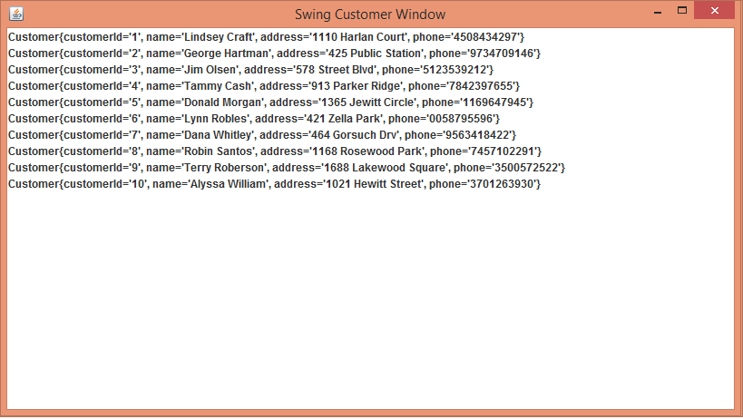
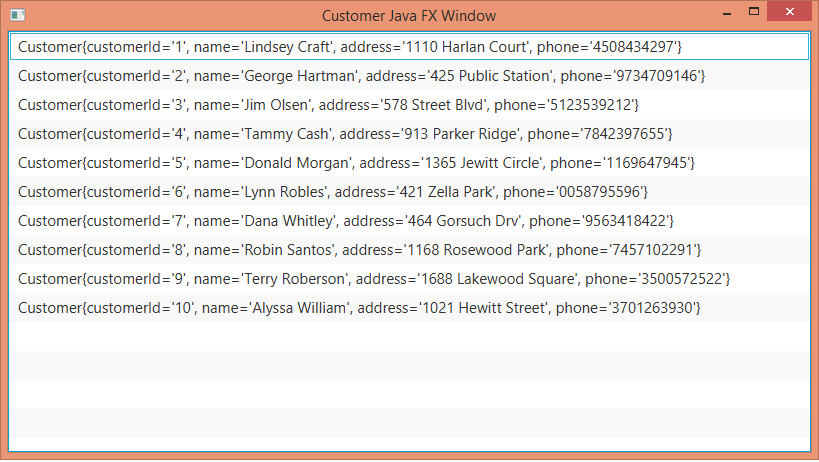

# Environment Profiles

A profile is a named, logical group of bean definitions to be registered with the container only if the given profile is active.

Profiles are useful for running application for different environment e.g. development, test, production etc.

We can select/deselect different beans in different environment.

Profiles can also be useful to customize application parts based on different customers preferences or there might be a core application which could be integrated with different kind of UI toolkit. In fact, we can customize the applications in a lot of different ways by using Spring profile.

## What is Environment?

Interface representing the environment in which the current application is running.

There are two main aspects of the application environment: profiles and properties.

In this tutorial we are going to focus on profiles.

### The annotation @Profile

The @Profile annotation specifies (by a name) what beans belong to what profile. On startup, we specify a profile name to be activated by the container. Here's how we can use this annotation:

1. The Java configuration/component classes are annotated with @Profile

2. The individual methods in the class can also be selectively annotated with @Profile

3. We can associate multiple profile names with a single @Profile annotation

4. We can activate profiles either by using system property (using a spring specific key spring.profiles.active and comma separated profile names) or by springContext#getEnvironment().setActiveProfiles("profile1", "profile2"...);

5. In a servlet based application we have to add this context-param in web.xml

```xml
<context-param>
    <param-name>spring.profiles.active</param-name>
    <param-value>profile1</param-value>
</context-param>
```

6. The beans without profile annotation will be loaded for all profiles or if no profile is active.

7. Naming a Profile as "default" , has special meanings, i.e. if we don't activate any profile during startup, the "default" profile will be loaded along with the beans which don't have any profile associations. If we activate other profile, "default" will not be loaded. We can change "default" profile name by using context.getEnvironment().setDefaultProfiles()

### Example Project

In this example, we are going to create three profiles for the core application "local", "dev" and "prod" and two profiles for ui part "swing" and "javafx". The first three will load related data source beans. The other two will show the data either in Java Swing ui or JavaFx ui. It's very unlikely that a single project will be developing two ui renderers at the same time but it's quite usual that projects migrate gradually from one to another.

In the example we used ObjectDB for dev profile and in memory data source for local profile. To generate dummy data we used org.fluttercode.datafactory

Run the example with different combinations of local/dev and swing/javafx profiles.

After running dev profile you will see the customerDev.odb file in the project root folder, created by ObjectDB.

Running profiles "local" and "swing", you will see the swing window:

 

Running profiles "dev" and "javafx", you will see the JavaFx window:

