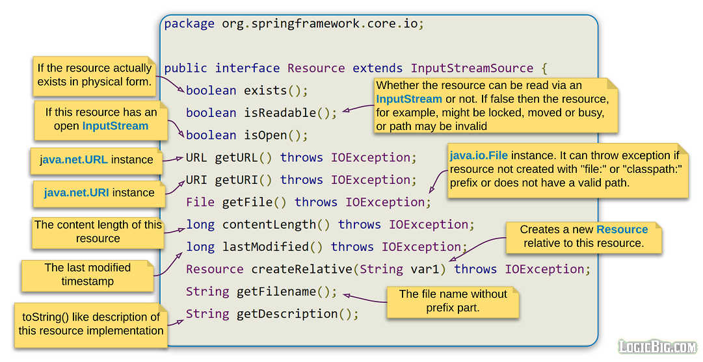
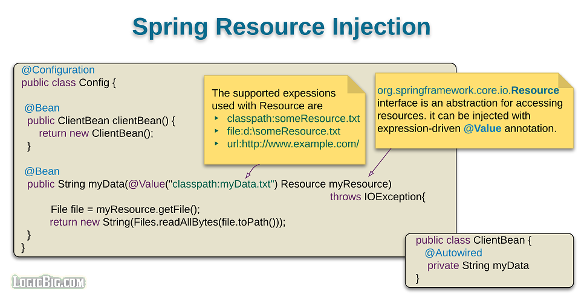

# Resource Injection

Spring provides an unified resource access mechanism via interface ResourceLoader.

ResourceLoader is a super interface of ApplicationContext. We can access resources using application context instance or we can inject ResourceLoader anywhere in our beans.

```java
 @Component
 public class MyBean{
    @Autowired
    private ResourceLoader resourceLoader;
      ......
 }
```

What we can do with ResourceLoader? Here's the commonly used method given by this interface:

```java
package org.springframework.core.io;

import org.springframework.core.io.Resource;

public interface ResourceLoader {
    Resource getResource(String resourceLocation);
    ....
}
```

The parameter 'resourceLocation' is typically prefix based which helps Spring to abstract away the low level Java resource based API details.

Commonly used prefixes are:

"**file:**d:\\myFile.txt"
"**classpath:**someInfo.txt"
"**url:**http://www.example.com"

## The Resource interface



Resource interface extends InputStreamSource which has a method to get an instance of java.io.InputStream to read the resource data.

```java
 package org.springframework.core.io;

 import java.io.IOException;
 import java.io.InputStream;

 public interface InputStreamSource {
    InputStream getInputStream() throws IOException;
 }
```

## How to load classpath/file resources?

This example shows how to read classpath resources obtained via resource location "classpath:someResource.txt" (we can also use file system resource i.e. "file:d:\\someResource.txt" same way) :

```java
    ....
 Resource resource = resourceLoader.getResource("classpath:someResource.txt");
 File file = resource.getFile();
 String s = new String(Files.readAllBytes(file.toPath()));
 System.out.println(s);
    ....
```

## How to load url resources?

```java
    ....
 Resource resource = resourceLoader.getResource("url:http://www.example.com/");
 StringBuilder stringBuilder = new StringBuilder();
   try (BufferedReader reader = new BufferedReader(
                                new InputStreamReader(resource.getInputStream()))) {
                reader.lines().forEach(stringBuilder::append);
            }
   System.out.println(stringBuilder.toString());
    ....
```
        
## Resource injection using @Value annotation



We have seen use of @Value annotation to inject a property value into a bean. That only works if used with @PropertySource annotation. Reading external properties is a sub set of resource loading. Here, we are exploring Spring resource loading in general.

We mentioned above that we can inject ResourceLoader into our application beans, but that approach is not recommended, because we want to avoid using Spring API into application code.

Resource instance can be injected directly with @Value annotation

```java
 public class MyBean {
    @Value("classpath:myResource.txt")
    private Resource myResource;
    ...
}
```

As we saw in above diagram, Resource along with @Value annotation can be injected in our @Configuration class. That's the best recommended way to inject resources. With that approach, we can pass raw resource data (or wrap it in another object) to our beans or expose it as a bean itself. That way we can avoid using Spring API in our business logic.

Some people argue, why should we avoid Spring API, after all we are already using Spring annotations in our application code? Well, the answer to that question is: annotations are only meta-data. Even if there are spring specific annotations in our application logic, we can still use our objects outside Spring container, whereas, if we have Spring specific API then our objects cannot live outside of Spring container.

## Implementations of Resource

There are multiple implementations of Resource interface, for example FileSystemResource, ClassPathResource, UrlResource.

The good news is, we don't have to know about those implementations as our prefix based resource location triggers and initializes related implementation. That's the beauty of abstraction.

The developers who want to create a custom Resource should explore those implementations.