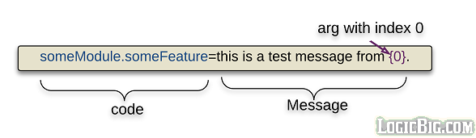
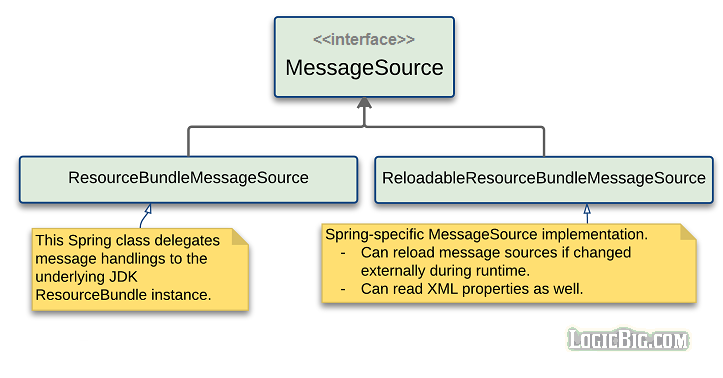

# Internationalization in Spring

Spring supports [internationalization (I18n) and localization (L10n)](https://en.wikipedia.org/wiki/Internationalization_and_localization) and specifically focuses on how to display the text labels/messages in different languages based on the provided locale.

An application written in Java, and Spring as well, are capable to support different languages by providing textual messages externally. These messages are usually written in .properties files (a Java standard).

## The interface MessageSource

The main Spring interface to support of I18n/L10n messages is org.springframework.context.MessageSource.

```java
public interface MessageSource {
	String getMessage(String code, Object[] args, String defaultMessage, Locale locale);
	String getMessage(String code, Object[] args, Locale locale)
                                                    throws NoSuchMessageException;
	String getMessage(MessageSourceResolvable resolvable, Locale locale) 
													throws NoSuchMessageException;
}
```

where:

* **code** is the a key which maps the above method calls to the messages written in the external files (usually .properties files).

* **args** are the runtime values to be substituted for the index based place-holders like {0} or {1} so on. 
Here's how a message in a properties file looks like:



* **locale** is the target java.util.Locale instance.

* **resolvable**: MessageSourceResolvable is an interface suitable for message resolution dynamically. Spring core validation error classes (FieldError, ObjectError) implement this interface. For simple use, we can bundle all message source related information in it's implementation DefaultMessageSourceResolvable which is easier to pass around as method arguments.

## MessageSource Implementation

Spring provides two out-of-the-box implementations:

* **ResourceBundleMessageSource** This uses java.util.ResourceBundle for it's internal working.

* **ReloadableResourceBundleMessageSource** It's able to reload messages from the source files based on timestamp changes, without restarting the application. It doesn't use ResourceBundle but uses it's own message loading and resolving logic. It can also detect XML property files and load them.



Also ApplicationContext interface extends MessageResource but it's implementation uses the underlying configured MessageResource as delegate, so it shouldn't be considered a full-blown implementation as the above two.

## Naming convention for resource files?

The following file name format must be used for MessageResource to work (this is actually java.util.ResourceBundle standard):

```shell
basename_languageCode_countryCode.properties
```

'basename' can be related to the application part where these properties belong to. For example orderView_en_us.properties.

We can create as many message properties files as we want and they can be anywhere in the classpath.

Per good practices, the file groups should be divided under different folders based on different modules of the application.

Following project structure shows how to do a maintainable grouping in a maven project (resources folder is in classpath by default):

```shell
+--src
`--+--main
   |--+--java
      |     .........
   `--+--resources
      `--+--messages
         |--+--trade-module
         |  `--+--tradeDetails_en_us.properties
         |     `--tradeDetails_fr_FR.properties
         |        .........
         `--+--order-module
            `--+--orderHistory_en_us.properties
               |--orderHistory_fr_FR.properties
               |--orderPlacement_en_us.properties
               `--orderPlacement_fr_FR.properties
               |  .........

`
```

## How to use MessageSource?

Spring doesn't provide any annotations based approach for message resolutions. Although, Spring does so for general purpose resource loading via Resource/@Value combination and @PropertySource/@Value combination for general purpose properties loading.

The reason of why there's no annotations support for resource messages is: the values resolved via annotations are static, which are loaded only at start up time and remain the same after that, whereas, Locale, in most practical scenarios, changes depending on different workflow. For example in Spring MVC application, a different locale is used for each different HTTP request client (with the help of 'Accept-Language' header) to generate the content in a different language which the client can understand.

The only appropriate way is to inject the implementation of MessageSource as a bean.

### ResourceBundleMessageSource example

```java
@Configuration
public class Config {

        @Bean
        public MyBean myBean () {
            return new MyBean();
        }

        @Bean
        public MessageSource messageSource () {
            ResourceBundleMessageSource messageSource = new ResourceBundleMessageSource();
            messageSource.setBasename("messages/msg");
            return messageSource;
        }
}
```

```java
public class MyBean {
        @Autowired
        private MessageSource messageSource;

        public void doSomething () {
            System.out.println(messageSource.getMessage("app.name", new Object[]{"Joe"},
                                                        Locale.getDefault()));
        }
}
```

If we are using xml configuration then one easy way to inject MessageSource is to implement MessageSourceAware in the target bean (MyBean in above example) and override it's setter. This is useful because in XML config we have to reference the resource bean every time we need it for other beans.

### ReloadableResourceBundleMessageSource example

```java
@Configuration
public class Config {

        @Bean
        public MyBean myBean () {
            return new MyBean();
        }

        @Bean
        public MessageSource messageSource () {
            ReloadableResourceBundleMessageSource messageSource =
                                            new ReloadableResourceBundleMessageSource();
            messageSource.setBasename("classpath:messages/msg");
            messageSource.setDefaultEncoding("UTF-8");
            //refresh cache after every 500 mill-secs
            messageSource.setCacheMillis(500);
            return messageSource;
        }
}
```

The following code access the message 20 times and sleeps for 2 sec every time. So we have enough time to change the messages in the files to see the effect in real time. Also remember to change the correct properties file which are under the target/classes folder (maven specific build folder) because those are the ones which are loaded during runtime.

```java
public static class MyBean {
        @Autowired
        private MessageSource messageSource;

        public void doSomething () {
            for (int i = 0; i < 20; i++) {
                System.out.println(messageSource.getMessage("app.name", new Object[]{"Joe"},
                                                            Locale.getDefault()));
                try {
                    Thread.sleep(2000);
                } catch (InterruptedException e) {
                    e.printStackTrace();
                }
            }
        }
    }
```

## Working with multiple message sources

If we want to use multiple sources with different base names we have two choices:

### Set multiple sources using setBasenames(String... basenames):

For example:

```java
        @Bean
        public MessageSource messageSource () {
            ResourceBundleMessageSource messageSource =
                                          new ResourceBundleMessageSource();
            messageSource.setBasenames("messages/msg", "messages/msg2");
            return messageSource;
        }
```

The message codes are searched in order the files are added in above method and first match will be returned.

### Set sources in hierarchical order using setParentMessageSource(parentMessageSource):

For example:

```java
        @Bean
        public MessageSource messageSource () {
            ResourceBundleMessageSource messageSource =
                                            new ResourceBundleMessageSource();
            messageSource.setBasename("messages/msg2");
            ResourceBundleMessageSource parentMessageSource =
                                            new ResourceBundleMessageSource();
            parentMessageSource.setBasename("messages/msg");
            messageSource.setParentMessageSource(parentMessageSource);
            return messageSource;
        }
```

This is useful when we want to override some of the messages from parent. The child MessageSource is searched for the message code first, if message is not found then parent is searched.

Also it's good to know that all setters on MessageSource implementations, as shown above, are defined in their super abstract classes (AbstractResourceBasedMessageSource extends AbstractMessageSource extends MessageSourceSupport).

AbstractMessageResource also implements HierarchicalMessageSource interface, which is the abstraction of the hierarchical message resolution.

## Example Project

This project includes the above complete examples plus the use of ApplicationContext as MessageSource and one XML properties source example read via ReloadableResourceBundleMessageSource. There's also one example of MessageSourceAware.

We try to put all related code in nested classes so that one concept is clear per java file, otherwise there will be explosions of java files which will be very confusing. In real project scenarios, we should create separate classes which should reside in appropriate packages.

