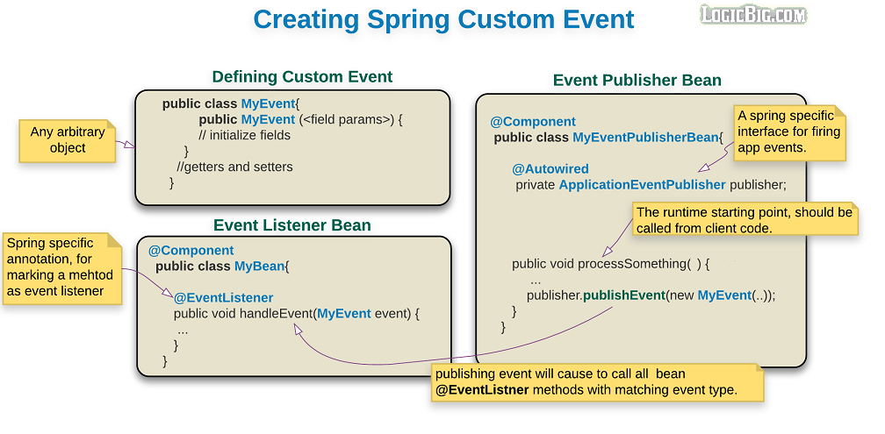

# Standard and Custom Events

Spring core framework provides application level event firing and event listening which is based on the standard Observer design pattern.

There are built-in application events available or we can create our own custom events in spring.

Let's see built-in application events in action first to have an idea.

## Spring build-in events

* **ContextRefreshedEvent** Event fired when an ApplicationContext gets initialized or refreshed (refreshed via context.refresh() call).

* **ContextStartedEvent** Event fired when context.start() method is called.

* **ContextStoppedEvent** Event fired when context.stop() method is called

* **ContextClosedEvent** Event fired when context.close() method is called.

* **RequestHandledEvent** This event can only be used in spring MVC environment. It is called just after an HTTP request is completed.

## How to listen to the events?

There are two ways to listen to the events.

### 1. Using annotation EventListener on any bean method and injecting the specific event parameter (typically a subtype of ApplicationEvent) to the method.

```java
   @Component
   public class MyBean{

       @EventListener
       public void handleContextRefresh(ContextRefreshedEvent event) {
        ...
       }
    }    
```

This method is called when spring context is refreshed.

When event is fired, a proper instance of ContextRefreshedEvent is passed by the framework.

We can name the bean method whatever we want, that doesn't matter here.

Note: The annotation support for event listener was added in Spring 4.2.

### Implementing ApplicationListener<E extends ApplicationEvent> to our bean and implement the method onApplicationEvent(E event)

```java
   @Component
   public class MyBean implements ApplicationListener <ContextRefreshedEvent> {

       @Override
       public void onApplicationEvent(ContextRefreshedEvent event) {
         ...
       }
    }  
```

## Defining custom events

It's not very difficult to create new custom events type, we just have to extend ApplicationEvent class.

```java
  public class MyEvent extends ApplicationEvent{
        //custom fields

        public MyEvent (Object source, <custom params>) {
            super(source);
            //initialize custom fields
        }

      //getters and setters
    }
```

**No need to extends ApplicationEvent anymore**

Starting from Spring 4.2, we can use any arbitrary object as event object, i.e. it doesn't need to extend ApplicationEvent any more:

```java
  public class MyEvent{
        //custom fields

        public MyEvent (<custom params>) {
            //initialize custom fields
        }

      //getters and setters
    }
```

## Publishing custom events

To publish custom events, we will need an instance of `ApplicationEventPublisher` and then call the method `ApplicationEventPublisher#publishEvent(..)`.

There are two ways to get the instance of `ApplicationEventPublisher`, inject it as a bean in any spring managed bean or extends `ApplicationEventPublisherAware` and implement it's `setApplicationEventPublisher` method. First method is recommended, and here's how we are going to use that:

```java
public class MyEvenPublisherBean{
        @Autowired
        ApplicationEventPublisher publisher;
        public void sendMsg(String msg){
            publisher.publishEvent(new MyEvent(this, msg));
        }
    }
```

Here's a summary of the recommended way to create custom events:



## Example Project

Following is the description of five independent main classes in this example project:

* **BuildInAnnotationBasedEventExample** Showing how to listen to built-in events using @EventListener annotation.

* **BuildInListenerBasedEventExample** Showing how to listen to built-in events by implementing ApplicationListener.

* **CustomEventWithApplicationEvent** Showing how to create custom event by extending ApplicationEvent and autowiring ApplicationEventPublisher for firing the custom event.

* **CustomEventWithoutApplicationEvent** Showing how to create custom event without extending ApplicationEvent, just using a POJO and autowiring ApplicationEventPublisher for firing the custom event.

* **BuildInListenerBasedEventExample** Showing how to create event publisher bean by implementing ApplicationEventPublisherAware instead of autowiring ApplicationEventPublisher.

### Examples on @EventListener showing more features:

* **@EventListener method listening to multiple events:** This can be done by specifying multiple classes as 'value' element of the annotation. In that case there shouldn't be any declared parameters with the listener method. Also without using this option, the listener method supports maximum one parameter only. - **EventListenerExample1.java**

* **Applying conditions to event:** This example shows how we can apply conditions to filter events. We have to use @EventListener element 'condition' to achieve that. This element accept Spring Expression language (SpEL) - **EventListenerExample2.java**

This example also demonstrates that ApplicationEventPublisher is in fact an instance of ApplicationContext.

* **Transforming to other events** This example shows how we can use an non-void return type with the listener methods. We will do that if we want to publish another event at the end of processing current event. - **EventListenerExample3.java**
