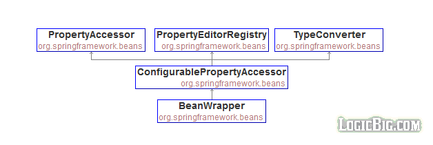
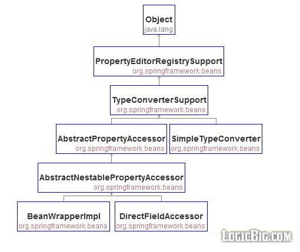

# Manipulating Java Beans

Spring beans creation and manipulation is based on standard JavaBeans. The package `org.springframework.beans` contains interfaces and classes for manipulating beans.

In this tutorial we are going to quickly walk through important interfaces/classes.

## BeanWrapper interface

Spring's BeanWrapper is central interface of JavaBeans infrastructure.



`BeanWrapper` provides methods to analyze and manipulate standard JavaBeans: the ability to get and set property values, get property descriptors, and query the readability/writability of properties. BeanWrapper also supports setting of index properties.

`BeanWrapperImpl` is the default implementation of BeanWrapper:



Examples : com.logicbig.example.beanwrapper

## PropertyAccessorFactory class

`PropertyAccessorFactory` is another way to get BeanWrapper instance. It's based on factory pattern so we don't have to worry about what implementation to use.

Examples : com.logicbig.example.propertyacessorfactory

## BeanInfoFactory interface

The interface `org.springframework.beans.BeanInfoFactory` is an alternative to `java.beans.Introspector` to create a Spring specific enhanced implementation of `java.beans.BeanInfo`. `BeanInfoFactory` has only one method

```java
BeanInfo getBeanInfo(Class<?> beanClass)
```

`BeanInfoFactory` implementation, `org.springframework.beans.ExtendedBeanInfoFactory`, accepts JavaBeans "non-standard" setter methods as 'writable' which returns some values instead of void.

This is the description from `org.springframework.beans.ExtendedBeanInfo`. This is a package private class which is a wrapper around standard `java.beans.BeanInfo`:

Wrap the given BeanInfo instance; copy all its existing property descriptors locally, wrapping each in a custom indexed or non-indexed PropertyDescriptor variant that bypasses default JDK weak/soft reference management; then search through its method descriptors to find any non-void returning write methods and update or create the corresponding PropertyDescriptor for each one found.

Examples : com.logicbig.example.beaninfofactory

## BeanUtils class

This class has static util methods for instantiating JavaBean, checking bean property types, copying bean properties, etc.

Examples : com.logicbig.example.beanutils

## DirectFieldAccessor class

DirectFieldAccessor can access fields without standard getters and setters.

Examples : com.logicbig.example.directfieldAccessor

## SimpleTypeConverter

`org.springframework.beans.SimpleTypeConverter` is implementation of `TypeConverter` which is not tied to a bean instance so it can be used as an alternative to `BeanWrapperImpl` to convert data types to target type without specifying the enclosing bean.

Examples : com.logicbig.example.typeconverter