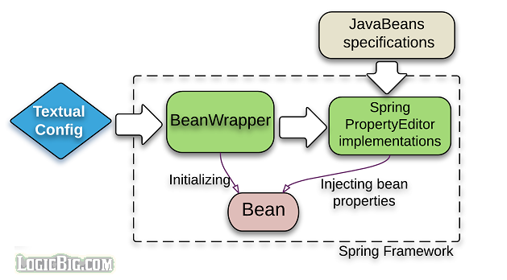
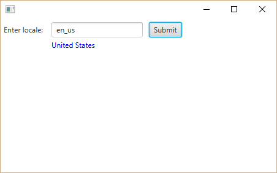

# Property Editors

Spring core framework uses `PropertyEditor` instances to convert text to object and vice versa, wherever it is needed.

The PropertyEditor concept is part of the JavaBeans specifications.

PropertyEditor was originally designed to be used in Swing applications. JavaBeans specification defines API to introspect and extract the bean inner details which can be used to show bean properties visually as components and edit them by using PropertyEditors.

Check out our [JavaBeans specs and API quick tutorial](https://www.logicbig.com/tutorials/core-java-tutorial/java-se-api/java-beans-specs.html) if you are already not familiar with that.

Following are the two of the cases where Spring uses PropertyEditor(s).

* Setting Bean properties defined in XML configuration files. As all values of bean properties are in text format there, Spring needs to convert them into Java objects by using an appropriate PropertyEditor instance. For example if the target bean's property is the `java.lang.Class` type then Spring uses `ClassEditor` (a Spring implementation of PropertyEditor).

* In Spring MVC framework, all incoming HTTP request parameters and other information is in text, that's where PropertyEditors are also used for Java Object conversions.

In this tutorial we are going to focus the use of property editors at core level. 

## Spring default PropertyEditors

Spring provides many default editors, e.g. `ClassEditor`, `FileEditor`, `LocaleEditor`, `CurrencyEditor` etc.

Here's the `CurrencyEditor` code snippet to understand the concept better:

```java
package org.springframework.beans.propertyeditors;

import java.beans.PropertyEditorSupport;
import java.util.Currency;

public class CurrencyEditor extends PropertyEditorSupport {

	@Override
	public void setAsText(String text) throws IllegalArgumentException {
		super.setValue(Currency.getInstance(text));
	}

	@Override
	public String getAsText() {
		Currency value = (Currency) super.getValue();
		return (value != null ? value.getCurrencyCode() : "");
	}
}
```

When spring parses following XML config, it first calls the method `setAsText(..)` and then `getValue()` to inject the Currency instance in the bean.

```xml
 <bean id="myBean" class="com.example.MyBean">
        <property name="myCurrencyProp" value="JPY"/>
 </bean>
```

The injection point `myCurrencyProp` data type has to be `java.lang.Currency` for above config to work.

## Spring custom PropertyEditors

Spring also provides custom editors e.g. `CustomNumberEditor`, `CustomDateEditor` etc. These custom editors can be configured in XML config by a developer or some of them are initialized by Spring itself depending on what context we are using.

Explore the related API [here](http://docs.spring.io/spring/docs/current/javadoc-api/org/springframework/beans/propertyeditors/package-summary.html).

Note all custom editors starts with 'Custom' prefix i.e. they are in format CustomXYZ.

We are not going to cover a lot of internal workings of Spring here. From a developer perspective, we are going to present scenarios where he/she will likely be working with PropertyEditors.

## PropertyEditors are tied to a data type

The `PropertyEditor` instances are tied to a Java data type globally and are used by Spring whenever they are needed.

In above code snippet Spring's `CurrencyEditor` is tied to `Currency` data type by default.

## Creating a new PropertyEditor

In XML based context (where all configuration is in textual format), we might need a user defined custom editor to convert a 'special' text format to bean objects.

In this example we will show how to convert a special text based phone format to Java Phone object.

```java
    public class Phone {
        private String phoneNumber;
        private PhoneType phoneType;

       //getters and setters
    }
    public enum PhoneType {
        LAND,
        CELL,
        WORK
    }
```

Here's the bean where we want to inject Phone object via XML config:

```java
public class Customer {
        private String customerName;
        private Phone phone;
    .....
    //getters and setters
}
```

Here's our XML:

```xml
<beans .....
    <bean id="customer" class="com.logicbig.example.XmlCustomEditorExample.Customer">
        <property name="customerName" value="Steve Thomas"/>
        <property name="phone" value="cell | 907-111-2123"/>
    </bean>

    <bean class="org.springframework.beans.factory.config.CustomEditorConfigurer">
        <property name="customEditors">
            <map>
                <entry key="com.logicbig.example.XmlCustomEditorExample$Phone"
                       value="com.logicbig.example.XmlCustomEditorExample$CustomPhoneEditor"/>
            </map>
        </property>
    </bean>
</beans>
```

In above XML, we are using phone value as 'cell | 907-111-2123'. This is our own custom format. We can invent any format here as we want. We then also have to define our Custom PropertyEditor to parse this text format.

Here's our custom PropertyEditor:

```
    public class CustomPhoneEditor extends PropertyEditorSupport {

        @Override
        public void setAsText (String text) throws IllegalArgumentException {
            String[] split = text.split("[|]");
            if (split.length != 2) {
                throw new IllegalArgumentException(
							"Phone is not correctly defined. The correct format is " +
								"PhoneType|111-111-1111");
            }

            PhoneType phoneType = PhoneType.valueOf(split[0].trim().toUpperCase());
            Phone phone = new Phone();
            phone.setPhoneType(phoneType);
            phone.setPhoneNumber(split[1].trim());
            setValue(phone);
        }
    }
```

Note we are just overriding `setAsText()` method and not `getAsText()`, that's because Spring XML config just needs text to object conversion and not the opposite, so we skipped that. For a generic editor which should work in different environments, we should override both methods.

Complete Example : XmlUserCustomEditorExample.java

## Using Spring Custom editor

The property `customEditors` of `CustomEditorConfigurer` cannot be used to configure spring custom editors. The reason is; this property meant to create new instance of the provided editor class with no argument constructor (as we saw in the above example). Most of the custom editors don't have no-arg constructor i.e. they are stateful.

According to the API doc:

> Note, that you shouldn't register PropertyEditor bean instances via the customEditors property as PropertyEditors are stateful and the instances will then have to be synchronized for every editing attempt. In case you need control over the instantiation process of PropertyEditors, use a PropertyEditorRegistrar to register them.

Above is true for all stateful custom editors; Spring Custom editors or user defined stateful custom editor.

Let's write an example to register a Spring provided custom editor with [PropertyEditorRegistrar](http://docs.spring.io/spring/docs/current/javadoc-api/org/springframework/beans/PropertyEditorRegistrar.html)

### XML config

```xml
<beans ...>
    <bean id="customer" class="com.logicbig.example.XmlSpringCustomEditorExample.MyBean">
        <property name="price" value="45,678.567"/>
    </bean>
    <bean class="org.springframework.beans.factory.config.CustomEditorConfigurer">
     <property name="propertyEditorRegistrars">
     <list>
     <bean
       class="com.logicbig.example.XmlSpringCustomEditorExample.MyCustomBeanRegistrar"/>
         </list>
       </property>
    </bean>
</beans>
```

### Registering Spring Custom Editor, CustomNumberEditor:

```java
public class MyCustomBeanRegistrar implements PropertyEditorRegistrar {
        @Override
        public void registerCustomEditors(PropertyEditorRegistry registry) {
            NumberFormat numberFormat = new DecimalFormat("##,###.00");
            registry.registerCustomEditor(java.lang.Double.class,
                                          new CustomNumberEditor(java.lang.Double.class,
                                                                 numberFormat, true));
        }
}
```

### The target bean

```java
 public class MyBean {
        private Double price;

         //getters and setters
 }
```

Complete Example : XmlSpringCustomEditorExample.java


## Using PropertyEditors with JavaConfig

We usually don't need any property editors in a pure JavaConfig context. But there might be scenario where we want to convert some text coming from any source to Java object. There we should definitely reuse the Spring predefined PropertyEditors instead of reinventing the wheel.

### Implicit data conversion by @Value

In this example we are injecting a property file source using `@PropertySource` and `@Value` annotations. We don't need to configure anything since Spring does implicit data conversion from property text to Java data objects.

**The property in app.properties file:**

```shell
theCurrency=PLN
```

**The configuration class:**

```java
    @Configuration
    @PropertySource("classpath:app.properties")
    public class Config {
        @Bean
        public ClientBean clientBean () {
            return new ClientBean();
        }
    }
```

**The target bean**

```java
 public class ClientBean {
        @Value("${theCurrency}")
        private Currency currency;

      .....
 }
```

Complete Example : JConfigPropertySourceExample

### JConfig PropertyEditorRegistrar example

Just like we used a Spring custom `PropertyEditor` using `PropertyEditorRegistrar` in XML config example above, we can achieve the same in JavaConfig:

**A date property in app.properties:**

```shell
theTradeDate=2016-9-14
```

**Configuration class**

```java
 @Configuration
 @PropertySource("classpath:app.properties")
 public class Config {

        @Bean
        public ClientBean clientBean () {
            return new ClientBean();
        }

        @Bean
        public CustomEditorConfigurer customEditorConfigurer () {
            CustomEditorConfigurer cec = new CustomEditorConfigurer();
            cec.setPropertyEditorRegistrars(
                           new PropertyEditorRegistrar[]{new MyCustomBeanRegistrar()});
            return cec;
        }
 }
```

**The PropertyEditorRegistrar implementation**

```java
public class MyCustomBeanRegistrar implements PropertyEditorRegistrar {
        @Override
        public void registerCustomEditors(PropertyEditorRegistry registry) {
            SimpleDateFormat dateFormatter = new SimpleDateFormat("yyyy-MM-dd");
            dateFormatter.setLenient(false);
            registry.registerCustomEditor(Date.class,
						new CustomDateEditor(dateFormatter, true));
        }
}
```

**The target bean**

```java
  public class ClientBean {
        @Value("${theTradeDate}")
        private Date tradeDate;
      ...
  }
```

Complete Example : JConfigPropertySourceExample2

### JavaConfig, using a custom editor for one time use

If we don't want to use Spring custom PropertyEditor for a given data type globally, we can create a custom editor instance on the fly ourselves, so that it will be used only once for a specific injection point.

**theTradePrice in app.properties**

```shell
thePrice=12,323.7654
```

**The Configuration class:**

```java
    @Configuration
    @PropertySource("classpath:app.properties")
    public class Config {
        @Bean
        public ClientBean clientBean () {
            return new ClientBean();
        }

        @Bean
        @Qualifier("tradePrice")
        public Double getPrice(Environment env) {
            NumberFormat numberFormat = new DecimalFormat("##,###.00");
            CustomNumberEditor customNumberEditor = new CustomNumberEditor(
                                                Double.class, numberFormat, true);
            customNumberEditor.setAsText(env.getProperty("thePrice"));
            return (Double) customNumberEditor.getValue();
        }
    }
```

**The target bean**

```java
    public class ClientBean {
        @Autowired
        @Qualifier("tradePrice")
        private Double price;
         ...
    }
```

Note: the use of `@Qualifier` is not relevant here, we can remove that in our simple example and just let it inject by type.

Complete Example : JConfigPropertySourceExample3

## Spring BeanWrapper

When spring context loads up the bean configuration, it uses an instance of the interface `BeanWrapper` for creating each bean's instance. The spring context's bean factory heavily rely on `BeanWrapper`. `BeanWrapperImpl` is its implementation which is intensively used by Spring framework.



`BeanWrapperImpl` also creates instances of default `PropertyEditors`.

The good thing about `BeanWrapperImpl` is, it can be used without a spring bean container as well.

## Using Spring PropertyEditors outside Spring container

There might be situations where we are not running a Spring context and we want to use Spring property editors instead of creating our own. There are many Spring editors available, and they are stable and well tested.

Following simple code shows how it can be used in a standalone application:

```java
public class DefaultEditorsTest {
    public static void main (String[] args) {
        BeanWrapperImpl wrapper = new BeanWrapperImpl();

        PropertyEditor editor = wrapper.getDefaultEditor(Currency.class);
        editor.setAsText("MYR");
        Currency value = (Currency) editor.getValue();
        System.out.println(value.getDisplayName());
    }
}
```

In above example `BeanWrapperImpl` is not actually wrapping any bean, which is fine for this simple example.

`BeanWrapperImpl` has overloaded constructors which accept the Bean class or it's instance. Imagine `BeanWrapper` as something which takes care of all java reflection work to populate underlying bean object.

### A JavaFx Example

This example populates a bean from the data coming from a GUI form. The form sends a locale string and we use Spring's `LocaleEditor` to convert that to `Locale` object. Here's a snippet (`JavaFxDefaultEditorExample.java` is the complete code, included in example project below)

```java
    ......
   button.setOnAction(event -> {

           LocaleClientBean bean = new LocaleClientBean();

            System.out.println(localeField.getText());
            BeanWrapperImpl beanWrapper = new BeanWrapperImpl(bean);

            //spring uses default property editor 'LocaleEditor' implicitly for conversion
            beanWrapper.setPropertyValue("locale", localeField.getText().trim());

            bean.workWithLocale();
            outputLabel.setText(bean.getLocale()
                                    .getDisplayCountry());

        });
   .....
```

Here is a screenshot. On entering a valid locale code and then clicking on the submit button, it shows the locale country in blue text.



The idea in above example is that we want to reuse Spring code outside of spring context. Or we can actually use a spring context side by side as well. Another approach could be to create a new implementation of `ApplicationContext` which will read some config meta-data and would tie the GUI components/screens to Spring context beans, just like Spring MVC which is also built on Spring core framework.