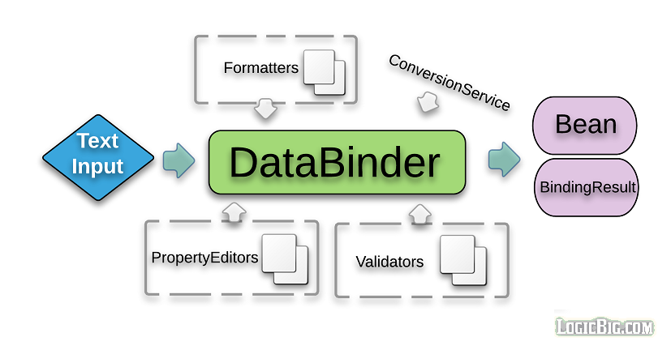

# Core Data binding

Spring data binding mechanism allows user input to be dynamically bound to the beans. In other words it allows for setting property values into a target object. The class `DataBinder` provides this functionality. `BeanWrapper` has similar functionality , but `DataBinder` additionally supports field validation, field formatting and binding result analysis.

`BeanWrapper` is a low-level class. `DataBinder` works on higher level. Both `DataBinder` and `BeanWrapper` use `PropertyEditor`s to parse and format property values. We should prefer to use `DataBinder` instead of `BeanWrapper`. `BeanWrapper` is in fact used by `DataBinder` itself.

`WebDataBinder` extends `DataBinder`. `WebDataBinder` is used for data binding from web request parameters to JavaBean objects. In Spring MVC application, we typically use it for customizing request param bindings .

## Using DataBinder

Let's see an example how to use `DataBinder` on core level:

### The bean:

```java
public class TestBean {
    private int anInt;

   // getter and setter
}
```

### Using DataBinder:

```java
public static void main (String[] args) {

  MutablePropertyValues mpv = new MutablePropertyValues();
  mpv.add("anInt", "10");

  TestBean testBean = new TestBean();
  DataBinder db = new DataBinder(testBean);

  db.bind(mpv);
  System.out.println(testBean);
}
```

### Output:

```Powershell
TestBean{anInt=10}
```

Above example doesn't show any advantage over using `BeanWrapper` for field bindings. 

## Using BindingResult

We can use the method `DataBinder#getBindingResult()` to get the instance of `BindingResult` which is created as a result of the binding process. `BindingResult` typically contains error information e.g. required field, type mismatch, method invocation errors.

Let's modify our last example to purposely create some type mismatch (set 'anInt' as some alpha-numeric value) and then capture the errors using getBindingResult method:

```java
  public static void main (String[] args) {

        MutablePropertyValues mpv = new MutablePropertyValues();
        mpv.add("anInt", "10x"); // 10x cannot be converted to int type

        TestBean testBean = new TestBean();
        DataBinder db = new DataBinder(testBean);

        db.bind(mpv);
        db.getBindingResult().getAllErrors().stream().forEach(System.out::println);
        System.out.println(testBean);
    }
```

**Output**

```Powershell
Field error in object 'target' on field 'anInt': rejected value [10x]; codes [typeMismatch.target.anInt,typeMismatch.anInt,typeMismatch.int,typeMismatch]; arguments [org.springframework.context.support.DefaultMessageSourceResolvable: codes [target.anInt,anInt]; arguments []; default message [anInt]]; default message [Failed to convert property value of type [java.lang.String] to required type [int] for property 'anInt'; nested exception is java.lang.NumberFormatException: For input string: "10x"]
TestBean{anInt=0}
```

Note that `anInt` in above example is still with default value of 0. `DataBinder` doesn't attempt to do actual conversion if there's a type mismatch, on the other hand, `BeanWrapper` throws TypeMismatchException, let's see that in code:

```java
 public static void main (String[] args) {
        MutablePropertyValues mpv = new MutablePropertyValues();
        mpv.add("aString", "SomeString");
        mpv.add("anInt", "10x");

        BeanWrapper bw =  new BeanWrapperImpl(new TestBean());
        bw.setPropertyValues(mpv);
        System.out.println(bw.getWrappedInstance());
 }
```

**Output:**

```Powershell
org.springframework.beans.TypeMismatchException: Failed to convert property value of type [java.lang.String] to required type [int] for property 'anInt'; nested exception is java.lang.NumberFormatException: For input string: "10x"
	at org.springframework.beans.AbstractNestablePropertyAccessor.convertIfNecessary(AbstractNestablePropertyAccessor.java:596)
	at org.springframework.beans.AbstractNestablePropertyAccessor.convertForProperty(AbstractNestablePropertyAccessor.java:603)
	at org.springframework.beans.AbstractNestablePropertyAccessor.setPropertyValue(AbstractNestablePropertyAccessor.java:449)
	at org.springframework.beans.AbstractNestablePropertyAccessor.setPropertyValue(AbstractNestablePropertyAccessor.java:280)
	at org.springframework.beans.AbstractPropertyAccessor.setPropertyValues(AbstractPropertyAccessor.java:95)
	at org.springframework.beans.AbstractPropertyAccessor.setPropertyValues(AbstractPropertyAccessor.java:75)
	at com.logicbig.example.BeanWrapperWithError.main(BeanWrapperWithError.java:14)
	at sun.reflect.NativeMethodAccessorImpl.invoke0(Native Method)
	at sun.reflect.NativeMethodAccessorImpl.invoke(NativeMethodAccessorImpl.java:62)
	at sun.reflect.DelegatingMethodAccessorImpl.invoke(DelegatingMethodAccessorImpl.java:43)
	at java.lang.reflect.Method.invoke(Method.java:497)
	at com.intellij.rt.execution.application.AppMain.main(AppMain.java:144)
Caused by: java.lang.NumberFormatException: For input string: "10x"
	at java.lang.NumberFormatException.forInputString(NumberFormatException.java:65)
	at java.lang.Integer.parseInt(Integer.java:580)
	at java.lang.Integer.valueOf(Integer.java:766)
	at org.springframework.util.NumberUtils.parseNumber(NumberUtils.java:208)
	at org.springframework.beans.propertyeditors.CustomNumberEditor.setAsText(CustomNumberEditor.java:113)
	at org.springframework.beans.TypeConverterDelegate.doConvertTextValue(TypeConverterDelegate.java:468)
	at org.springframework.beans.TypeConverterDelegate.doConvertValue(TypeConverterDelegate.java:441)
	at org.springframework.beans.TypeConverterDelegate.convertIfNecessary(TypeConverterDelegate.java:199)
	at org.springframework.beans.AbstractNestablePropertyAccessor.convertIfNecessary(AbstractNestablePropertyAccessor.java:576)
	... 11 more
```

In next couple of tutorials we will explore how to use `DataBinder` for field validations per application requirements, field formatting and how a `ConversionService` can be used for converting property values, as an alternative to JavaBeans `PropertyEditor`s.

Here's a high level view of data binder:

