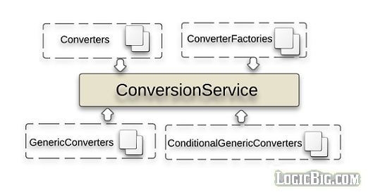

# Conversion Service

Spring 3 introduced a new type conversion mechanism as an alternative to PropertyEditors.

The disadvantage of JavaBean `PropertyEditor` is that they are not thread-safe because they directly attempt to modify the JavaBean fields (the instance variables). JavaBeans `PropertyEditor` was originally designed to be used in single-threaded GUI applications.

A `ConversionService` is a stateless object so is thread-safe.

Spring provides built in default converters which can do conversion between strings, numbers, enums, collections, maps, and other common types.

In this tutorial we are going to explore different ways to create converters and then how to use them with `DataBinder`.



## ConversionService

```java
package org.springframework.core.convert;

public interface ConversionService {

    boolean canConvert(Class<?> sourceType, Class<?> targetType);

    <T> T convert(Object source, Class<T> targetType);

    boolean canConvert(TypeDescriptor sourceType, TypeDescriptor targetType);

    Object convert(Object source, TypeDescriptor sourceType,
                                                   TypeDescriptor targetType);
}
```

### Using ConversionService

```java
public class ConversionServiceExample {
  public static void main (String[] args) {
      DefaultConversionService service = new DefaultConversionService();

      Currency currency = service.convert("USD", Currency.class);
      System.out.println(currency);

      Collection<String> list = service.convert("Deb, Mike, Kim", Collection.class);
      System.out.println(list);
  }
}
```

**Output:**

```shell
USD
[Deb, Mike, Kim]
```

## Converter interface

ConversionService is based on `Converter` interface:

```java
package org.springframework.core.convert.converter;

public interface Converter<S, T> {
    T convert(S source);
}
```

### Built-in converters

Spring comes with predefined converters. In above example Spring uses built-in converters (String to Currency, String Array to Collection).

The built-in converters are not public, so we cannot find them in API docs. To know what types can be converted by default please use your IDE to view hierarchy of Converter interface. A complete list can be viewed [here](https://www.logicbig.com/how-to/spring-framework/spring-converters-list.html).

### ApplicationContext and ConversionService

In the core application context like `AnnotationConfigApplicationContext`, Spring doesn't have any mechanism or hook on the client code to use/configure `ConversionService` instance as it does in spring MVC environment. In Core application context environment if we want to use it on client code then we have to inject it as a normal bean and apply the conversion manually by calling `ConversionService#convert()` method. In the next example we will demonstrate that.

### Creating a Custom Converter

In this example we are going to create a converter to convert `java.util.Date` to `java.time.LocalDateTime`.

```java
 public class DateToLocalDateTimeConverter
                     implements Converter<Date, LocalDateTime> {

     @Override
     public LocalDateTime convert(Date source) {
         return LocalDateTime.ofInstant(source.toInstant(),
                             ZoneId.systemDefault());
     }
 }
```

Besides implementing `ConversionService`, `DefaultConversionService` also implements `ConverterRegistry` interface which is an abstraction of converters registration with the underlying conversion service. In following configuration we are registering our custom converter with `DefaultConversionService`.

```java
 @Configuration
 public static class Config {
      @Bean
      public ConversionService conversionService () {
          DefaultConversionService service = new DefaultConversionService();
          service.addConverter(new DateToLocalDateTimeConverter());
          return service;
      }

      @Bean
      public ClientBean clientBean () {
          return new ClientBean(new Date());
      }
 }
```

```java
private static class ClientBean {
    @Autowired
    private ConversionService conversionService;
    private final Date date;

    private ClientBean (Date date) {
        this.date = date;
    }

    public void showLocalDateTime () {
        LocalDateTime dateTime = conversionService.convert(date, LocalDateTime.class);
        System.out.println(dateTime);
    }
}
```

```java
public class CustomConverterExample {

 public static void main (String[] args) {
       AnnotationConfigApplicationContext context = new
                     AnnotationConfigApplicationContext(Config.class);

        ClientBean clientBean = context.getBean(ClientBean.class);
        clientBean.showLocalDateTime();
 }
}
```

**Output**:

```shell
2016-11-02T22:02:58.509
```

## ConverterFactory

```java
package org.springframework.core.convert.converter;

public interface ConverterFactory<S, R> {

    <T extends R> Converter<S, T> getConverter(Class<T> targetType);

}
```

The interface `ConverterFactory` is used to tie a single converter to an entire class hierarchy type.

There are number of [built-in converter factories](https://www.logicbig.com/how-to/spring-framework/spring-converter-factory-list.html) provided by Spring. For example let's see `StringToEnumConverterFactory`:

```java
final class StringToEnumConverterFactory implements ConverterFactory<String, Enum> {

 @Override
 public <T extends Enum> Converter<String, T> getConverter(Class<T> targetType) {
  return new StringToEnum(ConversionUtils.getEnumType(targetType));
 }

 private class StringToEnum<T extends Enum> implements Converter<String, T> {
  private final Class<T> enumType;
  public StringToEnum(Class<T> enumType) {
   this.enumType = enumType;
  }

  @Override
  public T convert(String source) {
   if (source.length() == 0) {
    // It's an empty enum identifier: reset the enum value to null.
    return null;
   }
   return (T) Enum.valueOf(this.enumType, source.trim());
  }
 }
}
```

### Creating a custom converter factory

Let's say we have a hierarchy of number of classes extending a same base class: Entity. We are going to create a converter factory, `IdToEntityConverterFactory` which will tie all subclass of `Entity` to a single converter `IdToEntityConverter`. This converter will convert provided entity string id to entity object via some back-end service.

```java
public abstract static class Entity {
   private final String id;

   public Entity (String id) {
       this.id = id;
   }
   ....
}
```

```java
public class Order extends Entity {
    private final int quantity;
    private final Date date;

    private Order (String id, int quantity, Date date) {
        super(id);
        ....
    }
 ...
 }
```

```java
public class Item extends Entity {
    private final String itemName;
    private final BigDecimal cost;

    public Item (String id, String itemName, BigDecimal cost) {
        super(id);
        ....
    }
  ....
}
```

```java
public class Customer extends Entity {
    private final String name;

    private Customer (String id, String name) {
        super(id);
        ..
    }
 .....
}
```

The converter factory implementation:

```java
public class IdToEntityConverterFactory implements
                        ConverterFactory<String, Entity> {

   @Override
   public <T extends Entity> Converter<String, T> getConverter (Class<T> targetType) {
       return new IdToEntityConverter<>(targetType);
   }
}
```

```java
class IdToEntityConverter<T extends Entity> implements Converter<String, T> {

     private Class<T> targetType;

     public IdToEntityConverter (Class<T> targetType) {
         this.targetType = targetType;
     }

     @Override
     public T convert (String id) {
         return EntityService.getEntity(id, targetType);
     }
 }
}
```

Configuring beans and using Conversion service:

```java
 @Configuration
 public class Config {

    @Bean
    public ConversionService conversionService () {
        DefaultConversionService service = new DefaultConversionService();
        service.addConverterFactory(new IdToEntityConverterFactory());
        return service;
    }

    @Bean
    public MyBean myBean () {
        return new MyBean();
    }
}
```

```java
public class MyBean {
    @Autowired
    private ConversionService service;

    public Entity getEntity(String entityId, Class<? extends Entity> type) {
        return service.convert(entityId, type);
    }
}
```

```java
public class CustomConverterFactoryExample {

   public static void main (String[] args) {

       AnnotationConfigApplicationContext context = new
                           AnnotationConfigApplicationContext(Config.class);

       MyBean myBean = context.getBean(MyBean.class);
       Entity entity = myBean.getEntity("1000", Order.class);
       System.out.println(entity);

       entity = myBean.getEntity("431", Customer.class);
       System.out.println(entity);
   }
}
```

Output:

```shell
Order{quantity=400, date=Thu Nov 03 11:19:56 CDT 2016}
Customer{name='Mike'}
```

## GenericConverter

```java
package org.springframework.core.convert.converter;

public interface GenericConverter {

    public Set<ConvertiblePair> getConvertibleTypes();

    Object convert(Object source, TypeDescriptor sourceType,
                                          TypeDescriptor targetType);

}
```

GenericConverter is flexible but less strongly typed converter.

`getConvertibleTypes()` returns a `Set` of `ConvertiblePair` which allows converting between multiple source/target type pairs .

`convert()` method passes `TypeDescriptor` (field context information) of source and target types. This allows for resolving source and target field metadata such as annotations and generics information, which can be used to implement conversion logic.

The disadvantage of using `GenericConverter` is that it can get very complex because of it's flexibility.

In following simple example we are going to create a `GenericConverter` for `Number` to `BigDecimal` conversion.

```java
public static class NumberToBigDecimalConverter implements GenericConverter {

    @Override
    public Set<ConvertiblePair> getConvertibleTypes () {
       return Collections.singleton(new ConvertiblePair(Number.class,
                                                     BigDecimal.class));
    }

    @Override
    public Object convert (Object source, TypeDescriptor sourceType,
                        TypeDescriptor targetType) {
        if (sourceType.getType() == BigDecimal.class) {
            return source;
        }

        Number number = (Number) source;
        return new BigDecimal(number.doubleValue());
    }
}
```

```java
public class GenericConverterExample {
    public static void main (String[] args) {
       DefaultConversionService service = new DefaultConversionService();
       service.addConverter(new NumberToBigDecimalConverter());

       BigDecimal bd = service.convert(Double.valueOf("2222.336"), BigDecimal.class);
       bd = bd.setScale(2, BigDecimal.ROUND_HALF_UP);
       System.out.println(bd);
    }
}
```

Output:

```shell
2222.34
```

## ConditionalGenericConverter

```java
package org.springframework.core.convert.converter;

public interface ConditionalGenericConverter
        extends GenericConverter, ConditionalConverter {
}
```

```java
package org.springframework.core.convert.converter;

public interface ConditionalConverter {

 boolean matches(TypeDescriptor sourceType, TypeDescriptor targetType);
}
```

`ConditionalGenericConverter` is a specialization of `GenericConverter`. It allows to conditionally execute the converter based on the `matches()` return boolean.

In following example we are modifying our last example to exclude BigDecimal as source type.

```java
public static class NumberToBigDecimalConverter implements ConditionalGenericConverter {

    @Override
    public boolean matches(TypeDescriptor sourceType, TypeDescriptor targetType) {
        return sourceType.getType() != BigDecimal.class;
    }

    @Override
    public Set<ConvertiblePair> getConvertibleTypes() {
        return Collections.singleton(new ConvertiblePair(Number.class,
                            BigDecimal.class));
    }

    @Override
    public Object convert(Object source, TypeDescriptor sourceType,
                        TypeDescriptor targetType) {

        Number number = (Number) source;
        return new BigDecimal(number.doubleValue());
    }
}
```

```java
public class ConditionalGenericConverterExample {

 public static void main (String[] args) {
     DefaultConversionService service = new DefaultConversionService();
     service.addConverter(new NumberToBigDecimalConverter());

     BigDecimal bd = service.convert(Double.valueOf("2222.336"), BigDecimal.class);
     bd = bd.setScale(2, BigDecimal.ROUND_HALF_UP);
     System.out.println(bd);

     //this will return the same BigDecimal instance without conversion
     bd = service.convert(new BigDecimal("898.33"), BigDecimal.class);
     System.out.println(bd);
 }
}
```

Output:

```shell
2222.34
898.33
```

See [complete list of built-in GenericConverter and ConditionalGenericConverter](https://www.logicbig.com/how-to/spring-framework/spring-generic-converter-list.html).

## DataBinder using ConversionService

By default `DataBinder` uses PropertyEditors for binding process but it can be hooked with a conversion service for property values conversion.

Following example shows `DataBinder` using `DateToLocalDateTimeConverter` (from our custom converter example above) registered with `DefaultConversionService`.

```java
private static class MyObject {
   private LocalDateTime date;
    ....
}
```

```java
public class ConversionServiceWithDataBinderExample {
 public static void main (String[] args) {

     MutablePropertyValues mpv = new MutablePropertyValues();
     mpv.add("date", new Date());

     DataBinder dataBinder = new DataBinder(new MyObject());
     DefaultConversionService service = new DefaultConversionService();
     service.addConverter(new DateToLocalDateTimeConverter());
      //commenting the following line will not populate date field
     dataBinder.setConversionService(service);


     dataBinder.bind(mpv);
     dataBinder.getBindingResult().getModel().entrySet().forEach(System.out::println);
 }
}
```

Output:

```
target=MyObject{date=2016-11-03T15:17:59.376}
org.springframework.validation.BindingResult.target=org.springframework.validation.BeanPropertyBindingResult: 0 errors
```

Note that by default no `ConversionService` is setup with `DataBinder`.