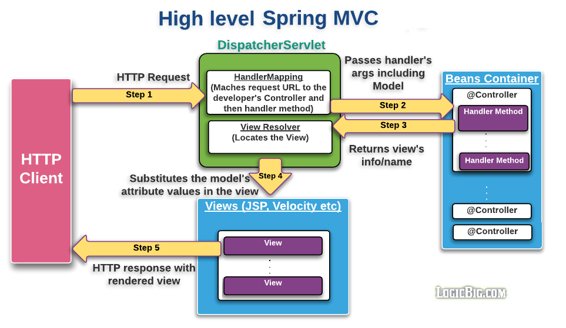

# Getting Started

## What is Spring Web MVC?

* Web Framework

* Based on MVC pattern, it allows developers to build a web application with clear separation of concerns. 

## The Controller

* A spring controller is a simple Java class created by the developer .

* This class is typically annotated with @Controller on the class level.

* The controller and/or its methods are mapped to request URI using @RequestMapping.

* The controller's methods are usually known as handlers.

* There can be multiple controller classes in an application.

* A controller is registered as a bean. That means we can inject any other bean/service there.

* The default scope of a controller is singleton.

A typical controller class looks like this:

```java
@Controller
public class MyController {
    @RequestMapping(value = "/my-handler-path", method = RequestMethod.GET)
    public String myHandlerMethod(...) {
       .....
    }
}
```

We have to register the controllers as beans (either by scanning or explicit factory @Bean methods):

```java
@Configuration
public class MyWebConfig {
    @Bean
    public MyController myController() {
        return new MyController();
    }
}
```

In above example the handler method returns String but that's not an absolute requirement.

The handler's method signature is very flexible. It can accept various type of parameters and return types, we will be exploring that in this series of tutorials.

## The Model

* org.springframework.ui.Model serves as MVC model.

* It binds the view attributes with application specific values.

* If the handler method parameters list has Model type, its instance is passed by Spring.

```java
@Controller
public class MyMvcController {
    @RequestMapping(value = "/my-uri-path")
    public String prepareView(Model model) {
       model.addAttribute("msg", "msg-value");
        .....
    }
}
```

## The View

* Generally speaking it's anything which implements org.springframework.web.servlet.View.

* Spring framework comes with many views.

* One of the commonly used views is JstlView, which expects JSP resources be provided at specified location under webapp directory. That means a developer responsibility is to provide a JSP file.

* A JSP file uses model's provided attribute. for example:

```jsp
<%@ page language="java"
    contentType="text/html; charset=ISO-8859-1"
    pageEncoding="ISO-8859-1"%>
<html>
<body>
Message : ${msg}
</body>
</html>
```

## What is ViewResolver?

* ViewResolver is an interface.

* Typically, the implementation of this interface is responsible to resolve views by name.

* We don't have to implement it ourselves as there are already many view resolvers available.

* One of the commonly used view resolvers is InternalResourceViewResolver, it's default View is JstlView, which can be changed.

* We can configured multiple view resolver in an application.

* We configure view resolver as a bean:

```java
@Configuration
public class MyWebConfig {

    @Bean
    public ViewResolver viewResolver() {
        InternalResourceViewResolver viewResolver =
                      new InternalResourceViewResolver();

        viewResolver.setPrefix("/WEB-INF/views/");
        viewResolver.setSuffix(".jsp");
        return viewResolver;
    }
}
```

Per above configuration the Jstl resources must be located under /WEB-INF/views/ directory and must have file extension of jsp.

## What is DispatcherServlet?

* This is the central servlet (front controller).

* Spring web MVC framework is request-driven and designed around DispatcherServlet.

* DispatcherServlet delegates the requests to the controllers based on the requested URI. Here's how it works:
    * When DispatcherServlet receives a web client request, it matches one of the application controllers (based on the requested URI). The servlet uses HandlerMapping object internally to match the controller.

    * The servlet then invokes the appropriate handler's method. The servlet also prepares and passes arguments to the handler method, including the instance of org.springframework.ui.Model as an argument.

    * At this point the application specific code is invoked in the handler's method. The code is responsible to prepare the model (based on business logic) and typically returns the view name back to the servlet.

    * Based on the returned view name, the servlet locates the view (ViewResolver is used to locate the view), substitute the model provided attribute values in the view and then returns that to the client as response.
        * For view technologies such as JSPs, the Servlet or JSP engine is invoked for processing before view is returned to the client.

        * For other view technologies, such as Velocity, XSLT, and so on, the view itself writes the content directly to the response stream.

        * The view name returned from the controller is internal selection of the view to render and should not be confused with URL redirection. The requested URL remains the same.



## What is WebApplicationInitializer?

In Servlet 3.0+, we can register DispatcherServlet programmatically (we can also use web.xml instead). All we have to do is to implement WebApplicationInitializer. It is invoked based on javax.servlet.ServletContainerInitializer concept.

In the implementation of WebApplicationInitializer we typically register DispatcherServlet.

We also initiate the Spring container, AnnotationConfigWebApplicationContext along with registering the class annotated with @Configuration. Here's how the implementation will look like:

```java
public class MyWebInitializer implements WebApplicationInitializer {

    @Override
    public void onStartup(ServletContext servletContext) throws ServletException {
        AnnotationConfigWebApplicationContext ctx =
                  new AnnotationConfigWebApplicationContext();
        ctx.register(MyWebConfig.class);
        ctx.setServletContext(servletContext);

        //using servlet 3 api to dynamically register
        //spring dispatcher servlet
        ServletRegistration.Dynamic servlet =
                  servletContext.addServlet("springDispatcherServlet",
                                            new DispatcherServlet(ctx));

        servlet.setLoadOnStartup(1);
        servlet.addMapping("/");
    }
}
```

## What is AnnotationConfigWebApplicationContext?

This class implements WebApplicationContext.

The interface WebApplicationContext extends ApplicationContext. So it's a representation of the spring IOC container. In addition to managing beans and DI stuff, it has the instance of javax.servlet.ServletContext as well.

AnnotationConfigWebApplicationContext implements AnnotationConfigRegistry as well (just like AnnotationConfigApplicationContext), so it accepts annotated classes as input, in particular @Configuration-annotated classes.

<p align='center'><a href="../README.md">Previous Page</a> | <a href="../02-mvc-configuration/README.md">Next Page</p>
