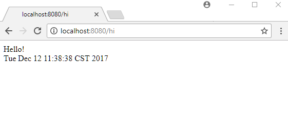

# Using Spring 5.0 WebMvcConfigurer default methods

Since Spring 5.0, WebMvcConfigurer has Java 8 default methods. That means, for MVC configuration, we can implement this interface directly without extending WebMvcConfigurerAdapter (deprecated in 5.0).

## Example

**Implementing WebMvcConfigurer**

```java
@EnableWebMvc
@Configuration
@ComponentScan
public class MyWebConfig implements WebMvcConfigurer {

  @Override
  public void configureViewResolvers(ViewResolverRegistry registry) {
      registry.jsp("/WEB-INF/views/", ".jsp");
  }

  @Override
  public void addViewControllers(ViewControllerRegistry registry) {
      //this will map uri to jsp view directly without a controller
      registry.addViewController("/hi")
              .setViewName("hello");
  }
}
```

**src/main/webapp/WEB-INF/views/hello.jsp**
```xml
<%@ page language="java"
contentType="text/html; charset=ISO-8859-1"
pageEncoding="ISO-8859-1"%>
<html>
<body>
Hello! <br/>
<%= new java.util.Date().toString() %>
</body>
</html>
```

## Output

