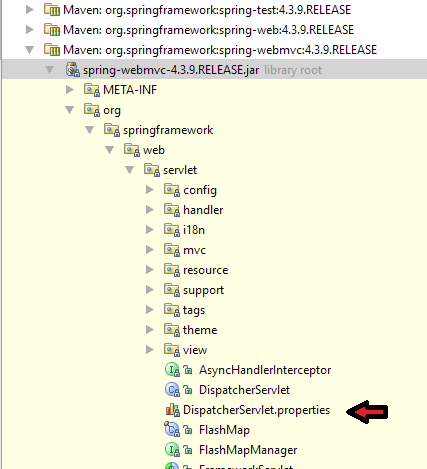

# What is DispatcherServlet.properties?

DispatcherServlet.properties contains the list of default strategy objects/handlers used by the DispatcherServlet.

This file is located at the same location as DispatcherServlet.java :



Following are the contents from version 4.3.9.RELEASE:

```shell
# Default implementation classes for DispatcherServlet's strategy interfaces.
# Used as fallback when no matching beans are found in the DispatcherServlet context.
# Not meant to be customized by application developers.

org.springframework.web.servlet.LocaleResolver=org.springframework.web.servlet.i18n.AcceptHeaderLocaleResolver

org.springframework.web.servlet.ThemeResolver=org.springframework.web.servlet.theme.FixedThemeResolver

org.springframework.web.servlet.HandlerMapping=org.springframework.web.servlet.handler.BeanNameUrlHandlerMapping,\
	org.springframework.web.servlet.mvc.annotation.DefaultAnnotationHandlerMapping

org.springframework.web.servlet.HandlerAdapter=org.springframework.web.servlet.mvc.HttpRequestHandlerAdapter,\
	org.springframework.web.servlet.mvc.SimpleControllerHandlerAdapter,\
	org.springframework.web.servlet.mvc.annotation.AnnotationMethodHandlerAdapter

org.springframework.web.servlet.HandlerExceptionResolver=org.springframework.web.servlet.mvc.annotation.AnnotationMethodHandlerExceptionResolver,\
	org.springframework.web.servlet.mvc.annotation.ResponseStatusExceptionResolver,\
	org.springframework.web.servlet.mvc.support.DefaultHandlerExceptionResolver

org.springframework.web.servlet.RequestToViewNameTranslator=org.springframework.web.servlet.view.DefaultRequestToViewNameTranslator

org.springframework.web.servlet.ViewResolver=org.springframework.web.servlet.view.InternalResourceViewResolver

org.springframework.web.servlet.FlashMapManager=org.springframework.web.servlet.support.SessionFlashMapManager
```

## How DispatcherServlet.properties is used?

DispatcherServlet loads these properties during class loading.

The DispatcherServlet, during initializing different strategies (DispatcherServlet#initStrategies()), checks one by one if those strategies have already been registered; if not, it uses the strategy set by DispatcherServlet.properties. That means if we register different strategies bean in our application ( e.g HandlerMapping, HandlerAdapter etc) or by other means like by using @EnableWebMvc, the strategies listed in DispatcherServlet.properties, will not be used.