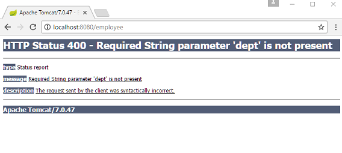
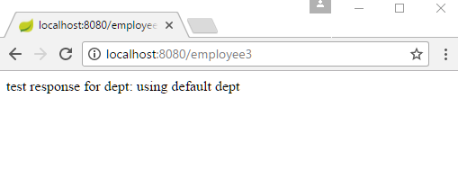

# Using java.util.Optional as handler method parameter

Spring supports JDK 1.8's java.util.Optional as a method parameter type as an alternative to using 'required' element of some of the annotations. Let's understand that with an example.

## Without java.util.Optional

In this example, we are going to use @RequestParam:

```java
@Controller
public class EmployeeController {

  @RequestMapping("/employee")
  @ResponseBody
  public String getEmployeeByDept(@RequestParam("dept") String deptName) {
      return "test response for dept: " + deptName;
  }
    .............
}
```

If we make the request without 'dept' query param, 400 Bad Request error will be returned:



One way to avoid above error (given that dept is really an optional param from business logic perspective) is to use 'required=false' of @RequestParam.

```java
@Controller
public class EmployeeController {
    .............
  @RequestMapping("/employee2")
  @ResponseBody
  public String getEmployeeByDept2(@RequestParam(value = "dept", required = false)
                                              String deptName) {
      return "test response for dept: " + deptName;
  }
    .............
}
```

## Using java.util.Optional

As Spring always tries to align the framework with standard JSE/JEE API, it now supports (since 4.3) java.util.Optional as an alternative to using 'required' element:

```java
@Controller
public class EmployeeController {
    .............
  @RequestMapping("/employee3")
  @ResponseBody
  public String getEmployeeByDept3 (@RequestParam("dept") Optional<String> deptName) {
      return "test response for dept: " + (deptName.isPresent() ? deptName.get() :
                "using default dept");
  }
}
```

