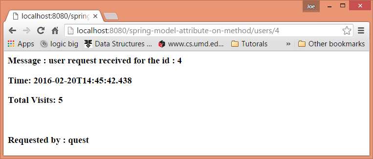
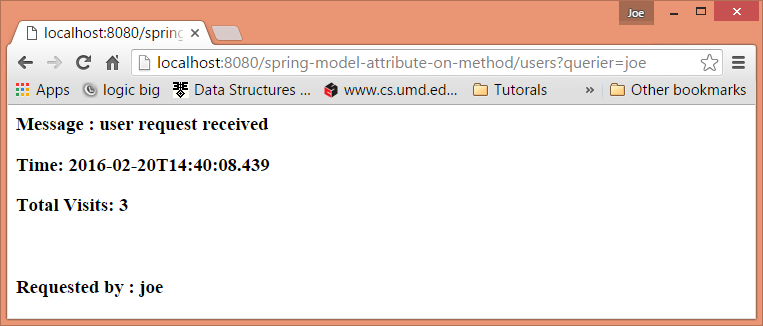
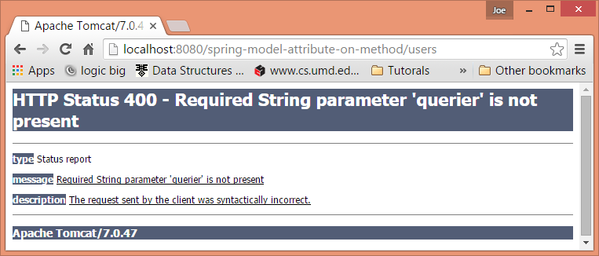

# Prepopulate Model with Common Attributes Using @ModelAttribute

The primary purpose of annotation @ModelAttribute is to prepopulate Model object before a handler method is called.

This annotation can be used on method level.

This annotation can also be used on handler method parameters. (Explained in next tutorial)

A controller can have any number of @ModelAttribute methods.

These methods support the same argument types as @RequestMapping methods

When a request comes in, all @ModelAttribute annotated methods are invoked before the target handler method is invoked.

The data return by each method is populated in the Model object before Spring calls the handler method.

As Model needs a pair of name and value to populate, @ModelAttribute element 'value' is used as attribute name and the method returned object is used as value. If no 'value' is specified in @ModelAttribute then the returned type is used as the attribute name.

This annotation is used to populated common model attributes for multiple request handlers. Just like other model attributes, the values populated this way, can be accessed in the view.

## Creating method with @ModelAttribute

These methods can have any parameters which are supported by handler methods, e.g. @RequestParam, @PathVariable, Model etc. It can return any object or primitive or it can also be void. In case of void no value is populated in the Model but the method can use Model parameter to populate it.

Note the two styles of @ModelAttribute methods. In the first, the method adds an attribute implicitly by returning it. In the second, the method accepts a Model and adds any number of model attributes to it. You can choose between the two styles depending on your needs.

In the following example, there are three methods annotated with @ModelAttribute and two request handlers:

```java
@Controller
@RequestMapping("users")
public class UserController {
    private static final Logger LOGGER = Logger.getLogger(UserController.class.getName());

    private static int counter = 0;

    @RequestMapping
    public String handleRequest (Model model) {
        model.addAttribute("msg", "user request received");
        LOGGER.info(model.toString());
        return "my-page";
    }

    @RequestMapping("{id}")
    public String handleRequestById (@PathVariable("id") String id, Model model) {
        model.addAttribute("msg", "user request received for the id : " + id);
        LOGGER.info(model.toString());
        return "my-page";
    }

    @ModelAttribute("time")
    public LocalDateTime getRequestTime () {
        return LocalDateTime.now();
    }

    @ModelAttribute("visits")
    public int getRequestCount () {
        return ++counter;
    }

    @ModelAttribute("querier")
    public void populateQuerierInfo (@RequestParam(value = "querier",
                                                   required = false)
                                     String querier,
                                     Model model) {
        model.addAttribute("querier", querier == null ? "quest" : querier);
    }
}
```

Here's the output.

Request: **/users**


Request: **/users/4**



Request: **/users?querier=joe**



As seen in the output for all requests, the three @ModelAttribute methods are invoked every time.

It's important to understand that all @ModelAttribute annotated methods are invoked on all requests. Spring doesn't provide a way to selectively invoke few @ModelAttribute methods based on the request. In our example, the last method populateQuerierInfo has @RequestParam with required=false. If we change it to required=true and the querier param is not present in the URL, then Spring will return this error:



That means all method with @ModelAttribute should be able to accept all request attributes.
