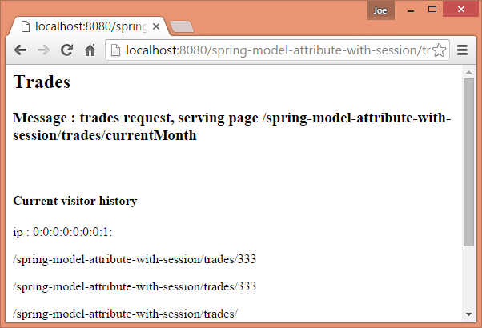
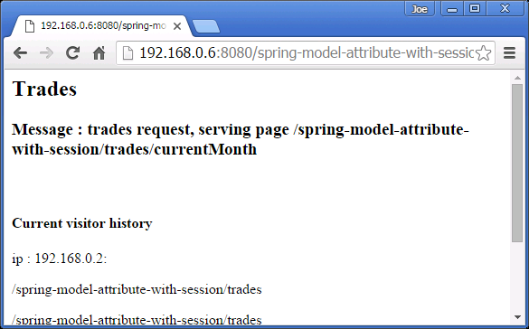
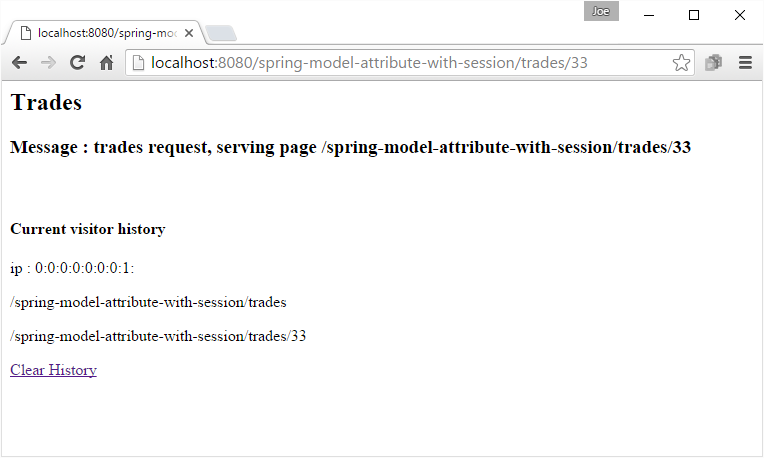
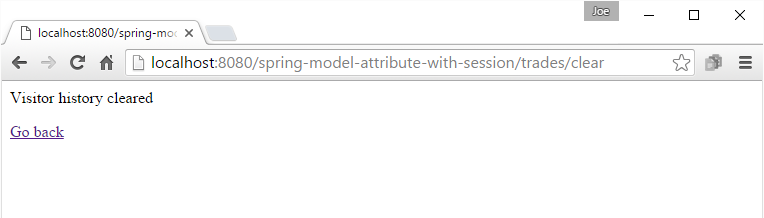

# Store Model attributes in HTTP session with @SessionAttributes

The annotation @SessionAttributes is used on class level. Typically it's used on the @Controller class. It's 'value' element is of type String[] whose values are the matching names used in @ModelAttribute either on method level or on handler's method parameter level.

Let's consider following arrangement:

```java
@Controller
@SessionAttributes("visitor")
@RequestMapping("/trades")
public class TradeController {

    @ModelAttribute("visitor")
    public Visitor getVisitor (....) {
        return new Visitor(....);
    }
  ....
}
```

In above code, when a request comes in, the first thing Spring will do is to notice @SessionAttributes('visitor') and then attempt to find the value of 'visitor' in javax.servlet.http.HttpSession. If it doesn't find the value, then the method with @ModelAttribute having the same name 'visitor' (method getVisitor()) will be invoked. The returned value from such method will be used to populate the session with name 'visitor'.

Now that 'visitor' with it's value is already in HttpSession, let's consider following arrangement:

```java
@Controller
@SessionAttributes("visitor")
@RequestMapping("/trades")
public class TradeController {

    @RequestMapping("/**")
    public String handleRequestById (@ModelAttribute("visitor") Visitor visitor,
                                     Model model,
                                     HttpServletRequest request) {
        model.addAttribute("msg", "trades request, serving page " +
                                                 request.getRequestURI());
        visitor.addPageVisited(request.getRequestURI());
        return "traders-page";
    }
   .......
}
```

On finding @ModelAttribute("visitor") in the target handler method, Spring will retrieve the value of 'visitor' from the session and will assign the value to the Visitor parameter and will invoke the method. At this step, Spring doesn't care how the session was populated with 'visitor', Whether it was populated using the last arrangement or some other way, it doesn't matter, Spring only requires the annotation @SessionAttributes('visitor'), the handler method parameter with @ModelAttribute("visitor") and the value of 'visitor' in HttpSession. If spring can't find it in the session and last arrangement is not available then following exception will be thrown:

org.springframework.web.HttpSessionRequiredException: Expected session attribute 'visitor'

In other words: when the target handler method is invoked first time in a given session, then method with @ModelAttribute('visitor') is invoked, the returned value is populated in HttpSession and the handler method with the same value is invoked. For the subsequent requests within the same HTTPSession, Spring retrieves the same object from the session and doesn't call the method with @ModelAttribute('visitor') again till the end of the session

Following is the complete controller class:

```java
@Controller
@SessionAttributes("visitor")
@RequestMapping("/trades")
public class TradeController {

    @RequestMapping("/**")
    public String handleRequestById (@ModelAttribute("visitor") Visitor visitor,
                                     Model model,
                                     HttpServletRequest request) {
        model.addAttribute("msg", "trades request, serving page " +
                                                 request.getRequestURI());
        visitor.addPageVisited(request.getRequestURI());
        return "traders-page";
    }

    @ModelAttribute("visitor")
    public Visitor getVisitor (HttpServletRequest request) {
        return new Visitor(request.getRemoteAddr());
    }
}
```

In above example we are tracking the user visited pages within the same HTTP session. We are using the wildcard '/**' so that all request starting with 'trades' will map to this controller.


## Removing Model Attribute from the session

Once the value returned from @ModelAttribute method is populated in the HTTPSession, it remains there till the end of the session.

We can, however, remove the attribute manually from the session by using org.springframework.web.bind.support.SessionStatus as handler method parameter and conditionally calling SessionStatus#setComplete in the handler method. This method signals that the session related processing is completed. Spring then removes the session attribute (using HTTPSession#removeAttribute).

```java
 @RequestMapping("/trades/**")
 public String handleRequestById (@ModelAttribute("visitor") Visitor visitor,
                                  Model model,
                                  HttpServletRequest request,
                                  SessionStatus sessionStatus) {

        model.addAttribute("msg", "trades request, serving page " +
                                                    request.getRequestURI());
        if (request.getRequestURI()
                   .endsWith("clear")) {
            sessionStatus.setComplete();
            return "clear-page";
        } else {
            visitor.addPageVisited(request.getRequestURI());
            return "traders-page";
        }
    }
```

Above example causes the Visitor object to be removed from HTTPSession, only if the requested URL ends with 'clear'. Within the same session, subsequent call to the same handler will re-create the session attribute again(@ModelAttribute method will be invoked again).

```jsp
traders-page.jsp
<%@ page language="java"
    contentType="text/html; charset=ISO-8859-1"
    pageEncoding="ISO-8859-1"%>
<%@taglib prefix="c" uri="http://java.sun.com/jsp/jstl/core"%>
<html>
<body>
<h2>Trades </h2>
   <h3> Message : ${msg} <h3>
<br/>
<h4>Current visitor history</h4>
<p>ip : ${visitor.ip}:</p>
<c:forEach items="${visitor.pagesVisited}" var="page">
    <p>${page}</p>
</c:forEach>

<a href="<%=request.getContextPath()%>/trades/clear">Clear History</a>
</body>
</html>
```

```jsp
clear-page.jsp
<%@ page language="java"
    contentType="text/html; charset=ISO-8859-1"
    pageEncoding="ISO-8859-1"%>
<html>
<body>
<p>Visitor history cleared</p>
<a href="<%=request.getContextPath()%>/trades">Go back</a>
</body>
</html>
```

Use this URL in your browser :

http://localhost:8080/spring-model-attribute-with-session/trades/**

/** can be replace with anything including long URI paths e.g. /trades/currentMonth/323/brokers

## output:

If you are using the same machine then you will get ip as 0:0:0:0:0:0:0:1 which is considered equivalent to 127.0.0.1. 



On another machine in the local network:



Clearing history:





Note:

If we close our browser and open it again with the same url, we will see the previous visitor history has gone. That demonstrates how @SessionAttributes works. If we remove the @SessionAttributes annotation from the controller and we will see that with each request, a new Visitor object is created each time.