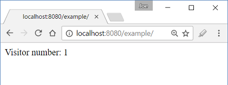

# Accessing pre-existing request attributes using @RequestAttribute

Starting from Spring 4.3, a new annotation @RequestAttribute was introduced. This annotation can be used to bind a request attribute to a handler method parameter.

Spring retrieves the named attribute's value from ServletRequest#getAttribute(String name) to populated the parameter annotated with @RequestAttribute.

Rather than using HttpServletRequest object directly, using this annotation can benefit auto type conversion and optional/required check. This annotation has an element 'required' which is true by default. That means if the attribute value is not present in the request, an exception will be thrown. If we set it to false then we can avoid the exception but the value received can be null.

## Difference between @RequestParam and @RequestAttribute

@RequestParam is used to bind parameter values from 'query string' e.g. in http://www.example.com?myParam=3, myParam=3 can populate @RequestParam parameter. On the other hand, @RequestAttribute is to access objects which have been populated on the server-side but during the same HTTP request, for example they can be populated in an interceptor or a filter. The difference is same as of the difference between ServletRequest#getParameter(name) and ServletRequest#getAttribute(name)

## Example

Following example shows, how to use @RequestAttribute to access visitor counter value, which has been populated as request attribute from an HandlerInterceptor method.

### The interceptor

```java
public class MyCounterInterceptor extends HandlerInterceptorAdapter {
  private AtomicInteger counter = new AtomicInteger(0);

  @Override
  public boolean preHandle (HttpServletRequest request,
                            HttpServletResponse response,
                            Object handler) throws Exception {

      request.setAttribute("visitorCounter", counter.incrementAndGet());
      return true;
  }
}
```

### The controller

```java
@Controller
public class ExampleController {

  @RequestMapping("/")
  @ResponseBody
  public String handle (@RequestAttribute("visitorCounter") Integer counter) {
      return String.format("Visitor number: %d", counter);
  }
}
```

### JavaConfig class

```java
@EnableWebMvc
@ComponentScan("com.logicbig.example")
public class AppConfig extends WebMvcConfigurerAdapter {

  @Override
  public void addInterceptors (InterceptorRegistry registry) {
      registry.addInterceptor(new MyCounterInterceptor());
  }
}
```

### Output

