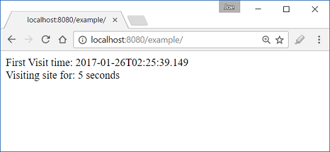

# Accessing pre-existing session attributes using @SessionAttribute

Starting from Spring 4.3, a new annotation @SessionAttribute was introduced. This annotation can be used to bind a session attribute, retrieved from javax.servlet.http.HttpSession, to a handler method parameter.

Rather than using HttpSession object directly, using this annotation can benefit auto type conversion and optional/required check. This annotation has an element 'required' which is true by default. That means if the attribute value is not present in the session, an exception will be thrown. If we set it to false then we can avoid the exception but the value received can be null.

## Difference between @SessionAttributes and @SessionAttribute

We saw in @SessionAttributes tutorial, that it can be used in conjunction with @ModelAttribute. That way of accessing session object is limited to a local controller only and suitable for use cases where workflow is limited to a single controller class e.g. form validation and submission. On the other hand, @SessionAttribute is used for pre-existing session attributes that are managed globally, outside the controller, e.g. in filter, interceptor etc. They are suitable for use cases like storing/accessing user authentication information etc.

## Example

Following example shows, how to use @SessionAttribute to access user first visit time. A custom HandlerInterceptor populates this information in the HttpSession when user first access to the web application.

### The interceptor

```java
public class MyCounterInterceptor extends HandlerInterceptorAdapter {

  @Override
  public boolean preHandle (HttpServletRequest request,
                            HttpServletResponse response,
                            Object handler) throws Exception {
      HttpSession session = request.getSession(true);
      if (session.getAttribute("sessionStartTime") == null) {
          session.setAttribute("sessionStartTime", LocalDateTime.now());
      }
      return true;
  }
}
```

### The controller

```java
@Controller
public class ExampleController {

  @RequestMapping("/")
  @ResponseBody
  public String handle (@SessionAttribute(name = "sessionStartTime")
                        LocalDateTime startDateTime) {

      Duration d = Duration.between(startDateTime, LocalDateTime.now());
      return String.format("First Visit time: %s<br/> Visiting site for:" +
                                     " %s seconds", startDateTime, d.getSeconds());
  }
}
```

### JavaConfig class

```java
@EnableWebMvc
@ComponentScan("com.logicbig.example")
public class AppConfig extends WebMvcConfigurerAdapter {

  @Override
  public void addInterceptors (InterceptorRegistry registry) {
      registry.addInterceptor(new MyCounterInterceptor());
  }
}
```



Refreshing the page multiple times, will increase the number of seconds.