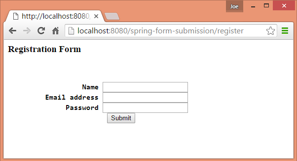
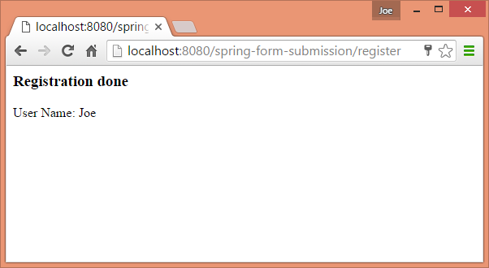

# Simple Form Submission

In this example we are going to demonstrate a simple form submission using spring implicit data binding.

## Create Form backing Object

```java
public class User {
    private Long id;
    private String name;
    private String password;
    private String emailAddress;

    //getters and setters
}
```

## Create the controller

We are creating two handler methods one with RequestMethod.GET to response back with an empty registration form and other one with RequestMethod.POST to handle the form submission. Just like [Java Objects binding examples](../../04-implementing-controllers/05-java-backing-objects/README.md), we don't have to use any @ModelAttribute annotation because Spring implicit data binding will map the form fields to User object fields matched by names.

```java
@Controller
@RequestMapping("/register")
public class UserRegistrationController {

    @Autowired
    private UserService userService;

    @RequestMapping(method = RequestMethod.GET)
    public String handleGetRequest () {
        return "user-registration";
    }

    @RequestMapping(method = RequestMethod.POST)
    public String handlePostRequest (User user, Model model) {
        userService.saveUser(user);
        return "registration-done";
    }
}
```

## Create form page (user-registration.jsp)

```jsp
<%@ page language="java"
    contentType="text/html; charset=ISO-8859-1"
    pageEncoding="ISO-8859-1"%>
<html>
<body>

<h3> Registration Form <h3>
<br/>
<form action="register" method="post" >
<pre>
                  Name <input type="text" name="name" />
         Email address <input type="text" name="emailAddress" />
              Password <input type="password" name="password" />
                        <input type="submit" value="Submit" />
</pre>
</form>
</body>
</html>
```

## Crete Response Page (registration-done.jsp)

```jsp
<%@ page language="java"
    contentType="text/html; charset=ISO-8859-1"
    pageEncoding="ISO-8859-1"%>
<html>
<body>
<h3> Registration done </h3>
<p>User Name: ${user.name}
</body>
</html>
```

## Output

/spring-form-submission/register



On form submission


