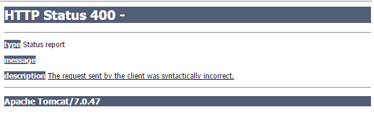

# Form Validation with JSR-349 Bean Validation

Spring supports Bean Validation 1.1 (JSR-303/349) to validate object fields declaratively.

Please see: [What is Bean Validation?](https://www.logicbig.com/quick-info/bean-validation/java-bean-validation.html) and a [standalone example](https://www.logicbig.com/how-to/bean-validation/bean-validation-example.html).

Let's modify our last example to show validation errors in the registration page.

## Backing Object with JSR 349 constraints annotations

```java
import org.hibernate.validator.constraints.Email;
import org.hibernate.validator.constraints.NotEmpty;

import javax.validation.constraints.Pattern;
import javax.validation.constraints.Size;

public class User {
    private Long id;

    @Size(min = 5, max = 20)
    private String name;


    @Size(min = 6, max = 15)
    @Pattern(regexp = "\\S+", message = "Spaces are not allowed")
    private String password;

    @NotEmpty
    @Email
    private String emailAddress;

    //getters and setters
}
```

The two annotations we used above are Hibernate specific custom JSR-349 compliant annotations: Email and NotEmpty.

## The Controller

```java
@Controller
@RequestMapping("/register")
public class UserRegistrationController {

    @Autowired
    private UserService userService;

    @RequestMapping(method = RequestMethod.GET)
    public String handleGetRequest () {
        return "user-registration";
    }

    @RequestMapping(method = RequestMethod.POST)
    public String handlePostRequest (@Valid User user, BindingResult bindingResult,
                                     Model model) {

        if (bindingResult.hasErrors()) {
            populateError("name", model, bindingResult);
            populateError("emailAddress", model, bindingResult);
            populateError("password", model, bindingResult);

            return "user-registration";
        }

        userService.saveUser(user);
        return "registration-done";
    }

    private void populateError (String field, Model model, BindingResult bindingResult) {
        if (bindingResult.hasFieldErrors(field)) {
            model.addAttribute(field + "Error", bindingResult.getFieldError(field)
                                                             .getDefaultMessage());
        }
}
```

### What is @Valid annotation?

This is JSR-349 specific annotation. The annotation @Valid used on instance or parameter marks it to be validated by the framework. In above example Spring will invoke the configured Validator instance on User instance before calling the handler method handlePostRequest. In our example the configured Validator is Hibernate Validator, the reference implementation of JSR-349.


### What is BindingResult?

org.springframework.validation.BindingResult is a general interface that represents binding results. One of it's feature is to contain validation error information.

In our example we are populating field errors into Model to show errors in the registration page. We have a better alternative which is to use spring-form JSP Tag Library. We will cover that in the next tutorial.

The BindingResult parameter has to follow the model object that is being bound immediately as the method signature might have more than one model object and Spring will create a separate BindingResult instance for each of them. 

In our example above 'bindingResult' parameter is immediately after 'user' parameter. If you don't follow this rule you will have 400 error code message 'The request sent by the client was syntactically incorrect'.



## user-registration.jsp

```jsp
<%@ page language="java"
    contentType="text/html; charset=ISO-8859-1"
    pageEncoding="ISO-8859-1"%>
<html>
<head>
<style>
span.error {
   color: red;
}
</style>
</head>
<body>
<h3> Registration Form <h3>
<br/>
 <form action="register" method="post" >
  <pre>
                  Name <input type="text" name="name" value="${user.name}" />
                       <span class="error">${nameError}</span>

         Email address <input type="text" name="emailAddress" value="${user.emailAddress}" />
                       <span class="error">${emailAddressError}</span>

              Password <input type="password" name="password" value="${user.password}" />
                       <span class="error">${passwordError}</span>
                                        <input type="submit" value="Submit" />
  </pre>
 </form>
</body>
</html>
```
