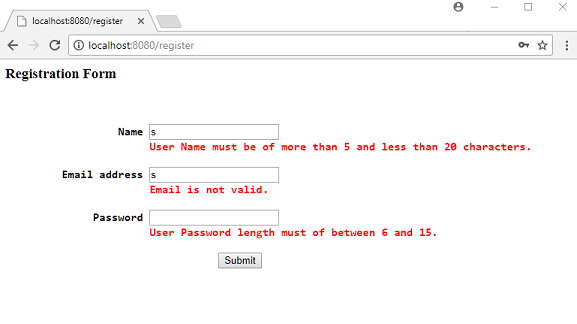

# Form Validation using Java Bean Validation API and External Message Source

Following example shows how to configure and map custom validation error codes to external messages while implementing Java Bean Validation in a Spring MVC application. We are going to reuse our last example. We just need to add our custom message codes with Java Bean Validation annotations and include an external message source.

## Example

### A Java Bean

```java
public class User {
  private Long id;

  @Size(min = 5, max = 20, message = "{user.name.size}")
  private String name;

  @Size(min = 6, max = 15, message = "{user.password.size}")
  @Pattern(regexp = "\\S+", message = "{user.password.pattern}")
  private String password;

  @NotEmpty(message = "{user.email.empty}")
  @Email(message = "{user.email.valid}")
  private String emailAddress;
    .............
}
```

### Message Source

** src/main/resources/ValidationMessages_en.properties **

```shell
user.name.size=User Name must be of more than 5 and less than 20 characters.
user.password.size=User Password length must of between 6 and 15.
user.password.pattern=Password must not have spaces.
user.email.empty=User Email cannot be empty.
user.email.valid=Email is not valid.
```

### Spring Controller

```java
@Controller
@RequestMapping("/register")
public class UserRegistrationController {

  @Autowired
  private UserService userService;

  @RequestMapping(method = RequestMethod.GET)
  public String handleGetRequest (Model model) {
      model.addAttribute("user", new User());
      return "user-registration";
  }

  @RequestMapping(method = RequestMethod.POST)
  public String handlePostRequest (@Valid @ModelAttribute("user") User user,
                                   BindingResult bindingResult, Model model) {
      if (bindingResult.hasErrors()) {
          return "user-registration";
      }

      userService.saveUser(user);
      return "registration-done";
  }
}
```

### JSP Form

** src/main/webapp/WEB-INF/views/user-registration.jsp **

```jsp
<%@taglib uri="http://www.springframework.org/tags/form" prefix="frm"%>
<html>
<head>
<style>
span.error {
color: red;
display: inline-block;
}
</style>
</head>
<body>

<h3> Registration Form <h3>
<br/>
 <frm:form action="register" method="post" commandName="user">
  <pre>
                  Name <frm:input path="name" />
                       <frm:errors path="name" cssClass="error" />

         Email address <frm:input path="emailAddress" />
                       <frm:errors path="emailAddress" cssClass="error" />

              Password <frm:password path="password" />
                       <frm:errors path="password" cssClass="error" />

                                  <input type="submit" value="Submit" />
  </pre>
 </frm:form>
</body>
</html>
```

### Java Config

```java
@EnableWebMvc
@Configuration
@Import(MyViewConfig.class)
public class MyWebConfig {

  @Bean
  public MessageSource messageSource() {
      ResourceBundleMessageSource messageSource = new ResourceBundleMessageSource();
      messageSource.setBasenames("ValidationMessages");
      return messageSource;
  }

  @Bean
  public UserRegistrationController userRegistrationController() {
      return new UserRegistrationController();
  }

  @Bean
  public UserService userService() {
      return new InMemoryUserService();
  }
}
```

## Output

Submitting invalid values:

