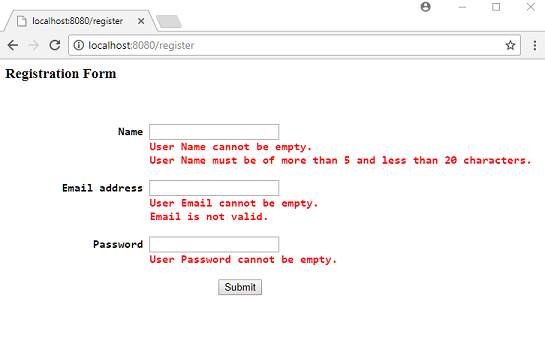

# Form Validation using Spring Validator Interface

Following example shows how to use Spring native validation (check out related [core tutorial](https://www.logicbig.com/tutorials/spring-framework/spring-core/core-validation.html)) in a MVC application. We need to implement Validator interface and perform validation programmatically. This is an alternative to JSR 349/303 annotation based validations (last example).

## Example

### A Java Bean

```java
public class User {
  private Long id;
  private String name;
  private String password;
  private String emailAddress;
    .............
}
```

### Implementing Validator

```java
package com.logicbig.example;

import org.springframework.validation.Errors;
import org.springframework.validation.ValidationUtils;
import org.springframework.validation.Validator;
import java.util.regex.Pattern;

public class UserValidator implements Validator {
  private static final Pattern EMAIL_REGEX =
          Pattern.compile("^[\\w\\d._-]+@[\\w\\d.-]+\\.[\\w\\d]{2,6}$");

  @Override
  public boolean supports(Class<?> clazz) {
      return clazz == User.class;
  }

  @Override
  public void validate(Object target, Errors errors) {
      ValidationUtils.rejectIfEmpty(errors, "name", "user.name.empty");
      ValidationUtils.rejectIfEmpty(errors, "password", "user.password.empty");
      ValidationUtils.rejectIfEmpty(errors, "emailAddress", "user.email.empty");

      User user = (User) target;
      if (user.getName() != null && user.getName().length() < 5 ||
              user.getName().length() > 20) {
          errors.rejectValue("name", "user.name.size");
      }

      if (user.getPassword() != null && user.getPassword().contains(" ")) {
          errors.rejectValue("password", "user.password.space");
      }

      if (user.getPassword() != null && user.getPassword().length() < 5 &&
              user.getPassword().length() > 15) {
          errors.rejectValue("password", "user.password.size");
      }

      if (user.getEmailAddress() != null && !EMAIL_REGEX.matcher(user.getEmailAddress()).matches()) {
          errors.rejectValue("emailAddress", "user.email.invalid");
      }
  }
}
```

### Message Source

** src/main/resources/ValidationMessages_en.properties **

```shell
user.name.empty=User Name cannot be empty.
user.name.size=User Name must be of more than 5 and less than 20 characters.
user.password.empty=User Password cannot be empty.
user.password.size=User Password length must of between 6 and 15.
user.password.space=Password must not have spaces.
user.email.empty=User Email cannot be empty.
user.email.invalid=Email is not valid.
```

### Spring Controller

```java
@Controller
@RequestMapping("/register")
public class UserRegistrationController {

  @Autowired
  private UserService userService;

  @RequestMapping(method = RequestMethod.GET)
  public String handleGetRequest (Model model) {
      model.addAttribute("user", new User());
      return "user-registration";
  }

  @RequestMapping(method = RequestMethod.POST)
  public String handlePostRequest (@ModelAttribute("user") User user,
                                   BindingResult bindingResult, Model model) {
      new UserValidator().validate(user, bindingResult);
      if (bindingResult.hasErrors()) {
          return "user-registration";
      }

      userService.saveUser(user);
      return "registration-done";
  }
}
```

### JSP Form

** src/main/webapp/WEB-INF/views/user-registration.jsp **

```jsp
<%@taglib uri="http://www.springframework.org/tags/form" prefix="frm"%>
<html>
<head>
<style>
span.error {
color: red;
display: inline-block;
}
</style>
</head>
<body>

<h3> Registration Form <h3>
<br/>
 <frm:form action="register" method="post" commandName="user">
  <pre>
                  Name <frm:input path="name" />
                       <frm:errors path="name" cssClass="error" />

         Email address <frm:input path="emailAddress" />
                       <frm:errors path="emailAddress" cssClass="error" />

              Password <frm:password path="password" />
                       <frm:errors path="password" cssClass="error" />

                                  <input type="submit" value="Submit" />
  </pre>
 </frm:form>
</body>
</html>
```

### Java Config

```java
@EnableWebMvc
@Configuration
public class MyWebConfig {

  @Bean
  public MessageSource messageSource() {
      ResourceBundleMessageSource messageSource = new ResourceBundleMessageSource();
      messageSource.setBasenames("ValidationMessages");
      return messageSource;
  }

  @Bean
  public UserRegistrationController userRegistrationController() {
      return new UserRegistrationController();
  }

  @Bean
  public UserService userService() {
      return new InMemoryUserService();
  }

  @Bean
  public ViewResolver viewResolver () {
      InternalResourceViewResolver viewResolver = new InternalResourceViewResolver();
      viewResolver.setPrefix("/WEB-INF/views/");
      viewResolver.setSuffix(".jsp");
      return viewResolver;
  }
}
```

## Output

Submitting invalid values:



