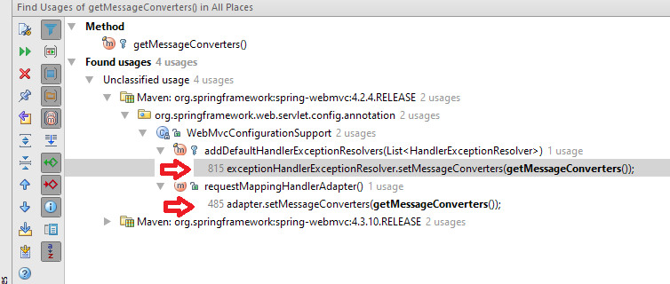

# List of default registered HttpMessageConverter

The registered `HttpMessageConverter` list is normally used at two places: `RequestMappingHandlerAdapter` and `HandlerExceptionResolvers`. The list is same at both places. This can be confirmed by finding `WebMvcConfigurationSupport#getMessageConverters()` method references in your IDE. Following screenshot is from Intellij:



In this quick example, we will see how to print list of all registered converters.

```java
@EnableWebMvc
public class AppConfig {

  @Autowired
  private RequestMappingHandlerAdapter handlerAdapter;

  @EventListener
  public void handleContextRefresh(ContextRefreshedEvent event) {
      System.out.println("-- context refreshed --");
      System.out.println("context: "+
              event.getApplicationContext());

      handlerAdapter.getMessageConverters()
                    .stream()
                    .forEach(System.out::println);
      System.out.println("-------");
  }
}
```

To try examples, run embedded tomcat.

**Output**

On the server console:

```
Mar 05, 2018 2:31:08 PM org.apache.catalina.startup.Catalina load
INFO: Initialization processed in 2061 ms
-- context refreshed --
context: Root WebApplicationContext: startup date [Mon Mar 05 14:31:15 EST 2018]; root of context hierarchy
org.springframework.http.converter.ByteArrayHttpMessageConverter@3679dc44
org.springframework.http.converter.StringHttpMessageConverter@702436e4
org.springframework.http.converter.ResourceHttpMessageConverter@36217234
org.springframework.http.converter.ResourceRegionHttpMessageConverter@51697525
org.springframework.http.converter.xml.SourceHttpMessageConverter@290a08b0
org.springframework.http.converter.support.AllEncompassingFormHttpMessageConverter@78c88863
org.springframework.http.converter.xml.Jaxb2RootElementHttpMessageConverter@45c5e59c
-------
-- context refreshed --
context: WebApplicationContext for namespace 'dispatcher-servlet': startup date [Mon Mar 05 14:31:16 EST 2018]; parent: Root WebApplicationContext
org.springframework.http.converter.ByteArrayHttpMessageConverter@3679dc44
org.springframework.http.converter.StringHttpMessageConverter@702436e4
org.springframework.http.converter.ResourceHttpMessageConverter@36217234
org.springframework.http.converter.ResourceRegionHttpMessageConverter@51697525
org.springframework.http.converter.xml.SourceHttpMessageConverter@290a08b0
org.springframework.http.converter.support.AllEncompassingFormHttpMessageConverter@78c88863
org.springframework.http.converter.xml.Jaxb2RootElementHttpMessageConverter@45c5e59c
-------
Mar 05, 2018 2:31:22 PM org.apache.catalina.startup.Catalina start
INFO: Server startup in 14328 ms
```

The list is printed twice on two parent/child contexts refresh events.

The list might be different from version to version, also there might be more converters depending on the dependencies on the classpath and other application level custom converters. 