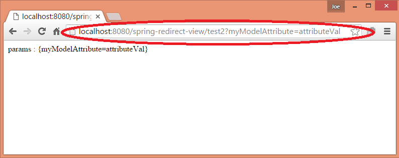

# Redirecting using RedirectView

To redirect HTTP request to another URL we can inject `javax.servlet.http.HttpServletResponse` to handler method and use the method:

```
HttpServletResponse.sendRedirect(String location)
```

Unlike URL forward (which is entirely server internal redirect), URL redirect sends the redirect HTTP code (typically 302) to the client browser along with new 'Location' header. The Browser re-submits the new 'Location' URL to the server. The redirected URL can point to the same domain or to a different domain. Other than 302 status code there are a number of other codes which can be used. Please check out our tutorials on [basics of URL redirection](https://www.logicbig.com/quick-info/web/url-redirection.html) and [URL redirect in Java Servlet](https://www.logicbig.com/tutorials/java-ee-tutorial/java-servlet/servlet-redirect.html).

## Using RedirectView

RedirectView is the suggested way to perform URL redirection.

We have to create and return an instance of `RedirectView` from the handler method:

```java
@Controller
public class MyController {

    @RequestMapping("test")
    public RedirectView handleTestRequest (Model model) {
        model.addAttribute("myModelAttribute", "attributeVal");
        RedirectView rv = new RedirectView();
        rv.setUrl("test2");
        return rv;
    }

    @RequestMapping("test2")
    public String handleRequest (@RequestParam Map<String, String> params,
                                 Model model) {
        model.addAttribute("params", params);
        return "my-page";
    }
}
```

In above example `handleTestRequest` returns instance of `RedirectView`. The attributes added to Model in this method are used as query string in the resultant new redirected URL location i.e. `test2?myModelAttribute=attributeVal`.

The `RedirectView` internally calls `HttpServletResponse.sendRedirect()` to send an HTTP redirect to the client browser.

By default, 302 (Found) status code is sent. If we want to send HTTP 1.1 compatible 303 (See other) status code, we have to set `RedirectView#setHttp10Compatible(false)`. We can set any 3xx status code by using `RedirectView#setStatusCode(..)`.

## The unit test

```java
@RunWith(SpringJUnit4ClassRunner.class)
@WebAppConfiguration
@ContextConfiguration(classes = MyWebConfig.class)
public class ControllerTest {

    @Autowired
    private WebApplicationContext wac;
    private MockMvc mockMvc;

    @Before
    public void setup () {
        DefaultMockMvcBuilder builder = MockMvcBuilders.webAppContextSetup(this.wac);
        this.mockMvc = builder.build();
    }

    @Test
    public void testUserController () throws Exception {

        MockHttpServletRequestBuilder builder =
                            MockMvcRequestBuilders.get("/test");

        this.mockMvc.perform(builder)
                   .andDo(MockMvcResultHandlers.print())
                   .andExpect(MockMvcResultMatchers.redirectedUrl
                                  ("test2?myModelAttribute=attributeVal"));

    }
}
```

## When URL redirection should be used?

Redirect should be used to avoid double form POST submission:

> It is sometimes desirable to issue an HTTP redirect back to the client, before the view is rendered. This is desirable, for example, when one controller has been called with POST data, and the response is actually a delegation to another controller (for example on a successful form submission). In this case, a normal internal forward will mean that the other controller will also see the same POST data, which is potentially problematic if it can confuse it with other expected data. Another reason to perform a redirect before displaying the result is to eliminate the possibility of the user submitting the form data multiple times. In this scenario, the browser will first send an initial POST; it will then receive a response to redirect to a different URL; and finally the browser will perform a subsequent GET for the URL named in the redirect response. Thus, from the perspective of the browser, the current page does not reflect the result of a POST but rather of a GET. The end effect is that there is no way the user can accidentally re-POST the same data by performing a refresh. The refresh forces a GET of the result page, not a resend of the initial POST data.

## Running the App

Enter the URL in your browser

http://localhost:8080/spring-redirect-view/test

You will see that on receiving response, the URL will change in the browser and will be re-submitting (two round trips)

