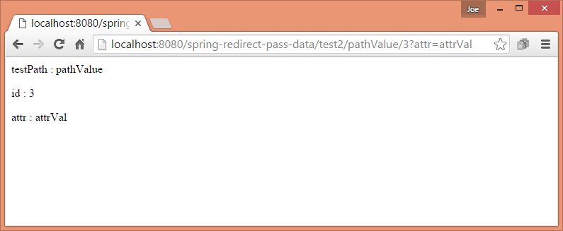

# Passing Data To the Redirect Target

In this tutorial we are going to understand default mechanism of passing data to the redirect target.

When redirecting to other URL (which in turn calls another controller method ) the model attributes by default are first matched with URI template variable if there are any. After matching template variable, the remaining model attributes, if they are of primitive types, are appended as query parameters.

Let's understand that with examples

## Redirecting with template variables

If the requested URL has template URI variable they can be redirected as it is:

```java
@Controller
public class MyController {

    @RequestMapping(value = "test/{id}")
    public RedirectView handleTestRequest (Model model) {
        ........
        RedirectView rv = new RedirectView();
        rv.setContextRelative(true);
        rv.setUrl("/test2/{id}");
        return rv;
    }

    @RequestMapping("test2/{id}")
    public String handleRequest (@PathVariable("id") String id,
                                 Model model) {

         .......
        return "my-page";
    }
}
```

## RedirectView.setContextRelative(true)

When set to true the redirected URL that starts with a slash ("/") is considered as relative to the current `ServletContext`, i.e. as relative to the web application root. Default is "false": A URL that starts with a slash will be interpreted as absolute, i.e. taken as-is. If "true", the context path will be prepended to the URL in such a case.

In above example if you don't set it to true, the redirected path will be considered as http://localhost:8080/test2/{id} instead of http://localhost:8080/context-root/test2/{id}

Also if we don't set the above flag and our redirected URL starts without a slash i.e. test2/{id} instead of /test2/{id}, the resultant redirected URL will be considered relative to the current path i.e. http://localhost:8080/context-root/test/test2/{id} instead of http://localhost:8080/context-root/test2/{id}

In practice we should always use a leading slash in redirected URL and set this flag to true if we want to work relative to application root.

## Automatic substitution of template URI variables from Model

If there are any attributes in the Model object which matches the template URI variable names, then their values will be substituted before the redirect URL is sent to the browser:


```java
@Controller
public class MyController {

    @RequestMapping(value = "test/{id}")
    public RedirectView handleTestRequest (Model model) {
        model.addAttribute("attr", "attrVal");
        model.addAttribute("testPath", "pathValue");

        RedirectView rv = new RedirectView();
        rv.setContextRelative(true);
        rv.setUrl("/test2/{testPath}/{id}");
        return rv;
    }

    @RequestMapping("test2/{testPath}/{id}")
    public String handleRequest (@PathVariable("testPath") String testPath,
                                 @PathVariable("id") String id,
                                 @RequestParam("attr") String attr,
                                 Model model) {

        model.addAttribute("testPath", testPath);
        model.addAttribute("id", id);
        model.addAttribute("attr", attr);
        return "my-page";
    }
}
```

In above example the template variable '{testPath}' matches with a model attribute, so it will be automatically substituted. The remaining model attribute 'id' will be appended as query string.

In browser, if we enter the URL http://localhost:8080/context-root/test/3, then browser will receive the new redirected URL as http://localhost:8080/context-root/test2/pathValue/3?attr=attrVal

