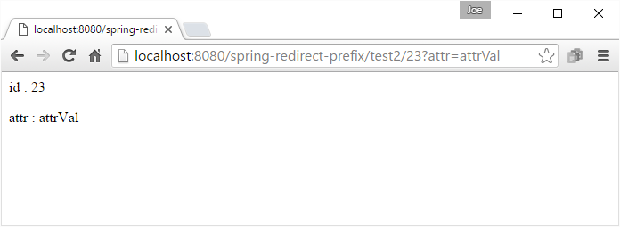
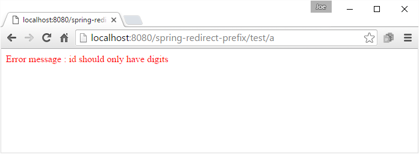

# Using redirect: prefix

Other than `RedirectView` , Spring provides another option to perform redirection, that is return redirected url as String with prefix `redirect:`. The net effect is the same as if the controller had returned a `RedirectView`, but with this option the controller itself can simply operate in terms of logical view names.

The prefix `redirect:` is a special directive for the view resolver to treat the returned string as URL redirection rather than as a view name.

A logical view name such as `redirect:/some/resource` will redirect relative to the current Servlet context, while a name such as `redirect:http://www.example.com/path` will redirect to an absolute URL.

The controller conditionally can return a view name or redirected URL.

By default status code 302 is sent. If we want to change that we can annotate the return type of handler method with `@ResponseStatus(..)`.

## The Controller

In this example: if the path template variable `id` consists of digits then redirect to different URL otherwise return the error page view name.

```java
@Controller
public class MyController {

    @RequestMapping(value = "test/{id}")
    public String handleTestRequest (@PathVariable("id") String id, Model model) {
        if (!id.matches("\\d+")) {
            model.addAttribute("msg", "id should only have digits");
            return "error-page";
        } else {
            model.addAttribute("attr", "attrVal");
            return "redirect:/test2/{id}";
        }
    }

    @RequestMapping("test2/{id}")
    public String handleRequest (@PathVariable("id") String id,
                                 @RequestParam("attr") String attr,
                                 Model model) {

        model.addAttribute("id", id);
        model.addAttribute("attr", attr);
        return "my-page";
    }
}
```

### my-page.jsp

```jsp
<%@ page language="java"
    contentType="text/html; charset=ISO-8859-1"
    pageEncoding="ISO-8859-1"%>
<html>
<body>
<p> id : ${id}</p>
<p> attr : ${attr}</p>
</body>
</html>
```

### error-page.jsp

```jsp
<%@ page language="java"
    contentType="text/html; charset=ISO-8859-1"
    pageEncoding="ISO-8859-1"%>
<html>
<body>
<p style="color:red;"> Error message : ${msg}</p>
</body>
</html>
```

Enter a valid URL e.g. http://localhost:8080/spring-redirect-prefix/test/23. The URL in the address bar will change due to redirection http://localhost:8080/spring-redirect-prefix/test2/23?attr=attrVal.



Now enter an invalid URL which will show the error page (no redirection will happen):

