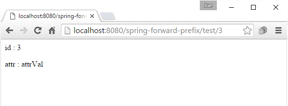

# Using forward: prefix

Like `redirect:` prefix , Spring also allows to use special directive `forward:` to return forwarded url as String.

On encountering this special prefix in the return value of a controller, Spring uses `javax.servlet.RequestDispatcher#forward` to forward a request from one controller to another.

Forwarding a URL transfers the request internally within the same server without involving the client browser, that means in the browser the original request URL remains same and there's only one round trip instead of two (which is the case of redirect).
	
The following example demonstrates the use of 'forward:'

## The Controller

We have to manually prepare the forwarded URL with any possible path variables and query parameters

```
@Controller
public class MyController {

    @RequestMapping(value = "test/{id}")
    public String handleTestRequest (@PathVariable("id") String id, Model model) {
        if (!id.matches("\\d+")) {
            model.addAttribute("msg", "id should only have digits");
            return "error-page";
        } else {
            return "forward:/testFinal/" + id + "?attr=attrVal";
        }
    }

    @RequestMapping("testFinal/{id}")
    public String handleRequestFinal (@PathVariable("id") String id,
                                      @RequestParam("attr") String attr,
                                      Model model) {

        model.addAttribute("id", id);
        model.addAttribute("attr", attr);
        return "my-page";
    }
}
```

Unlink `redirect` the attributes in Model doesn't propagate automatically in case of forwarding, so in above example we are preparing the URL manually.

## Using HttpServletRequest

Alternatively we can use HttpServletRequest to pass any attributes to the target controller method:

```
@Controller
public class MyController {

    @RequestMapping(value = "test2/{id}")
    public String handleTestRequest2 (@PathVariable("id") String id,
                                      Model model, HttpServletRequest request) {
        if (!id.matches("\\d+")) {
            model.addAttribute("msg", "id should only have digits");
            return "error-page";
        } else {
            request.setAttribute("attr", "attrVal");
            return "forward:/testFinal2/" + id;
        }
    }

    @RequestMapping("testFinal2/{id}")
    public String handleRequestFinal2 (@PathVariable("id") String id,
                                       HttpServletRequest request,
                                       Model model) {
        model.addAttribute("id", id);
        model.addAttribute("attr", request.getAttribute("attr"));
        return "my-page";
    }
}
```

## my-page.jsp

```
<%@ page language="java"
    contentType="text/html; charset=ISO-8859-1"
    pageEncoding="ISO-8859-1"%>
<html>
<body>
<p> id : ${id}</p>
<p> attr : ${attr}</p>
</body>
</html>
```

## error-page.jsp

```
<%@ page language="java"
    contentType="text/html; charset=ISO-8859-1"
    pageEncoding="ISO-8859-1"%>
<html>
<body>
<p style="color:red;"> Error message : ${msg}</p>
</body>
</html>
```

Enter the URL http://localhost:8080/spring-forward-prefix/test/3

