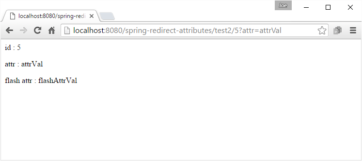

# Using RedirectAttributes

`RedirectAttributes` is a sub-interface of `Model`. It is a preferred way to pass attributes to redirect target. Using Model attributes for passing redirection data is not always desirable as it may conflict some attributes used for rendering purposes.

The following example demonstrates the use of RedirectAttributes

## Disable default usage of Model attributes during redirection.

The `RequestMappingHandlerAdapter` provides a flag called `ignoreDefaultModelOnRedirect` that can be used to indicate the content of the default Model should never be used if a controller method redirects. Instead the controller method should declare an attribute of type `RedirectAttributes` or if it doesn't do so no attributes should be passed on to `RedirectView`.

For backwards compatibility reasons this flag is set to false by default. We typically set `RequestMappingHandlerAdapter#ignoreDefaultModelOnRedirect` flag in our `@Configuration` class:

```java
@EnableWebMvc
@Configuration
public class MyWebConfig {
    @Autowired
    private RequestMappingHandlerAdapter requestMappingHandlerAdapter;

    @PostConstruct
    public void init() {
       requestMappingHandlerAdapter.setIgnoreDefaultModelOnRedirect(true);
    }
    ......
}
```

## The Controller

```
@Controller
public class MyController {

    @RequestMapping(value = "test/{id}")
    public String handleTestRequest (@PathVariable("id") String id, Model model,
                                     RedirectAttributes ra) {
        if (!id.matches("\\d+")) {
            model.addAttribute("msg", "id should only have digits");
            return "error-page";
        } else {
            ra.addAttribute("attr", "attrVal");
            ra.addFlashAttribute("flashAttr", "flashAttrVal");
            return "redirect:/test2/{id}";
        }
    }

    @RequestMapping("test2/{id}")
    public String handleRequest (@PathVariable("id") String id,
                                 @RequestParam("attr") String attr,
                                 @ModelAttribute("flashAttr") String flashAttr,
                                 Model model) {

        model.addAttribute("id", id);
        model.addAttribute("attr", attr);
        model.addAttribute("flashAttr", flashAttr+"");
        return "my-page";
    }
}
```

In above example we used `RedirectAttributes#addAttribute` instead of `Model#addAttribute` to pass data to redirect target. The mechanism is same when using Model attributes.

`RedirectAttributes` also provides a way to add flash attributes.

---

**What is Flash Attribute?**

Flash Attributes provide a way for one request to store attributes intended to used in another controller method during URL redirection.

The flash attribute data is not sent to the client browser as a part of `Location` URL header.

It is saved on the server side before redirection happens (saved typically in the session) and is made available in the target handler method after the redirect and then removed immediately.

We can use flash attribute as any object type and can access it in the target handler method using @ModelAttribute

---

## my-page.jsp

```
<%@ page language="java"
    contentType="text/html; charset=ISO-8859-1"
    pageEncoding="ISO-8859-1"%>
<html>
<body>
<p> id : ${id}</p>
<p> attr : ${attr}</p>
<p> flash attr : ${flashAttr}</p>
</body>
</html>
```

Enter the URL http://localhost:8080/spring-redirect-attributes/test/5. The URL in the address bar will change as the result of redirection: http://localhost:8080/spring-redirect-attributes/test2/5?attr=attrVal.

 