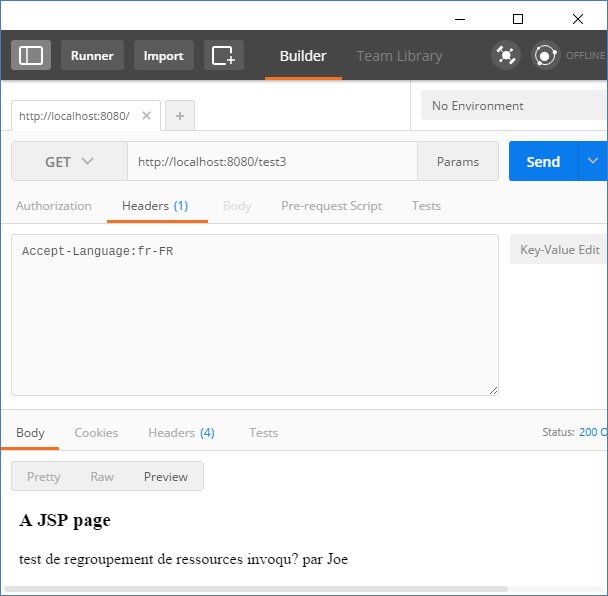

# Internationalization in Spring MVC

Internationalization (i18n) mechanism of Spring web MVC is based on the interface `LocaleResolver`. The implementations of this interface apply different strategies to resolve locale information of the HTTP request client.

When `DispatcherServlet` (the front controller) receives an HTTP request, it looks for the configured `LocalResolver`, if it finds one it tries to use it to set the client's locale based on the request content.

By default, `AcceptHeaderLocaleResolver` implementation is used, which utilizes the HTTP request header's `Accept-Language` value to resolve client locale. It actually internally uses `ServletRequest.getLocale()` which applies the logic of constructing Locale from the header.

In this tutorial we are going to see some examples to make use of this default LocaleResolver.

> **Note**: SpringBoot does not work well with JSP, and the code for this tutorial has been rewritten using Spring MVC.

## Working with client's Locale

### The controller:

We can retrieve client's Locale instance as a controller parameter, so that we can apply whatever i18n logic we want to.

```java
@Controller
public class I18nExampleController {

    @RequestMapping("/test1")
    @ResponseBody
    public String handleRequest (Locale locale) {
        return String.format("Request received. Language: %s, Country: %s %n",
                             locale.getLanguage(), locale.getDisplayCountry());
    }
}
```

### The main Spring Boot class

```java
@SpringBootApplication
public class I18nExampleMain {

    public static void main (String[] args) {
        SpringApplication.run(I18nExampleMain.class, args);
    }
}
```


Let's try it with some other locale. The `Accept-Language` header is sent implicitly by client web browser. For testing purpose, we can modify the browser settings with different display language. I prefer to use Postman to explicitly send a different `Accept-Language` header. In following example we are sending 'fr-FR' with the HTTP request from Postman:


## Using MessageSource to display external i18n messages

To display localized external messages, we have to provide an instance of `MessageSource` as bean. Please check out our [Spring core i18n tutorial](../../../01-core/05-resource/02-internationalization/REAEME.md).

With a traditional spring mvc configuration also, we have to explicitly register an implementation:

```
@EnableWebMvc
@Configuration
public class MyAppConfig{

  @Bean
  public MessageSource messageSource () {
      ResourceBundleMessageSource messageSource =
                new ResourceBundleMessageSource();
      messageSource.setBasenames("texts/msg");
      return messageSource;
  }

 .......
}
```

If we are using Spring boot then we can still register the `MessageSource` as above (but with `@SpringBootApplication`). If we want to take advantage of boot auto configuration, we just have to place `messages.properties` along with couple of optional `messages_xy.properties` (xy represents language codes) files in classpath.

In this example we are going to place following properties files:

**src/main/resources/messages.properties**

```shell
app.name = resource bundle test invoked by {0}
```

**src/main/resources/messages_fr.properties**

```shell
app.name=test de regroupement de ressources invoqué par {0}
```

### Resolving messages in a controller

```java
@Controller
public class I18nExampleController2 {

   @Autowired
   MessageSource messageSource;

   @RequestMapping("/test2")
   @ResponseBody
   public String handleRequest (Locale locale) {

       return messageSource.getMessage(
                 "app.name", new Object[]{"Joe"}, locale);
   }
}
```

### Main class

```java
@SpringBootApplication
public class I18nExampleMain {

    public static void main (String[] args) {
        SpringApplication.run(I18nExampleMain.class, args);
    }
}
```


In spring boot application, to use resource files names other than 'messages' we have to add following property in `application.properties`:

```shell
spring.messages.basename= myFolder/msg
```

Please check out INTERNATIONALIZATION section of [boot properties](http://docs.spring.io/spring-boot/docs/current/reference/html/common-application-properties.html).

Note that a default file without language code must be provided for boot auto configuration to work (e.g `messages.properties` along with `messages_fr.properties` or `myFolder/msg.properties` along with `myFolder/msg_fr.properties`). That is not the case with explicitly registering a `MessageSource` as a bean.

## Resolving messages in a JSP page

In a JSP file, to resolve i18n messages by code, we will use `spring:message` tag.

**src/main/webapp/WEB-INF/pages/myPage.jsp**:

```shell
<%@ page language="java"
    contentType="text/html; charset=ISO-8859-1"
    pageEncoding="ISO-8859-1"%>
<%@taglib uri="http://www.springframework.org/tags" prefix="spring"%>
<html>
<body>
<h3>A JSP page</h3>
  <spring:message code="app.name" arguments="${by}"/>
</body>
</html>
```

### The controller

```shell
@Controller
public class I18nExampleController3 {

    @RequestMapping("/test3")
    public String handleRequest (Model model) {
        model.addAttribute("by", "Joe");
        return "myPage";
    }
}
```




## Custom Locale selection

Some web application might want to provide options to the users to select a preferred language rather than using browser generated Accept-Language header. They might use a dropdown language selection component at the home page or whatever method they choose to get that information from users. Once user has selected a language it should be remembered by server side for further visits/interactions. Spring addresses these kind of use cases (where a custom locale setting must be remembered) by providing following implementations of `LocaleResolver`:

* `SessionLocaleResolver`: stores/retrieves user selected locale attribute in HTTPSession.

* `CookieLocaleResolver`: uses a cookie to store user selected locale.

There's one more implementation of LocaleResolver: `FixedLocaleResolver`, which always returns a fixed default locale.