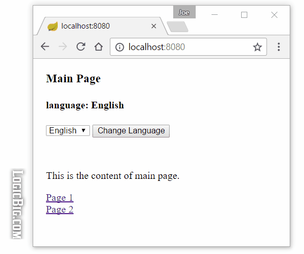

# Customized Locale selection using SessionLocaleResolver

A customized locale selection is desired in some cases as mentioned in the [last tutorial](../01-internationalization/README.md). In this tutorial we are going to see an example on `SessionLocaleResolver` which supports a customized locale selection.

`SessionLocaleResolver` internally populates a custom Locale instance in `HttpSession`.

There might be many different scenarios where a Locale instance should be populated in user session. In this tutorial we are going to demonstrate following flow:

1. A user selects a desired language from a dropdown component on the client site. 

2. On the server site, a corresponding Locale is constructed and populated in session using `SessionLocaleResolver`.

3. From that point on the Locale is retrieved from `HTTPSession` for further interaction till the end of the session.

> **Note**: SpringBoot does not work well with JSP, and the code for this tutorial has been rewritten using Spring MVC.

# Registering SessionLocaleResolver

We have to register our `LocaleResolver` as a bean:

```
@SpringBootApplication
public class Main {

    @Bean
    public LocaleResolver localeResolver(){
        SessionLocaleResolver r = new SessionLocaleResolver();
        r.setDefaultLocale(Locale.US);
        return r;
    }
...
}
```

Spring boot by default auto configures AcceptHeaderLocaleResolver. It also allows to set FixedLocaleResolver as following two properties:

```
spring.mvc.locale-resolver=fixed
spring.mvc.locale=fr_FR
```

The second property is the default locale.
It doesn't allow other resolvers. If interested check out the method `localeResolver()` of WebMvcAutoConfiguration.java.

> Here is what I did in Spring MVC:

```
@EnableWebMvc
@Configuration
@ComponentScan
public class MyConfig implements WebMvcConfigurer {
	
	@Bean
	public LocaleResolver localeResolver() {
		SessionLocaleResolver localeResolver = new SessionLocaleResolver();
		localeResolver.setDefaultLocale(Locale.US);
		System.out.println("register localeResolver");
		return localeResolver;
	}
	....
}
```

# Populating session with custom Locale using LocaleChangeInterceptor

In our example, when user selects a language option from the dropdown component, a corresponding Locale should be constructed and then there should be a call `LocaleResolver#setLocale(..)`. We can achieve that in a controller's handler method mapped with the specific request. But what if multiple pages have that dropdown components? Then we should implement a `HandlerInterceptor` to accomplish that. Good news is, Spring already provides such an interceptor: `LocaleChangeInterceptor`. This interceptor can change the current locale of underlying `LocaleResolver` on every request only if a specified request parameter (set by `LocaleChangeInterceptor.setParamName(..)`) is present in the HTTP request.

We are going to register LocalChangeInterceptor by using WebMvcConfigurerAdapter:

```
@SpringBootApplication
public class Main {
.....

    @Bean
    public WebMvcConfigurer configurer(){
        return new WebMvcConfigurerAdapter() {
            @Override
            public void addInterceptors (InterceptorRegistry registry) {
                LocaleChangeInterceptor l = new LocaleChangeInterceptor();
                l.setParamName("localeCode");
                registry.addInterceptor(l);
            }
        };
    }
}
```

> To make this works in Spring MVC, I have to annotate the class with @EnableWebMvc, and specifically declare a LocaleChangeInterceptor bean and add the bean as the interceptor.  

```
@EnableWebMvc
@Configuration
@ComponentScan
public class MyConfig implements WebMvcConfigurer {
	
	... 
	@Bean
	public LocaleChangeInterceptor localeChangeInterceptor() {
		LocaleChangeInterceptor l = new LocaleChangeInterceptor();
        l.setParamName("localeCode");
        return l;
	}
	
	@Override
   public void addInterceptors(InterceptorRegistry registry) {
        registry.addInterceptor(localeChangeInterceptor());
        System.out.println("register interceptor");
   }
    
   ...
}
```

# The Controller

```java
@Controller
public class TheController {

    @RequestMapping("/")
    public String handleGet (Model model, Locale locale) {

        FormData formData = new FormData();
        formData.setLocaleCode(locale.toString());
        model.addAttribute("formData", formData);

        //map's key/value: html's <option value='key'>value</option>
        Map<String, String> localeChoices = new LinkedHashMap<>();
        Locale l = Locale.US;
        localeChoices.put(l.toString(), l.getDisplayLanguage());
        l = Locale.GERMANY;
        localeChoices.put(l.toString(), l.getDisplayLanguage());
        l = Locale.FRANCE;
        localeChoices.put(l.toString(), l.getDisplayLanguage());
        model.addAttribute("localeChoices", localeChoices);

        return "main";
    }

    @RequestMapping(value = "/page1")
    public String handlePage1 () {
        return "page1";
    }

    @RequestMapping(value = "/page2")
    public String handlePage2 () {
        return "page2";
    }


    public static class FormData {
        private String localeCode;

        // getters/setters
    }
}
```

## JSP pages

### src/main/webapp/WEB-INF/pages/main.jsp

```
<%@ page language="java"
    contentType="text/html; charset=ISO-8859-1"
    pageEncoding="ISO-8859-1"%>
<%@ taglib uri="http://www.springframework.org/tags/form" prefix="fm"%>
<%@taglib uri="http://www.springframework.org/tags" prefix="spring"%>
<html>
  <body style="margin:20px;">
    <h3> <spring:message code="label.mainPage"/></h3>
    <h4><spring:message code="label.lang"/>:
    <spring:message code="text.lang"/></h4>

    <fm:form method="post" action="/" modelAttribute="formData">
     <fm:select path="localeCode">
        <fm:options items="${localeChoices}"/>
     </fm:select>
     <input type="submit" value="Change Language" />
    </fm:form>
    <br/>
    <P><spring:message code="text.mainPage"/></p>
    <a href="/page1"><spring:message code="label.page1"/></a>
    <br/>
    <a href="/page2"><spring:message code="label.page2"/></a>
  </body>
</html>
```

Note that above page sends post request with the param name `localeCode` (the same name we set with `LocaleChangeInterceptor.setParamName()`) and with the value of selected locale code (which we set as `Locale.toString()` in the above controller when populating the map). The presence of the same param name in HTTP request will trigger the `LocaleChangeInterceptor`'s logic. As a result the param String value will be parsed to an instance of Locale object and will be set with `LocaleResolver#setLocal(...)`. If interested check out the method `preHandle()` of `LocaleChangeInterceptor.java`.

### src/main/webapp/WEB-INF/pages/page1.jsp

```
...
<html>
<body>
  <h3><spring:message code="label.page1"/></h3>
  <h4><spring:message code="label.lang"/>:
  <spring:message code="text.lang"/></h4>

  <P><spring:message code="text.page1"/></p>

  <a href="/page2"><spring:message code="label.page2"/></a>
  <br/>
  <a href="/"><spring:message code="label.mainPage"/></a>
</body>
</html>
```

### src/main/webapp/WEB-INF/pages/page2.jsp

```
 .....
<html>
<body>
  <h3><spring:message code="label.page2"/></h3>
  <h4><spring:message code="label.lang"/>:
  <spring:message code="text.lang"/></h4>
  <P><spring:message code="text.page2"/></p>

  <a href="/page1"><spring:message code="label.page1"/></a>
  <br/>
  <a href="/"><spring:message code="label.mainPage"/></a>
</body>
</html>
```

## Resource bundle property files

### src/main/resources/msgs/msg.properties

```
label.mainPage = Main Page
label.page1 = Page 1
label.page2 = Page 2
label.lang = language
text.lang = English
text.mainPage = This is the content of main page.
text.page1 = This is the content of page 1.
text.page2 = This is the content of page 2.
```

Similarly we have populated two more property files for German and French languages.

## Boot application properties

### src/main/resources/application.properties

```
spring.mvc.view.prefix= /WEB-INF/pages/
spring.mvc.view.suffix= .jsp
spring.messages.basename= msgs/msg
```

## The main class:

```
@SpringBootApplication
public class Main {

    public static void main (String[] args) {
        SpringApplication.run(Main.class, args);
    }
  ......
}
```

## Output


