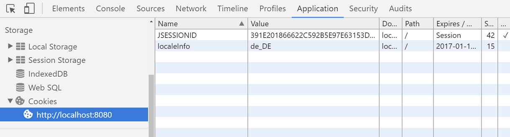

# Customized Locale selection using CookieLocaleResolver

This is another option to remember a customized locale selection.

`CookieLocaleResolver` internally persists a custom locale and/or a time zone information as browser cookie. It uses `javax.servlet.http.Cookie` to accomplish that. This `LocaleResolver` is preferred to be used (over `SessionLocaleResolver`), when application has to be stateless or when locale information should be persisted beyond HTTPSession life time.

There might be many different scenarios where a Locale instance should be remembered on the server side. Here we are going to use the same scenarios as of the last example, where `ChangeLocaleInterceptor` will retrieve the specified HTTP param value, parse it to the Locale instance and then will hand over it to the underlying `LocaleResolver` (`CookieLocaleResolver` in this case). The `CookieLocaleResolver` at this point will add the locale information as a Cookie to HTTP response.

# Registering CookieLocaleResolver

```java
@SpringBootApplication
public class Main {

    public static void main (String[] args) {
        SpringApplication.run(Main.class, args);
    }

    @Bean
    public LocaleResolver localeResolver () {
        CookieLocaleResolver r = new CookieLocaleResolver();
        r.setDefaultLocale(Locale.US);
        r.setCookieName("localeInfo");

        //if set to -1, the cookie is deleted
        // when browser shuts down
        r.setCookieMaxAge(24*60*60);
        return r;
    }

    @Bean
    public WebMvcConfigurer configurer () {
        return new WebMvcConfigurerAdapter() {
            @Override
            public void addInterceptors (InterceptorRegistry registry) {
                LocaleChangeInterceptor l = new LocaleChangeInterceptor();
                l.setParamName("localeCode");
                registry.addInterceptor(l);
            }
        };
    }
}
```

The rest of the artifacts remain the same as of the last example. The output and flow is also same.

After changing the language in the dropdown, a cookie will be created in the browser.

In google chrome browser (right click on page > Inspect > Application (top toolbar) > Storage (left tree) > Cookies > http://localhost:8080):


