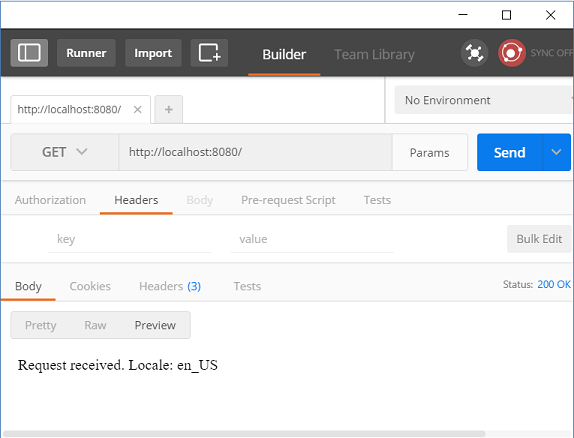
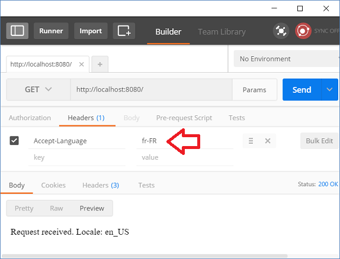

# Using FixedLocaleResolver

`FixedLocaleResolver` always uses a default locale and optionally a time zone. It doesn't allow to change both of them once set. In this tutorial we are only to focus on locale feature only. We can set it's fixed default locale during construction time. If none is set, system locale is used.

```
public FixedLocaleResolver() {
  setDefaultLocale(Locale.getDefault());
}
```

`FixedLocaleResolver` is usually needed when we want to turn off the default behavior of `AcceptHeaderLocaleResolver`. Or we want to switch existing `LocaleResolver` to a fixed locale for some reasons.

Let's see a quick example how we can use it.

## Registering FixedLocaleResolver

If we are using Spring Boot then we have to specify two application properties:

**src/main/resources/application.properties**

```apache
spring.mvc.locale-resolver=fixed
spring.mvc.locale=en_US
```

The second property is the fixed default locale of `FixedLocaleResolver`. Both properties are mandatory for auto configuration to work.

In a traditional mvc configuration with `@EnableWebMVC`, we have to register it as a bean:

```java
@Configuration
@EnableWebMVC
public class MyConfig{
  @Bean
  LocaleResolver localeResolver(){
     FixedLocaleResolver l = new FixedLocaleResolver();
     l.setDefaultLocale(Locale.JAPAN);
     return l;
  }
 .....
}
```

## The Controller

```java
@Controller
public class TheController {

  @RequestMapping("/")
  @ResponseBody
  public String handleRequest (Locale locale) {
      return String.format("Request received. Locale: %s%n",
                           locale);
  }
}
```

## The main class

```
@SpringBootApplication
public class Main {

    public static void main (String[] args) {
        SpringApplication.run(Main.class, args);
    }
}
```

## Output

We are using Postman for testing:




