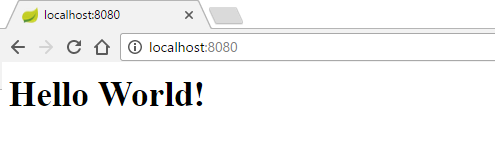

# Spring Boot KickStart

## What is Spring Boot?

Spring Boot helps us to avoid writing boilerplate configuration and code so that we can just focus on the application/business logic.

Basically it provides the followings:

- Auto configuration at the project build/dependency level. For example in Maven based project, it simplify all kind of configurations.
- It provides embedded Tomcat/Jetty server, so that we can run web based projects as stand-alone applications.
- Auto Spring specific XML/JavaConfig whenever possible.

## Writing a normal Spring MVC Controller

```java
package com.logicbig.example;

import org.springframework.stereotype.Controller;
import org.springframework.web.bind.annotation.RequestMapping;
import org.springframework.web.bind.annotation.ResponseBody;

@Controller
public class HelloWorldController {
    @RequestMapping("/")
    @ResponseBody
    public String helloHandler () {
        return "<h1>Hello World!</h1>";
    }
}
```

Normally we have to write XML/JavaConfig to register the controller with the Spring MVC context container but with Spring boot we don't have to do that. To achieve that first we have to do build level dependency configuration. In this example we are using maven build (Spring boot is not limited to that only).

### Maven configuration

pom.xml:

```xml
<?xml version="1.0" encoding="UTF-8"?>
<project xmlns="http://maven.apache.org/POM/4.0.0"
         xmlns:xsi="http://www.w3.org/2001/XMLSchema-instance"
         xsi:schemaLocation="http://maven.apache.org/POM/4.0.0 http://maven.apache.org/xsd/maven-4.0.0.xsd">
 <modelVersion>4.0.0</modelVersion>

 <groupId>com.logicbig.example</groupId>
 <artifactId>spring-boot</artifactId>
 <version>1.0-SNAPSHOT</version>

 <parent>
  <groupId>org.springframework.boot</groupId>
  <artifactId>spring-boot-starter-parent</artifactId>
  <version>1.4.2.RELEASE</version>
 </parent>

 <dependencies>
  <dependency>
   <groupId>org.springframework.boot</groupId>
   <artifactId>spring-boot-starter-web</artifactId>
  </dependency>
 </dependencies>
</project>
```

Two things to notice above: we specified spring-boot-starter-parent as maven project parent and spring-boot-starter-web as dependency.

spring-boot-starter-parent brings a number of benefits. It already has a lot of configuration which we don't have to repeat with every project. For example we can just specify different spring modules dependencies without even specifying the versions. The parent takes care of the versions management for us which is compatible with the spring-boot-starter-parent version. In above pom.xml, we used spring-boot-starter-web dependency without specifying any version.

### Running as stand-alone application

We are going to use Spring Boot specific API to run the MVC application from main method.

```java
package com.logicbig.example;

import org.springframework.boot.SpringApplication;
import org.springframework.boot.autoconfigure.SpringBootApplication;
import org.springframework.context.ApplicationContext;

@SpringBootApplication
public class HelloWorldApplication {
    public static void main (String[] args) {
        ApplicationContext ctx =
                            SpringApplication.run(HelloWorldApplication.class, args);

    }
}
```

We will see the following output in the console:

```shell
  .   ____          _            __ _ _
 /\\ / ___'_ __ _ _(_)_ __  __ _ \ \ \ \
( ( )\___ | '_ | '_| | '_ \/ _` | \ \ \ \
 \\/  ___)| |_)| | | | | || (_| |  ) ) ) )
  '  |____| .__|_| |_|_| |_\__, | / / / /
 =========|_|==============|___/=/_/_/_/
 :: Spring Boot ::        (v1.4.2.RELEASE)

2016-11-22 15:23:27.440  INFO 9576 --- [           main] c.l.example.HelloWorldApplication        : Starting HelloWorldApplication on JoeMsi with PID 9576 (D:\LogicBig\test-examples\spring\boot\target\classes started by Joe in D:\LogicBig\test-examples)
2016-11-22 15:23:27.442  INFO 9576 --- [           main] c.l.example.HelloWorldApplication        : No active profile set, falling back to default profiles: default
2016-11-22 15:23:27.489  INFO 9576 --- [           main] ationConfigEmbeddedWebApplicationContext : Refreshing org.springframework.boot.context.embedded.AnnotationConfigEmbeddedWebApplicationContext@64cd705f: startup date [Tue Nov 22 15:23:27 CST 2016]; root of context hierarchy
2016-11-22 15:23:28.841  INFO 9576 --- [           main] s.b.c.e.t.TomcatEmbeddedServletContainer : Tomcat initialized with port(s): 8080 (http)
2016-11-22 15:23:28.853  INFO 9576 --- [           main] o.apache.catalina.core.StandardService   : Starting service Tomcat
2016-11-22 15:23:28.855  INFO 9576 --- [           main] org.apache.catalina.core.StandardEngine  : Starting Servlet Engine: Apache Tomcat/8.5.6
2016-11-22 15:23:28.934  INFO 9576 --- [ost-startStop-1] o.a.c.c.C.[Tomcat].[localhost].[/]       : Initializing Spring embedded WebApplicationContext
2016-11-22 15:23:28.934  INFO 9576 --- [ost-startStop-1] o.s.web.context.ContextLoader            : Root WebApplicationContext: initialization completed in 1448 ms
2016-11-22 15:23:29.054  INFO 9576 --- [ost-startStop-1] o.s.b.w.servlet.ServletRegistrationBean  : Mapping servlet: 'dispatcherServlet' to [/]
2016-11-22 15:23:29.057  INFO 9576 --- [ost-startStop-1] o.s.b.w.servlet.FilterRegistrationBean   : Mapping filter: 'characterEncodingFilter' to: [/*]
2016-11-22 15:23:29.057  INFO 9576 --- [ost-startStop-1] o.s.b.w.servlet.FilterRegistrationBean   : Mapping filter: 'hiddenHttpMethodFilter' to: [/*]
2016-11-22 15:23:29.057  INFO 9576 --- [ost-startStop-1] o.s.b.w.servlet.FilterRegistrationBean   : Mapping filter: 'httpPutFormContentFilter' to: [/*]
2016-11-22 15:23:29.057  INFO 9576 --- [ost-startStop-1] o.s.b.w.servlet.FilterRegistrationBean   : Mapping filter: 'requestContextFilter' to: [/*]
2016-11-22 15:23:29.261  INFO 9576 --- [           main] s.w.s.m.m.a.RequestMappingHandlerAdapter : Looking for @ControllerAdvice: org.springframework.boot.context.embedded.AnnotationConfigEmbeddedWebApplicationContext@64cd705f: startup date [Tue Nov 22 15:23:27 CST 2016]; root of context hierarchy
2016-11-22 15:23:29.321  INFO 9576 --- [           main] s.w.s.m.m.a.RequestMappingHandlerMapping : Mapped "{[/]}" onto public java.lang.String com.logicbig.example.HelloWorldController.helloHandler()
2016-11-22 15:23:29.324  INFO 9576 --- [           main] s.w.s.m.m.a.RequestMappingHandlerMapping : Mapped "{[/error]}" onto public org.springframework.http.ResponseEntity<java.util.Map<java.lang.String, java.lang.Object>> org.springframework.boot.autoconfigure.web.BasicErrorController.error(javax.servlet.http.HttpServletRequest)
2016-11-22 15:23:29.324  INFO 9576 --- [           main] s.w.s.m.m.a.RequestMappingHandlerMapping : Mapped "{[/error],produces=[text/html]}" onto public org.springframework.web.servlet.ModelAndView org.springframework.boot.autoconfigure.web.BasicErrorController.errorHtml(javax.servlet.http.HttpServletRequest,javax.servlet.http.HttpServletResponse)
2016-11-22 15:23:29.347  INFO 9576 --- [           main] o.s.w.s.handler.SimpleUrlHandlerMapping  : Mapped URL path [/webjars/**] onto handler of type [class org.springframework.web.servlet.resource.ResourceHttpRequestHandler]
2016-11-22 15:23:29.347  INFO 9576 --- [           main] o.s.w.s.handler.SimpleUrlHandlerMapping  : Mapped URL path [/**] onto handler of type [class org.springframework.web.servlet.resource.ResourceHttpRequestHandler]
2016-11-22 15:23:29.382  INFO 9576 --- [           main] o.s.w.s.handler.SimpleUrlHandlerMapping  : Mapped URL path [/**/favicon.ico] onto handler of type [class org.springframework.web.servlet.resource.ResourceHttpRequestHandler]
2016-11-22 15:23:29.490  INFO 9576 --- [           main] o.s.j.e.a.AnnotationMBeanExporter        : Registering beans for JMX exposure on startup
2016-11-22 15:23:29.538  INFO 9576 --- [           main] s.b.c.e.t.TomcatEmbeddedServletContainer : Tomcat started on port(s): 8080 (http)
2016-11-22 15:23:29.541  INFO 9576 --- [           main] c.l.example.HelloWorldApplication        : Started HelloWorldApplication in 2.505 seconds (JVM running for 2.791)
2016-11-22 15:23:59.497  INFO 9576 --- [nio-8080-exec-1] o.a.c.c.C.[Tomcat].[localhost].[/]       : Initializing Spring FrameworkServlet 'dispatcherServlet'
2016-11-22 15:23:59.497  INFO 9576 --- [nio-8080-exec-1] o.s.web.servlet.DispatcherServlet        : FrameworkServlet 'dispatcherServlet': initialization started
2016-11-22 15:23:59.512  INFO 9576 --- [nio-8080-exec-1] o.s.web.servlet.DispatcherServlet        : FrameworkServlet 'dispatcherServlet': initialization completed in 15 ms
First time it will take a little longer as maven has to download some dependencies.
```

It also runs Tomcat embedded server at port 8080 by default.

### Accessing from browser:

