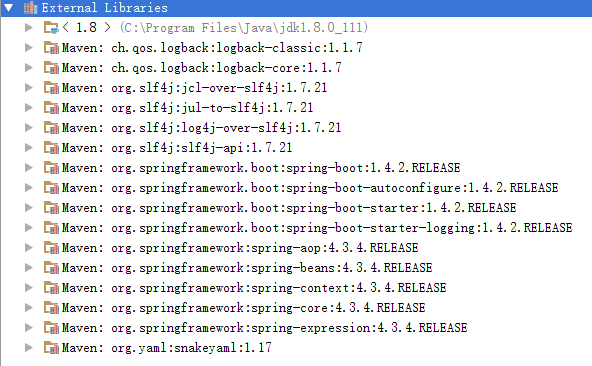

# Maven Configuration

## Spring Boot Starters

Spring Boot starters are jar dependencies, which provide a quick way to configure our application, without manually including a lot of related dependencies.

In this tutorial we are going to explain different starters aspects using Maven. Though other project managements tools like Gradle or Ant can be used as well.

### spring-boot-starter-parent

The spring-boot-starter-parent is a special starter that provides useful Maven defaults. We extend our project pom from this starter. By using a specific version of this starter, we are going to implicitly select compatible versions of targeted spring modules and third party tools.

Spring Boot project management uses maven Dependency Management mechanism for centralizing dependency information so that we can omit version tags for dependencies. We can also override default setting e.g. changing default java version from 1.6 to 1.8:

<java.version>1.8</java.version> 

### Application specific starters dependencies

We have to specify other starters, under <dependencies></dependencies> section which provide our application specific dependencies.

For example let's create a spring core context application. There we will need to add spring-boot-starter:

```xml
<project ....>
 <modelVersion>4.0.0</modelVersion>

 <groupId>com.logicbig.example</groupId>
 <artifactId>spring-boot-starter-example</artifactId>
 <version>1.0-SNAPSHOT</version>

 <parent>
   <groupId>org.springframework.boot</groupId>
   <artifactId>spring-boot-starter-parent</artifactId>
   <version>1.4.2.RELEASE</version>
 </parent>

 <properties>
   <java.version>1.8</java.version>
 </properties>

<dependencies>
   <dependency>
     <groupId>org.springframework.boot</groupId>
     <artifactId>spring-boot-starter</artifactId>
   </dependency>
 </dependencies>
</project>
```

That is going to bring in the following dependencies (screenshot from Intellij IDE)



Latest Spring boot release version usually going to bring latest Spring modules release version. To use other versions of Spring Boot check out Release Notes. We can also change spring framework modules version by overriding this single property:
<spring.version>4.3.2</spring.version>

After including parent and dependency starters, we can start using spring core context:

```java
@SpringBootApplication
public class ApplicationExample {
    @Bean
    public MyBean myBean () {
        return new MyBean();
    }

    public static void main (String[] args) {
        ApplicationContext ctx =
                            SpringApplication.run(ApplicationExample.class, args);
        MyBean bean = ctx.getBean(MyBean.class);
        bean.doSomething();
    }

    private static class MyBean {
        public void doSomething () {
            System.out.println("Doing something in MyBean");
        }
    }
}
```

Output

```shell
  .   ____          _            __ _ _
 /\\ / ___'_ __ _ _(_)_ __  __ _ \ \ \ \
( ( )\___ | '_ | '_| | '_ \/ _` | \ \ \ \
 \\/  ___)| |_)| | | | | || (_| |  ) ) ) )
  '  |____| .__|_| |_|_| |_\__, | / / / /
 =========|_|==============|___/=/_/_/_/
 :: Spring Boot ::        (v1.4.2.RELEASE)

2016-11-30 00:54:16.359  INFO 2500 --- [           main] com.logicbig.example.ApplicationExample  : Starting ApplicationExample on JoeMsi with PID 2500 (D:\LogicBig\test-examples\spring\spring-boot\spring-boot-starters\spring-boot-starter-example\target\classes started by Joe in D:\LogicBig\test-examples\spring\spring-boot\spring-boot-starters\spring-boot-starter-example)
2016-11-30 00:54:16.362  INFO 2500 --- [           main] com.logicbig.example.ApplicationExample  : No active profile set, falling back to default profiles: default
2016-11-30 00:54:16.405  INFO 2500 --- [           main] s.c.a.AnnotationConfigApplicationContext : Refreshing org.springframework.context.annotation.AnnotationConfigApplicationContext@727803de: startup date [Wed Nov 30 00:54:16 CST 2016]; root of context hierarchy
2016-11-30 00:54:17.085  INFO 2500 --- [           main] o.s.j.e.a.AnnotationMBeanExporter        : Registering beans for JMX exposure on startup
2016-11-30 00:54:17.094  INFO 2500 --- [           main] com.logicbig.example.ApplicationExample  : Started ApplicationExample in 0.955 seconds (JVM running for 1.238)
Doing something in MyBean
2016-11-30 00:54:17.095  INFO 2500 --- [       Thread-1] s.c.a.AnnotationConfigApplicationContext : Closing org.springframework.context.annotation.AnnotationConfigApplicationContext@727803de: startup date [Wed Nov 30 00:54:16 CST 2016]; root of context hierarchy
2016-11-30 00:54:17.096  INFO 2500 --- [       Thread-1] o.s.j.e.a.AnnotationMBeanExporter        : Unregistering JMX-exposed beans on shutdown
```

In above example @SpringBootApplication is equivalent to using @Configuration. It's actually more than that; we will discuss about that in upcoming tutorials.

### Spring starter list

Check out the complete starters list [here](https://github.com/spring-projects/spring-boot/tree/master/spring-boot-project/spring-boot-starters).

### Including third party dependency and overriding versions

We can find all third party tools and default versions in [spring-boot-dependencies's pom](https://github.com/spring-projects/spring-boot/blob/v1.4.2.RELEASE/spring-boot-dependencies/pom.xml). spring-boot-dependencies is parent of spring-boot-starter-parent.

We can also browse the parent poms from an IDE to find the answers.

Another way is to use mvn help:effective-pom from project root. Or better save it to a file for our investigation: mvn help:effective-pom > myEffectivePom.txt

As stated above, the version of dependencies can be changed by adding appropriate property elements.

Let's modify our above example to change spring version and also add dependency of another third party jar: commons-collections whose default version is : 3.2.2. Let's change that to 3.2.1.

```xml
<project ...>
 <modelVersion>4.0.0</modelVersion>

 <groupId>com.logicbig.example</groupId>
 <artifactId>spring-boot-starter-example</artifactId>
 <version>1.0-SNAPSHOT</version>

 <parent>
  <groupId>org.springframework.boot</groupId>
  <artifactId>spring-boot-starter-parent</artifactId>
  <version>1.4.2.RELEASE</version>
 </parent>

 <properties>
  <java.version>1.8</java.version>
  <commons-collections.version>3.2.1</commons-collections.version>
  <spring.version>4.3.2.RELEASE</spring.version>
 </properties>

 <dependencies>
  <dependency>
   <groupId>org.springframework.boot</groupId>
   <artifactId>spring-boot-starter</artifactId>
  </dependency>
  <dependency>
   <groupId>commons-collections</groupId>
   <artifactId>commons-collections</artifactId>
  </dependency>
 </dependencies>
</project>
```

Modifying our Java code a little to use apache common collections:

```java
package com.logicbig.example;

import org.apache.commons.collections.Bag;
import org.apache.commons.collections.bag.HashBag;
import org.springframework.boot.SpringApplication;
import org.springframework.boot.autoconfigure.SpringBootApplication;
import org.springframework.context.ApplicationContext;
import org.springframework.context.annotation.Bean;

@SpringBootApplication
public class ApplicationExample {
    @Bean
    public MyBean myBean () {
        return new MyBean();
    }

    public static void main (String[] args) {
        ApplicationContext ctx =
                            SpringApplication.run(ApplicationExample.class, args);
        MyBean bean = ctx.getBean(MyBean.class);
        bean.doSomething();
    }

    private static class MyBean {

        public void doSomething () {
            Bag bag = new HashBag();
            bag.add("ONE", 6);
            System.out.println("Doing something in MyBean");
            System.out.println(bag);
        }
    }
}
```

Output

```shell
................
 Doing something in MyBean
 [6:ONE]
 ...............
```

### Starters naming convention

All spring starter project names start with spring-boot-starter.*. Which is reserved for official Spring Boot artifacts. If we are going to create our own starter then we should use a different naming convention e.g. myCompany-spring-boot-starter. This applies to all third party starters as well.

### What's next?

In the next tutorial, we are going to discuss how to use Spring Boot without inheriting the spring-boot-starter-parent POM.

