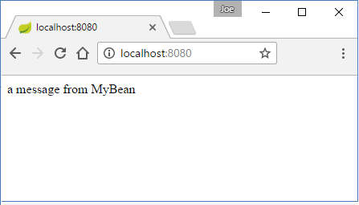

# Auto Configuration

[1. Auto Configuration with @EnableAutoConfiguration](#1)

[2. @EnableAutoConfiguration with @ComponentScan](#2)

[3. Auto-configuration with @SpringBootApplication](#3)

[4. Customizing application startup](#4)

[5. How auto configuration works?](#5)

## <a id="1"></id>Auto Configuration with @EnableAutoConfiguration

Using @EnableAutoConfiguration is like using @Configuration annotation. It configures and wires our beans based on what @Bean methods we have defined in our configuration class. It does other additional configurations too, which includes configuring/invoking helper components (like embedded tomcat in web application). This mechanism works based on the jar dependencies available in the classpath. The jar are usually supplied via starter dependencies, but that's not the absolute requirement. The two things (starters and auto-configuration) are not dependent on each others.

### Example using @EnableAutoConfiguration

In this example we are going to use spring-boot-starter-web which will add Spring MVC and Tomcat dependencies. Because of these dependencies auto-configuration mechanism will assume that we are developing a web application and setup Spring accordingly.

```java
public class MyBean {
   public String getMessage () {
       return "a message from MyBean";
   }
}
```

```java
import org.springframework.beans.factory.annotation.Autowired;
import org.springframework.stereotype.Controller;
import org.springframework.web.bind.annotation.RequestMapping;
import org.springframework.web.bind.annotation.ResponseBody;

@Controller
public class MyWebController {

   @Autowired
   private MyBean myBean;

   @RequestMapping("/")
   @ResponseBody
   public String theHandler () {
       return myBean.getMessage();
   }
}
```

```java
import org.springframework.boot.SpringApplication;
import org.springframework.boot.autoconfigure.EnableAutoConfiguration;
import org.springframework.context.annotation.Bean;

@EnableAutoConfiguration
public class EnabledAutoConfigExample {

   @Bean
   public MyBean myBean () {
       return new MyBean();
   }

   @Bean
   public MyWebController controller () {
       return new MyWebController();
   }

   public static void main (String[] args) {
       SpringApplication.run(EnabledAutoConfigExample.class, args);
   }
}
```

Output in browser



## <a id="2"></id>@EnableAutoConfiguration with @ComponentScan

In a boot application, Spring core component scanning doesn't work by just using @EnableAutoConfiguration. We have to additionally use @ComponentScan:

```java
@Component
public class MyBean {
   public String getMessage () {
       return "a message from MyBean";
   }
}
import org.springframework.beans.factory.annotation.Autowired;
import org.springframework.stereotype.Controller;
import org.springframework.web.bind.annotation.RequestMapping;
import org.springframework.web.bind.annotation.ResponseBody;

@Controller
public class MyWebController {

   @Autowired
   private MyBean myBean;

   @RequestMapping("/")
   @ResponseBody
   public String theHandler () {
       return myBean.getMessage();
   }
}
```

```java
import org.springframework.boot.SpringApplication;
import org.springframework.boot.autoconfigure.EnableAutoConfiguration;
import org.springframework.context.annotation.Bean;

@ComponentScan
@EnableAutoConfiguration
public class EnabledAutoConfigExample {

   public static void main (String[] args) {
       SpringApplication.run(EnabledAutoConfigExample.class, args);
   }
}
```

Note that if no packages are defined by using ComponentScan(basePackages) or ComponentScan(basePackageClasses), the scanning will happen from the package of the class that declares this annotation.

## <a id="3"></id>Auto-configuration with @SpringBootApplication

Since @EnableAutoConfiguration and @ComponentScanare likely to be frequently used by the developers, Spring Boot provides a convenient equivalent shortcut (a meta-annotation) for these two annotations: @SpringBootApplication.

```java
@Component
public class MyBean {
   public String getMessage () {
       return "a message from MyBean";
   }
}
```

```java
import org.springframework.beans.factory.annotation.Autowired;
import org.springframework.stereotype.Controller;
import org.springframework.web.bind.annotation.RequestMapping;
import org.springframework.web.bind.annotation.ResponseBody;

@Controller
public class MyWebController {

   @Autowired
   private MyBean myBean;

   @RequestMapping("/")
   @ResponseBody
   public String theHandler () {
       return myBean.getMessage();
   }
}
```

```java
import org.springframework.boot.SpringApplication;
import org.springframework.boot.autoconfigure.EnableAutoConfiguration;
import org.springframework.context.annotation.Bean;

@SpringBootApplication
public class EnabledAutoConfigExample {

   public static void main (String[] args) {
       SpringApplication.run(EnabledAutoConfigExample.class, args);
   }
}
```

Just like @ComponentScan elements: basePackageClasses and basePackages, @SpringBootApplication annotation provides scanBasePackageClasses and scanBasePackages to be specified if the scan base path is not same as of this configuration class.

## <a id="4"></id>Customizing application startup

Starting spring boot application with static method: SpringApplication.run() uses default settings. In this tutorial, we are going to explore how to customize some of those default settings. We are going to go quickly with examples.

In these examples, we are using spring-boot-starter (core spring context). We are not even going to annotate the main class with @SpringBootApplication because we are not going to configure any beans in these examples:

```java
package com.logicbig.example;

import org.springframework.boot.SpringApplication;

public class CustomizeBootExample {
    public static void main (String[] args) {
        SpringApplication app = new SpringApplication(CustomizeBootExample.class);
        // customize start up here
        app.run(args);
    }
}
```

### Turning off startup INFO logs

```java
public static void main (String[] args) {
     SpringApplication app = new SpringApplication(CustomizeBootExample.class);
     app.setLogStartupInfo(false);
}
```

Output

```shell
  .   ____          _            __ _ _
 /\\ / ___'_ __ _ _(_)_ __  __ _ \ \ \ \
( ( )\___ | '_ | '_| | '_ \/ _` | \ \ \ \
 \\/  ___)| |_)| | | | | || (_| |  ) ) ) )
  '  |____| .__|_| |_|_| |_\__, | / / / /
 =========|_|==============|___/=/_/_/_/
 :: Spring Boot ::        (v1.4.2.RELEASE)

2016-12-15 01:33:08.393  INFO 8904 --- [           main] s.c.a.AnnotationConfigApplicationContext : Refreshing org.springframework.context.annotation.AnnotationConfigApplicationContext@727803de: startup date [Thu Dec 15 01:33:08 CST 2016]; root of context hierarchy
2016-12-15 01:33:08.478  INFO 8904 --- [       Thread-1] s.c.a.AnnotationConfigApplicationContext : Closing org.springframework.context.annotation.AnnotationConfigApplicationContext@727803de: startup date [Thu Dec 15 01:33:08 CST 2016]; root of context hierarchy
```

### Turning off banner

```java
  public static void main (String[] args) {
        SpringApplication app = new SpringApplication(CustomizeBootExample.class);
        app.setBannerMode(Banner.Mode.OFF);
        app.run(args);
  }
```

Output

```shell
2016-12-14 15:47:04.468  INFO 9880 --- [           main] c.logicbig.example.CustomizeBootExample  : Starting CustomizeBootExample on JoeMsi with PID 9880 (D:\LogicBig\test-examples\spring\spring-boot\boot-startup-customizing\target\classes started by Joe in D:\LogicBig\test-examples)
2016-12-14 15:47:04.472  INFO 9880 --- [           main] c.logicbig.example.CustomizeBootExample  : No active profile set, falling back to default profiles: default
2016-12-14 15:47:04.489  INFO 9880 --- [           main] s.c.a.AnnotationConfigApplicationContext : Refreshing org.springframework.context.annotation.AnnotationConfigApplicationContext@10a035a0: startup date [Wed Dec 14 15:47:04 CST 2016]; root of context hierarchy
2016-12-14 15:47:04.553  INFO 9880 --- [           main] c.logicbig.example.CustomizeBootExample  : Started CustomizeBootExample in 0.303 seconds (JVM running for 0.605)
2016-12-14 15:47:04.554  INFO 9880 --- [       Thread-1] s.c.a.AnnotationConfigApplicationContext : Closing org.springframework.context.annotation.AnnotationConfigApplicationContext@10a035a0: startup date [Wed Dec 14 15:47:04 CST 2016]; root of context hierarchy
```

### Using an image for banner

```
public static void main (String[] args) throws MalformedURLException {
     SpringApplication app = new SpringApplication(CustomizeBootExample2.class);
     UrlResource r = new UrlResource("http://www.logicbig.com/tutorials/" +
                                               "spring-framework/spring-boot/" +
                                               "images/spring-boot.png");
     app.setBanner(new ImageBanner(r));
     app.run(args);
}
```

Output

```shell
             8888888&&&&&&&&&&&&&&&&&ooooooooooooo:::::::::::::::
             8888888&&&&&&&&&&&&&&&&&oooooooooooo::::::::::::::::
             8888888&&&&&&&&&&&&&&&&&&&oo:ooooooo::::::::::::::::
             8888888&88&&&&&&&&&&&&&&&    o.     ::::::::::::::::
             8888888888&&&&&&&&&&&&&&8  .8&   *  .:::::::::::::::
             8888888&88&&&&&&&&&&&&&&o  88   *o   :::::::::::::::
             8888888&&&&&&&&&&&&&&&&&8       o   ::::::::::::::::
             8888888888&&&&&&&&&&&&&&&8     oo  oo:::::::::::::::
             8888888888&&&&&&&&&&&&&&8           *:::::::::::::::
             8888888888&&&&&&&&&&&&&&&           *:::::::::::::::
             8888888888&&&&&&&&&&&&&&&&&88  :oo  *:::::::::::::::
             8888888888&&&&&&&&&&&&&&&&&88       *:::::::::::::::
             8888888888&&&&&&&&&&&&oo&&&888      ::::::::::::::::
             88888888888&&&&&&&&&&&&&&           *:::::::::::::::
             88888888888&&&&&&&&&&&&&&           *:::::::::::::::
             888888888        &&&&&&&&&888   oo  *:::::::::::::::
             888888888  &  &  &&&&&&&&88     oo  *:::::::::::::::
             888888888  &     &&&&&&&&           ::::::::::::::::
             888888888.   &  &&&&&&&&&  888&:  .:::::::::::::::::
             8888888888&   *&&&&&&&&&&           . :   ::::::::::
             888888888        &&&&&&&&           *   *  :::::::::
             88888888  8&&&&  &&&&&&&&:::::****..:::    *::::::::
             888888888   ..   &&&&&&&&           *::::::**:::::::
             8888888888     &&&&&&&&&&&&888      ::::::::::::::::
             8888888888&   *&&&&&&&&&&88      o::::::::::::::::::
             888888888        &&&&&&&&           *:::::::::::::::
             88888888  8&&&&  &&&&&&&&           *:::::::::::::::
             888888888   ..   &&&&&&&&&888. .ooo:::::::::::::::::
             8888888888     &&&&&&&&&&8         :::::::::::::::::
             88888888888&&&&  &&&&&&&&   *8&o.   ::::::::::::::::
             888888888&&&&&&  &&&&&&&o  &o&&ooo   :::::::::::::::
             888888888        &&&&&&&&  &&  oo    :::::::::::::::
             88888888888&&&&  &&&&&&&&      oo   ::::::::::::::::
             88888888888&&&&&&&&&&&&&o&*....ooo::::::::::::::::::
             8888888888&&&&&&&&&&&&&&oooooooo::::::::::::::::::::
             8888888888&&&&&&&&&&&&&&oooooooo::::::::::::::::::::

2016-12-14 21:26:22.395  INFO 8148 --- [           main] s.c.a.AnnotationConfigApplicationContext : Refreshing org.springframework.context.annotation.AnnotationConfigApplicationContext@b7f23d9: startup date [Wed Dec 14 21:26:22 CST 2016]; root of context hierarchy
2016-12-14 21:26:23.261  INFO 8148 --- [       Thread-3] s.c.a.AnnotationConfigApplicationContext : Closing org.springframework.context.annotation.AnnotationConfigApplicationContext@b7f23d9: startup date [Wed Dec 14 21:26:22 CST 2016]; root of context hierarchy
```

### Using banner.txt

By default Spring will try to find a file 'banner.txt' in the classpath for banner.

In this example, we are going to put banner.txt in resources folder:

**src/main/resources/banner.txt**

```shell
---------------------
Test Banner
---------------------
```

```java
    public static void main (String[] args) throws MalformedURLException {
        SpringApplication app = new SpringApplication(CustomizeBootExample3.class);
        app.setLogStartupInfo(false);
        app.run(args);
    }
```

Output

```shell
---------------------
Test Banner
---------------------
2016-12-14 21:21:11.394  INFO 14224 --- [           main] s.c.a.AnnotationConfigApplicationContext : Refreshing org.springframework.context.annotation.AnnotationConfigApplicationContext@376b4233: startup date [Wed Dec 14 21:21:11 CST 2016]; root of context hierarchy
2016-12-14 21:21:11.459  INFO 14224 --- [       Thread-1] s.c.a.AnnotationConfigApplicationContext : Closing org.springframework.context.annotation.AnnotationConfigApplicationContext@376b4233: startup date [Wed Dec 14 21:21:11 CST 2016]; root of context hierarchy
```

### Using a custom Banner implementation

```java
 public static void main (String[] args) throws MalformedURLException {
       SpringApplication app = new SpringApplication(CustomizeBootExample4.class);
       app.setLogStartupInfo(false);
       app.setBanner(new Banner() {
           @Override
           public void printBanner (Environment environment,
                                    Class<?> sourceClass,
                                    PrintStream out) {
               out.println("--- my custom banner ---");
           }
       });
       app.run(args);
 }
```

Output

```shell
--- my custom banner ---
2016-12-14 21:34:04.926  INFO 13740 --- [           main] s.c.a.AnnotationConfigApplicationContext : Refreshing org.springframework.context.annotation.AnnotationConfigApplicationContext@545997b1: startup date [Wed Dec 14 21:34:04 CST 2016]; root of context hierarchy
2016-12-14 21:34:04.990  INFO 13740 --- [       Thread-1] s.c.a.AnnotationConfigApplicationContext : Closing org.springframework.context.annotation.AnnotationConfigApplicationContext@545997b1: startup date [Wed Dec 14 21:34:04 CST 2016]; root of context hierarchy
Also checkout SpringBootBanner.java source code to find out how they implemented that.
```

### Using application.properties

We can externalize startup properties (including above ones) in a properties file. By default Spring boot uses 'application.properties', if it is in the classpath.

We can specify a custom property file (other than application.properties) by using command line arg:

```shell
--spring.config.name=my-application 
```

Here's the list of [Common application properties](http://docs.spring.io/spring-boot/docs/current/reference/html/common-application-properties.html)

In this tutorial we are exploring how to apply properties rather than going through each and every properties to understand what they do. We will occasionally be looking at remaining important properties in upcoming tutorials.

### Using command line args for customization

Instead of using property file, we can also use command line args. For example:

```shell
--banner.location=my-banner.txt
```

Note that command line switches will always override programmatic settings or settings from property files.

### Using SpringApplication#setDefaultProperties()

SpringApplication provides two methods for setting default properties programmatically.

```java
public void setDefaultProperties(Map<String,Object> defaultProperties)
```

```java
public void setDefaultProperties(Properties defaultProperties)
```

Here's an example

```java
public static void main (String[] args) throws MalformedURLException {
      SpringApplication app = new SpringApplication(CustomBannerExample.class);
      Properties p = new Properties();
      p.setProperty("banner.location", "my-banner.txt");
      p.setProperty("logging.level.org.springframework", "DEBUG");
      app.setDefaultProperties(p);
      app.run(args);
}
```

Output

```shell
2016-12-14 23:50:16.012 DEBUG 9472 --- [           main] .b.l.ClasspathLoggingApplicationListener : Application started with classpath: [file:/C:/Program%20Files/Java/jdk1.8.0_111/jre/lib/charsets.jar, file:/C:/Program%20Files/Java/jdk1.8.0_111/jre/lib/deploy.jar, file:/C:/Program%20Files/Java/jdk1.8.0_111/jre/lib/ext/access-bridge-64.jar, file:/C:/Program%20Files/Java/jdk1.8.0_111/jre/lib/ext/cldrdata.jar, file:/C:/Program%20Files/Java/jdk1.8.0_111/jre/lib/ext/dnsns.jar, file:/C:/Program%20Files/Java/jdk1.8.0_111/jre/lib/ext/jaccess.jar, file:/C:/Program%20Files/Java/jdk1.8.0_111/jre/lib/ext/jfxrt.jar, file:/C:/Program%20Files/Java/jdk1.8.0_111/jre/lib/ext/localedata.jar, file:/C:/Program%20Files/Java/jdk1.8.0_111/jre/lib/ext/nashorn.jar, file:/C:/Program%20Files/Java/jdk1.8.0_111/jre/lib/ext/sunec.jar, file:/C:/Program%20Files/Java/jdk1.8.0_111/jre/lib/ext/sunjce_provider.jar, file:/C:/Program%20Files/Java/jdk1.8.0_111/jre/lib/ext/sunmscapi.jar, file:/C:/Program%20Files/Java/jdk1.8.0_111/jre/lib/ext/sunpkcs11.jar, file:/C:/Program%20Files/Java/jdk1.8.0_111/jre/lib/ext/zipfs.jar, file:/C:/Program%20Files/Java/jdk1.8.0_111/jre/lib/javaws.jar, file:/C:/Program%20Files/Java/jdk1.8.0_111/jre/lib/jce.jar, file:/C:/Program%20Files/Java/jdk1.8.0_111/jre/lib/jfr.jar, file:/C:/Program%20Files/Java/jdk1.8.0_111/jre/lib/jfxswt.jar, file:/C:/Program%20Files/Java/jdk1.8.0_111/jre/lib/jsse.jar, file:/C:/Program%20Files/Java/jdk1.8.0_111/jre/lib/management-agent.jar, file:/C:/Program%20Files/Java/jdk1.8.0_111/jre/lib/plugin.jar, file:/C:/Program%20Files/Java/jdk1.8.0_111/jre/lib/resources.jar, file:/C:/Program%20Files/Java/jdk1.8.0_111/jre/lib/rt.jar, file:/D:/LogicBig/test-examples/spring/spring-boot/boot-startup-customizing/target/classes/, file:/C:/Users/Joe/.m2/repository/org/springframework/boot/spring-boot-starter/1.4.2.RELEASE/spring-boot-starter-1.4.2.RELEASE.jar, file:/C:/Users/Joe/.m2/repository/org/springframework/boot/spring-boot/1.4.2.RELEASE/spring-boot-1.4.2.RELEASE.jar, file:/C:/Users/Joe/.m2/repository/org/springframework/spring-context/4.3.4.RELEASE/spring-context-4.3.4.RELEASE.jar, file:/C:/Users/Joe/.m2/repository/org/springframework/spring-aop/4.3.4.RELEASE/spring-aop-4.3.4.RELEASE.jar, file:/C:/Users/Joe/.m2/repository/org/springframework/spring-beans/4.3.4.RELEASE/spring-beans-4.3.4.RELEASE.jar, file:/C:/Users/Joe/.m2/repository/org/springframework/spring-expression/4.3.4.RELEASE/spring-expression-4.3.4.RELEASE.jar, file:/C:/Users/Joe/.m2/repository/org/springframework/boot/spring-boot-autoconfigure/1.4.2.RELEASE/spring-boot-autoconfigure-1.4.2.RELEASE.jar, file:/C:/Users/Joe/.m2/repository/org/springframework/boot/spring-boot-starter-logging/1.4.2.RELEASE/spring-boot-starter-logging-1.4.2.RELEASE.jar, file:/C:/Users/Joe/.m2/repository/ch/qos/logback/logback-classic/1.1.7/logback-classic-1.1.7.jar, file:/C:/Users/Joe/.m2/repository/ch/qos/logback/logback-core/1.1.7/logback-core-1.1.7.jar, file:/C:/Users/Joe/.m2/repository/org/slf4j/slf4j-api/1.7.21/slf4j-api-1.7.21.jar, file:/C:/Users/Joe/.m2/repository/org/slf4j/jcl-over-slf4j/1.7.21/jcl-over-slf4j-1.7.21.jar, file:/C:/Users/Joe/.m2/repository/org/slf4j/jul-to-slf4j/1.7.21/jul-to-slf4j-1.7.21.jar, file:/C:/Users/Joe/.m2/repository/org/slf4j/log4j-over-slf4j/1.7.21/log4j-over-slf4j-1.7.21.jar, file:/C:/Users/Joe/.m2/repository/org/springframework/spring-core/4.3.4.RELEASE/spring-core-4.3.4.RELEASE.jar, file:/C:/Users/Joe/.m2/repository/org/yaml/snakeyaml/1.17/snakeyaml-1.17.jar, file:/C:/Program%20Files%20(x86)/JetBrains/IntelliJ%20IDEA%20Community%20Edition%2015.0.2/lib/idea_rt.jar]
2016-12-14 23:50:16.016 DEBUG 9472 --- [           main] o.s.c.e.PropertySourcesPropertyResolver  : Could not find key 'context.listener.classes' in any property source
2016-12-14 23:50:16.019 DEBUG 9472 --- [           main] o.s.c.e.PropertySourcesPropertyResolver  : Could not find key 'banner.image.location' in any property source
2016-12-14 23:50:16.020 DEBUG 9472 --- [           main] o.s.c.e.PropertySourcesPropertyResolver  : Found key 'banner.location' in [defaultProperties] with type [String]
2016-12-14 23:50:16.023 DEBUG 9472 --- [           main] o.s.c.e.PropertySourcesPropertyResolver  : Could not find key 'banner.charset' in any property source
2016-12-14 23:50:16.024 DEBUG 9472 --- [           main] o.s.core.env.MutablePropertySources      : Adding [version] PropertySource with lowest search precedence
2016-12-14 23:50:16.026 DEBUG 9472 --- [           main] o.s.core.env.MutablePropertySources      : Adding [ansi] PropertySource with highest search precedence
2016-12-14 23:50:16.027 DEBUG 9472 --- [           main] o.s.core.env.MutablePropertySources      : Adding [title] PropertySource with highest search precedence
---------------------
Test Banner
---------------------
2016-12-14 23:50:16.057 DEBUG 9472 --- [           main] o.s.core.env.StandardEnvironment         : Adding [systemProperties] PropertySource with lowest search precedence
2016-12-14 23:50:16.057 DEBUG 9472 --- [           main] o.s.core.env.StandardEnvironment         : Adding [systemEnvironment] PropertySource with lowest search precedence
2016-12-14 23:50:16.057 DEBUG 9472 --- [           main] o.s.core.env.StandardEnvironment         : Initialized StandardEnvironment with PropertySources [systemProperties,systemEnvironment]
2016-12-14 23:50:16.093 DEBUG 9472 --- [           main] o.s.c.e.PropertySourcesPropertyResolver  : Could not find key 'context.initializer.classes' in any property source
2016-12-14 23:50:16.094 DEBUG 9472 --- [           main] o.s.c.e.PropertySourcesPropertyResolver  : Could not find key 'spring.config.name:application' in any property source
2016-12-14 23:50:16.094 DEBUG 9472 --- [           main] o.s.c.e.PropertySourcesPropertyResolver  : Could not find key 'spring.config.name' in any property source
2016-12-14 23:50:16.094 DEBUG 9472 --- [           main] o.s.c.e.PropertySourcesPropertyResolver  : Could not find key 'vcap.application.name:application' in any property source
2016-12-14 23:50:16.094 DEBUG 9472 --- [           main] o.s.c.e.PropertySourcesPropertyResolver  : Could not find key 'vcap.application.name' in any property source
2016-12-14 23:50:16.094 DEBUG 9472 --- [           main] o.s.c.e.PropertySourcesPropertyResolver  : Could not find key 'spring.application.name:application' in any property source
2016-12-14 23:50:16.094 DEBUG 9472 --- [           main] o.s.c.e.PropertySourcesPropertyResolver  : Could not find key 'spring.application.name' in any property source
2016-12-14 23:50:16.095 DEBUG 9472 --- [           main] o.s.c.e.PropertySourcesPropertyResolver  : Could not find key 'PORT:null' in any property source
2016-12-14 23:50:16.095 DEBUG 9472 --- [           main] o.s.c.e.PropertySourcesPropertyResolver  : Could not find key 'PORT' in any property source
2016-12-14 23:50:16.095 DEBUG 9472 --- [           main] o.s.c.e.PropertySourcesPropertyResolver  : Could not find key 'server.port:null' in any property source
2016-12-14 23:50:16.095 DEBUG 9472 --- [           main] o.s.c.e.PropertySourcesPropertyResolver  : Could not find key 'server.port' in any property source
2016-12-14 23:50:16.095 DEBUG 9472 --- [           main] o.s.c.e.PropertySourcesPropertyResolver  : Could not find key 'spring.application.index:null' in any property source
2016-12-14 23:50:16.095 DEBUG 9472 --- [           main] o.s.c.e.PropertySourcesPropertyResolver  : Could not find key 'spring.application.index' in any property source
2016-12-14 23:50:16.095 DEBUG 9472 --- [           main] o.s.c.e.PropertySourcesPropertyResolver  : Could not find key 'vcap.application.instance_index:null' in any property source
2016-12-14 23:50:16.096 DEBUG 9472 --- [           main] o.s.c.e.PropertySourcesPropertyResolver  : Could not find key 'vcap.application.instance_index' in any property source
2016-12-14 23:50:16.096 DEBUG 9472 --- [           main] o.s.c.e.PropertySourcesPropertyResolver  : Could not find key 'spring.profiles.active' in any property source
2016-12-14 23:50:16.100 DEBUG 9472 --- [           main] o.s.b.f.s.DefaultListableBeanFactory     : Returning cached instance of singleton bean 'autoConfigurationReport'
2016-12-14 23:50:16.103  INFO 9472 --- [           main] c.l.example.SetDefaultPropertiesExample  : Starting SetDefaultPropertiesExample on JoeMsi with PID 9472 (D:\LogicBig\test-examples\spring\spring-boot\boot-startup-customizing\target\classes started by Joe in D:\LogicBig\test-examples)
2016-12-14 23:50:16.103 DEBUG 9472 --- [           main] o.s.c.e.PropertySourcesPropertyResolver  : Could not find key 'spring.profiles.active' in any property source
2016-12-14 23:50:16.104 DEBUG 9472 --- [           main] o.s.c.e.PropertySourcesPropertyResolver  : Could not find key 'spring.profiles.default' in any property source
2016-12-14 23:50:16.104  INFO 9472 --- [           main] c.l.example.SetDefaultPropertiesExample  : No active profile set, falling back to default profiles: default
2016-12-14 23:50:16.104 DEBUG 9472 --- [           main] o.s.boot.SpringApplication               : Loading source class com.logicbig.example.CustomBannerExample
2016-12-14 23:50:16.120  INFO 9472 --- [           main] s.c.a.AnnotationConfigApplicationContext : Refreshing org.springframework.context.annotation.AnnotationConfigApplicationContext@543788f3: startup date [Wed Dec 14 23:50:16 CST 2016]; root of context hierarchy
2016-12-14 23:50:16.121 DEBUG 9472 --- [           main] s.c.a.AnnotationConfigApplicationContext : Bean factory for org.springframework.context.annotation.AnnotationConfigApplicationContext@543788f3: org.springframework.beans.factory.support.DefaultListableBeanFactory@60611244: defining beans [org.springframework.context.annotation.internalConfigurationAnnotationProcessor,org.springframework.context.annotation.internalAutowiredAnnotationProcessor,org.springframework.context.annotation.internalRequiredAnnotationProcessor,org.springframework.context.annotation.internalCommonAnnotationProcessor,org.springframework.context.event.internalEventListenerProcessor,org.springframework.context.event.internalEventListenerFactory,customBannerExample]; root of factory hierarchy
2016-12-14 23:50:16.130 DEBUG 9472 --- [           main] o.s.b.f.s.DefaultListableBeanFactory     : Creating shared instance of singleton bean 'org.springframework.context.annotation.internalConfigurationAnnotationProcessor'
2016-12-14 23:50:16.131 DEBUG 9472 --- [           main] o.s.b.f.s.DefaultListableBeanFactory     : Creating instance of bean 'org.springframework.context.annotation.internalConfigurationAnnotationProcessor'
2016-12-14 23:50:16.136 DEBUG 9472 --- [           main] o.s.b.f.s.DefaultListableBeanFactory     : Eagerly caching bean 'org.springframework.context.annotation.internalConfigurationAnnotationProcessor' to allow for resolving potential circular references
2016-12-14 23:50:16.148 DEBUG 9472 --- [           main] o.s.b.f.s.DefaultListableBeanFactory     : Creating shared instance of singleton bean 'org.springframework.boot.autoconfigure.internalCachingMetadataReaderFactory'
2016-12-14 23:50:16.148 DEBUG 9472 --- [           main] o.s.b.f.s.DefaultListableBeanFactory     : Creating instance of bean 'org.springframework.boot.autoconfigure.internalCachingMetadataReaderFactory'
2016-12-14 23:50:16.148 DEBUG 9472 --- [           main] o.s.b.f.s.DefaultListableBeanFactory     : Eagerly caching bean 'org.springframework.boot.autoconfigure.internalCachingMetadataReaderFactory' to allow for resolving potential circular references
2016-12-14 23:50:16.150 DEBUG 9472 --- [           main] o.s.b.f.s.DefaultListableBeanFactory     : Finished creating instance of bean 'org.springframework.boot.autoconfigure.internalCachingMetadataReaderFactory'
2016-12-14 23:50:16.157 DEBUG 9472 --- [           main] o.s.b.f.s.DefaultListableBeanFactory     : Finished creating instance of bean 'org.springframework.context.annotation.internalConfigurationAnnotationProcessor'
2016-12-14 23:50:16.164 DEBUG 9472 --- [           main] o.s.core.env.StandardEnvironment         : Removing [applicationConfigurationProperties] PropertySource
2016-12-14 23:50:16.164 DEBUG 9472 --- [           main] o.s.core.env.StandardEnvironment         : Removing [defaultProperties] PropertySource
2016-12-14 23:50:16.164 DEBUG 9472 --- [           main] o.s.core.env.StandardEnvironment         : Adding [defaultProperties] PropertySource with lowest search precedence
2016-12-14 23:50:16.165 DEBUG 9472 --- [           main] o.s.b.f.s.DefaultListableBeanFactory     : Creating shared instance of singleton bean 'org.springframework.context.annotation.internalAutowiredAnnotationProcessor'
2016-12-14 23:50:16.166 DEBUG 9472 --- [           main] o.s.b.f.s.DefaultListableBeanFactory     : Creating instance of bean 'org.springframework.context.annotation.internalAutowiredAnnotationProcessor'
2016-12-14 23:50:16.166 DEBUG 9472 --- [           main] o.s.b.f.s.DefaultListableBeanFactory     : Eagerly caching bean 'org.springframework.context.annotation.internalAutowiredAnnotationProcessor' to allow for resolving potential circular references
2016-12-14 23:50:16.167 DEBUG 9472 --- [           main] o.s.b.f.s.DefaultListableBeanFactory     : Finished creating instance of bean 'org.springframework.context.annotation.internalAutowiredAnnotationProcessor'
2016-12-14 23:50:16.167 DEBUG 9472 --- [           main] o.s.b.f.s.DefaultListableBeanFactory     : Creating shared instance of singleton bean 'org.springframework.context.annotation.internalRequiredAnnotationProcessor'
2016-12-14 23:50:16.167 DEBUG 9472 --- [           main] o.s.b.f.s.DefaultListableBeanFactory     : Creating instance of bean 'org.springframework.context.annotation.internalRequiredAnnotationProcessor'
2016-12-14 23:50:16.167 DEBUG 9472 --- [           main] o.s.b.f.s.DefaultListableBeanFactory     : Eagerly caching bean 'org.springframework.context.annotation.internalRequiredAnnotationProcessor' to allow for resolving potential circular references
2016-12-14 23:50:16.167 DEBUG 9472 --- [           main] o.s.b.f.s.DefaultListableBeanFactory     : Finished creating instance of bean 'org.springframework.context.annotation.internalRequiredAnnotationProcessor'
2016-12-14 23:50:16.168 DEBUG 9472 --- [           main] o.s.b.f.s.DefaultListableBeanFactory     : Creating shared instance of singleton bean 'org.springframework.context.annotation.internalCommonAnnotationProcessor'
2016-12-14 23:50:16.168 DEBUG 9472 --- [           main] o.s.b.f.s.DefaultListableBeanFactory     : Creating instance of bean 'org.springframework.context.annotation.internalCommonAnnotationProcessor'
2016-12-14 23:50:16.171 DEBUG 9472 --- [           main] o.s.b.f.s.DefaultListableBeanFactory     : Eagerly caching bean 'org.springframework.context.annotation.internalCommonAnnotationProcessor' to allow for resolving potential circular references
2016-12-14 23:50:16.171 DEBUG 9472 --- [           main] o.s.b.f.s.DefaultListableBeanFactory     : Finished creating instance of bean 'org.springframework.context.annotation.internalCommonAnnotationProcessor'
2016-12-14 23:50:16.172 DEBUG 9472 --- [           main] o.s.b.f.s.DefaultListableBeanFactory     : Creating shared instance of singleton bean 'org.springframework.context.annotation.ConfigurationClassPostProcessor.importAwareProcessor'
2016-12-14 23:50:16.172 DEBUG 9472 --- [           main] o.s.b.f.s.DefaultListableBeanFactory     : Creating instance of bean 'org.springframework.context.annotation.ConfigurationClassPostProcessor.importAwareProcessor'
2016-12-14 23:50:16.172 DEBUG 9472 --- [           main] o.s.b.f.s.DefaultListableBeanFactory     : Eagerly caching bean 'org.springframework.context.annotation.ConfigurationClassPostProcessor.importAwareProcessor' to allow for resolving potential circular references
2016-12-14 23:50:16.172 DEBUG 9472 --- [           main] o.s.b.f.s.DefaultListableBeanFactory     : Finished creating instance of bean 'org.springframework.context.annotation.ConfigurationClassPostProcessor.importAwareProcessor'
2016-12-14 23:50:16.172 DEBUG 9472 --- [           main] o.s.b.f.s.DefaultListableBeanFactory     : Creating shared instance of singleton bean 'org.springframework.context.annotation.ConfigurationClassPostProcessor.enhancedConfigurationProcessor'
2016-12-14 23:50:16.172 DEBUG 9472 --- [           main] o.s.b.f.s.DefaultListableBeanFactory     : Creating instance of bean 'org.springframework.context.annotation.ConfigurationClassPostProcessor.enhancedConfigurationProcessor'
2016-12-14 23:50:16.172 DEBUG 9472 --- [           main] o.s.b.f.s.DefaultListableBeanFactory     : Eagerly caching bean 'org.springframework.context.annotation.ConfigurationClassPostProcessor.enhancedConfigurationProcessor' to allow for resolving potential circular references
2016-12-14 23:50:16.172 DEBUG 9472 --- [           main] o.s.b.f.s.DefaultListableBeanFactory     : Finished creating instance of bean 'org.springframework.context.annotation.ConfigurationClassPostProcessor.enhancedConfigurationProcessor'
2016-12-14 23:50:16.174 DEBUG 9472 --- [           main] s.c.a.AnnotationConfigApplicationContext : Unable to locate MessageSource with name 'messageSource': using default [org.springframework.context.support.DelegatingMessageSource@70e8f8e]
2016-12-14 23:50:16.174 DEBUG 9472 --- [           main] s.c.a.AnnotationConfigApplicationContext : Unable to locate ApplicationEventMulticaster with name 'applicationEventMulticaster': using default [org.springframework.context.event.SimpleApplicationEventMulticaster@17046283]
2016-12-14 23:50:16.175 DEBUG 9472 --- [           main] o.s.b.f.s.DefaultListableBeanFactory     : Pre-instantiating singletons in org.springframework.beans.factory.support.DefaultListableBeanFactory@60611244: defining beans [org.springframework.context.annotation.internalConfigurationAnnotationProcessor,org.springframework.context.annotation.internalAutowiredAnnotationProcessor,org.springframework.context.annotation.internalRequiredAnnotationProcessor,org.springframework.context.annotation.internalCommonAnnotationProcessor,org.springframework.context.event.internalEventListenerProcessor,org.springframework.context.event.internalEventListenerFactory,customBannerExample,org.springframework.boot.autoconfigure.internalCachingMetadataReaderFactory,org.springframework.context.annotation.ConfigurationClassPostProcessor.importAwareProcessor,org.springframework.context.annotation.ConfigurationClassPostProcessor.enhancedConfigurationProcessor]; root of factory hierarchy
2016-12-14 23:50:16.175 DEBUG 9472 --- [           main] o.s.b.f.s.DefaultListableBeanFactory     : Returning cached instance of singleton bean 'org.springframework.context.annotation.internalConfigurationAnnotationProcessor'
2016-12-14 23:50:16.175 DEBUG 9472 --- [           main] o.s.b.f.s.DefaultListableBeanFactory     : Returning cached instance of singleton bean 'org.springframework.context.annotation.internalAutowiredAnnotationProcessor'
2016-12-14 23:50:16.175 DEBUG 9472 --- [           main] o.s.b.f.s.DefaultListableBeanFactory     : Returning cached instance of singleton bean 'org.springframework.context.annotation.internalRequiredAnnotationProcessor'
2016-12-14 23:50:16.175 DEBUG 9472 --- [           main] o.s.b.f.s.DefaultListableBeanFactory     : Returning cached instance of singleton bean 'org.springframework.context.annotation.internalCommonAnnotationProcessor'
2016-12-14 23:50:16.176 DEBUG 9472 --- [           main] o.s.b.f.s.DefaultListableBeanFactory     : Creating shared instance of singleton bean 'org.springframework.context.event.internalEventListenerProcessor'
2016-12-14 23:50:16.176 DEBUG 9472 --- [           main] o.s.b.f.s.DefaultListableBeanFactory     : Creating instance of bean 'org.springframework.context.event.internalEventListenerProcessor'
2016-12-14 23:50:16.181 DEBUG 9472 --- [           main] o.s.b.f.s.DefaultListableBeanFactory     : Eagerly caching bean 'org.springframework.context.event.internalEventListenerProcessor' to allow for resolving potential circular references
2016-12-14 23:50:16.184 DEBUG 9472 --- [           main] o.s.b.f.s.DefaultListableBeanFactory     : Finished creating instance of bean 'org.springframework.context.event.internalEventListenerProcessor'
2016-12-14 23:50:16.185 DEBUG 9472 --- [           main] o.s.b.f.s.DefaultListableBeanFactory     : Creating shared instance of singleton bean 'org.springframework.context.event.internalEventListenerFactory'
2016-12-14 23:50:16.185 DEBUG 9472 --- [           main] o.s.b.f.s.DefaultListableBeanFactory     : Creating instance of bean 'org.springframework.context.event.internalEventListenerFactory'
2016-12-14 23:50:16.185 DEBUG 9472 --- [           main] o.s.b.f.s.DefaultListableBeanFactory     : Eagerly caching bean 'org.springframework.context.event.internalEventListenerFactory' to allow for resolving potential circular references
2016-12-14 23:50:16.188 DEBUG 9472 --- [           main] o.s.b.f.s.DefaultListableBeanFactory     : Finished creating instance of bean 'org.springframework.context.event.internalEventListenerFactory'
2016-12-14 23:50:16.188 DEBUG 9472 --- [           main] o.s.b.f.s.DefaultListableBeanFactory     : Creating shared instance of singleton bean 'customBannerExample'
2016-12-14 23:50:16.188 DEBUG 9472 --- [           main] o.s.b.f.s.DefaultListableBeanFactory     : Creating instance of bean 'customBannerExample'
2016-12-14 23:50:16.188 DEBUG 9472 --- [           main] o.s.b.f.s.DefaultListableBeanFactory     : Eagerly caching bean 'customBannerExample' to allow for resolving potential circular references
2016-12-14 23:50:16.190 DEBUG 9472 --- [           main] o.s.b.f.s.DefaultListableBeanFactory     : Finished creating instance of bean 'customBannerExample'
2016-12-14 23:50:16.190 DEBUG 9472 --- [           main] o.s.b.f.s.DefaultListableBeanFactory     : Returning cached instance of singleton bean 'org.springframework.boot.autoconfigure.internalCachingMetadataReaderFactory'
2016-12-14 23:50:16.191 DEBUG 9472 --- [           main] o.s.b.f.s.DefaultListableBeanFactory     : Returning cached instance of singleton bean 'org.springframework.context.annotation.ConfigurationClassPostProcessor.importAwareProcessor'
2016-12-14 23:50:16.191 DEBUG 9472 --- [           main] o.s.b.f.s.DefaultListableBeanFactory     : Returning cached instance of singleton bean 'org.springframework.context.annotation.ConfigurationClassPostProcessor.enhancedConfigurationProcessor'
2016-12-14 23:50:16.191 DEBUG 9472 --- [           main] o.s.b.f.s.DefaultListableBeanFactory     : Returning cached instance of singleton bean 'org.springframework.context.event.internalEventListenerFactory'
2016-12-14 23:50:16.213 DEBUG 9472 --- [           main] s.c.a.AnnotationConfigApplicationContext : Unable to locate LifecycleProcessor with name 'lifecycleProcessor': using default [org.springframework.context.support.DefaultLifecycleProcessor@72057ecf]
2016-12-14 23:50:16.213 DEBUG 9472 --- [           main] o.s.b.f.s.DefaultListableBeanFactory     : Returning cached instance of singleton bean 'lifecycleProcessor'
2016-12-14 23:50:16.214 DEBUG 9472 --- [           main] o.s.b.f.s.DefaultListableBeanFactory     : Returning cached instance of singleton bean 'org.springframework.boot.autoconfigure.internalCachingMetadataReaderFactory'
2016-12-14 23:50:16.216 DEBUG 9472 --- [           main] o.s.c.e.PropertySourcesPropertyResolver  : Could not find key 'spring.liveBeansView.mbeanDomain' in any property source
2016-12-14 23:50:16.220  INFO 9472 --- [           main] c.l.example.SetDefaultPropertiesExample  : Started SetDefaultPropertiesExample in 0.373 seconds (JVM running for 0.655)
2016-12-14 23:50:16.221  INFO 9472 --- [       Thread-1] s.c.a.AnnotationConfigApplicationContext : Closing org.springframework.context.annotation.AnnotationConfigApplicationContext@543788f3: startup date [Wed Dec 14 23:50:16 CST 2016]; root of context hierarchy
2016-12-14 23:50:16.222 DEBUG 9472 --- [       Thread-1] o.s.b.f.s.DefaultListableBeanFactory     : Returning cached instance of singleton bean 'lifecycleProcessor'
2016-12-14 23:50:16.222 DEBUG 9472 --- [       Thread-1] o.s.b.f.s.DefaultListableBeanFactory     : Destroying singletons in org.springframework.beans.factory.support.DefaultListableBeanFactory@60611244: defining beans [org.springframework.context.annotation.internalConfigurationAnnotationProcessor,org.springframework.context.annotation.internalAutowiredAnnotationProcessor,org.springframework.context.annotation.internalRequiredAnnotationProcessor,org.springframework.context.annotation.internalCommonAnnotationProcessor,org.springframework.context.event.internalEventListenerProcessor,org.springframework.context.event.internalEventListenerFactory,customBannerExample,org.springframework.boot.autoconfigure.internalCachingMetadataReaderFactory,org.springframework.context.annotation.ConfigurationClassPostProcessor.importAwareProcessor,org.springframework.context.annotation.ConfigurationClassPostProcessor.enhancedConfigurationProcessor]; root of factory hierarchy
2016-12-14 23:50:16.222 DEBUG 9472 --- [       Thread-1] o.s.b.f.s.DefaultListableBeanFactory     : Retrieved dependent beans for bean 'org.springframework.boot.autoconfigure.internalCachingMetadataReaderFactory': [org.springframework.context.annotation.internalConfigurationAnnotationProcessor]
```

## <a id="5"></id>How auto configuration works?
