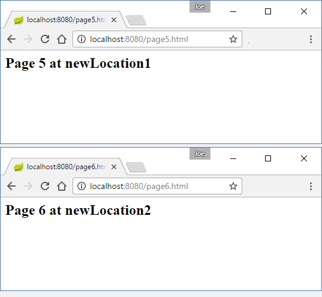
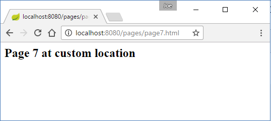

# Serving Static Web Contents

By default Spring boot serves static content from one of the following locations in the classpath:

1. /static

2. /public

3. /resources

4. /META-INF/resources

## Example

For a maven project, the content of src/main/resources/ is in classpath during runtime, so we will be adding above locations there.

Let's create a web page under one of the locations listed above: src/main/resources/static/page1.html

```html
<h2>Page 1</h2>
```

We don't have to add any controller for static contents.

```java
@EnableAutoConfiguration
public class WebStaticPagesExample {

    public static void main (String[] args) {
        SpringApplication app =
                  new SpringApplication(WebStaticPagesExample.class);
        app.run(args);
    }
}
```

Run the above main class and access the page at 'http://localhost:8080/page1.html' :


## Setting new locations

We can customize the static resource locations using spring.resources.static-locations property. That will replace the default values with a list of new directory locations.

```java
@EnableAutoConfiguration
public class ReplaceDefaultLocationsExample {

    public static void main (String[] args) {

        SpringApplication app =
                  new SpringApplication(ReplaceDefaultLocationsExample.class);

        Properties properties = new Properties();
        properties.setProperty("spring.resources.static-locations",
                          "classpath:/newLocation1/, classpath:/newLocation2/");
        app.setDefaultProperties(properties);
        app.run(args);
    }
}
```

Note that the property spring.resources.static-locations (dash notation) is equivalent to spring.resources.staticLocations (camel case syntax) or spring.resources.static_locations (underscore notation). This is due to spring boot relaxed binding rules. These rules are automatically applied whenever the provided properties are mapped to a class annotated with @ConfigurationProperties (check out this tutorial). In above case ResourceProperties is used (Spring boot class with @ConfigurationProperties) and the above property is mapped to ResourceProperties.setStaticLocations() java bean property.

To test above property, add a page at new location, src/main/resources/newLocation1/Page5.html

```html
<h2>Page 5 at newLocation1</h2>
```

Add a similar page at src/main/resources/newLocation2/Page6.html.



## Specifying additional locations for static content

We can specify additional static locations by using WebMvcConfigurerAdapter and overriding the addResourceHandlers method.

This doesn't override the default locations.

```java
@EnableAutoConfiguration
public class AddCustomLocations {
    @Bean
    WebMvcConfigurer configurer () {
        return new WebMvcConfigurerAdapter() {
            @Override
            public void addResourceHandlers (ResourceHandlerRegistry registry) {
                registry.addResourceHandler("/pages/**").
                          addResourceLocations("classpath:/my-custom-location/");
            }
        };
    }

    public static void main (String[] args) {

        SpringApplication app =
                  new SpringApplication(AddCustomLocations.class);
        app.run(args);
    }
}
```

Add new page: src/main/resources/new-custom-location/page7.html

```xml
<h2>Page 7 at custom location/h2>
```

Access page at http://localhost:8080/pages/page7.html



## Static Welcome page

A static welcome page can added with name 'index.html' at any of the active static locations. For example, let's add following index.html and run our first example WebStaticPagesExample class.

src\main\resources\static\index.html

```xml
<h2>Welcome Page</h2>
```


