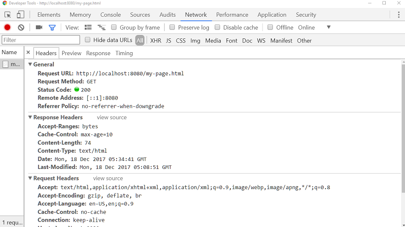
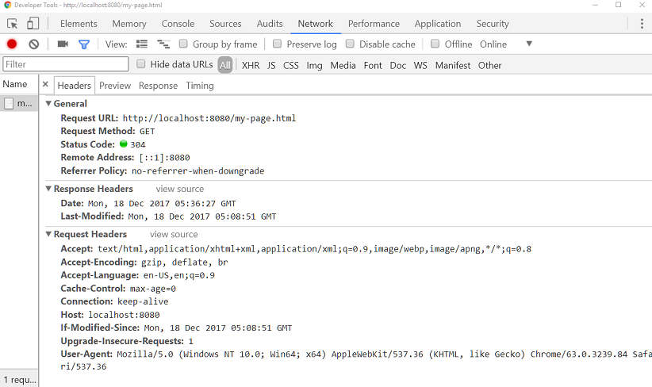

# Setting Cache Period for Static Resources

In Spring Boot, we can set spring.resources.cache-period property to specify the cache period for the static resources in seconds. By default this value is zero. The value set to this property (say n) will cause the response header of Cache-Control:max-age=n to be sent to the browser.

## Example

In this example, we are going to create a static page under default '/static' folder.

**src\main\resources\static\my-page.html**

```html
<!DOCTYPE html>
<html>
<body>
<h2>My Static page 9</h2>
</body>
</html>
```
**src/main/resources/application.properties**

```shell
spring.main.banner-mode=off 
spring.main.logStartupInfo=false
spring.resources.cache-period=10
```

**Main Class**

```java
@SpringBootApplication
public class ExampleMain {
  public static void main(String[] args) throws InterruptedException {
      SpringApplication.run(ExampleMain.class, args);
  }
}
```

**Output**


In chrome's developer tools:



Refresh again:



See also 'Last-Modified', 'If-Modified-Since' and 'Cache-Control' headers info [here](http://www.logicbig.com/quick-info/web/last-modified-and-if-modified-since/) and Spring MVC support for Cache-Control [here](http://www.logicbig.com/tutorials/spring-framework/spring-web-mvc/cache-control/).

