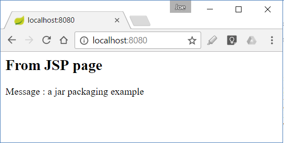
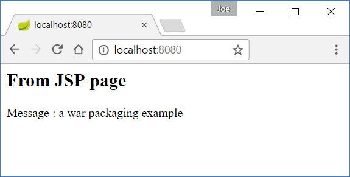

# 03.Serving JSP pages

Placing dynamic contents like JSP pages into static locations does not work.

In a war project, JSP pages are served from src/main/webapp/WEB-INF/.

In a Jar project, JSP pages cannot simply be served from webapp location or from src/main/resources/. That's because of the [limitation stated in boot ref docs](http://docs.spring.io/spring-boot/docs/current/reference/html/boot-features-developing-web-applications.html#boot-features-jsp-limitations).

The location src/main/webapp/WEB-INF may work in exploded form but should be avoided. From boot ref docs:

Do not use the src/main/webapp directory if your application will be packaged as a jar. Although this directory is a common standard, it will only work with war packaging and it will be silently ignored by most build tools if you generate a jar.

Fortunately we have another option for a Jar project: Servlet 3.0 specification allows to have dynamic pages in src/main/resources/META-INF/resources/ (Please check out an example [here](http://www.logicbig.com/tutorials/java-ee-tutorial/java-servlet/servlet-web-fragment/)).

Let's explore both options with examples.

## Serving JSPs with Jar Packaging

**Creating Controller**

```java
@Controller
public class MyController {

   @RequestMapping("/")
   public String handler (Model model) {
       model.addAttribute("msg",
                          "a jar packaging example");
       return "myView";
   }
}
```

**The JSP page**

Save the following page at location: src/main/resources/META-INF/resources/WEB-INF/views/myView.jsp

```jsp
<h2>From JSP page </h2>
<%@ page language="java"
    contentType="text/html; charset=ISO-8859-1"
    pageEncoding="ISO-8859-1"%>
<html>
<body>
    Message : ${msg}
</body>
</html>
```

**The view resolver**

Boot auto-configuration implicitly adds many view resolvers including InternalResourceViewResolver. This resolver is used to locate and render JSP pages. A boot application client just need to add spring.mvc.view.prefix and spring.mvc.view.suffix properties:

src/main/resources/application.properties:

```shell
spring.mvc.view.prefix= /WEB-INF/views/
spring.mvc.view.suffix= .jsp
```

**JSP related dependencies in gradle**

```gradle
buildscript {
	ext {
		springBootVersion = '1.5.10.RELEASE'
	}
	repositories {
		mavenCentral()
	}
	dependencies {
		classpath("org.springframework.boot:spring-boot-gradle-plugin:${springBootVersion}")
	}
}

apply plugin: 'java'
apply plugin: 'eclipse'
apply plugin: 'org.springframework.boot'

sourceCompatibility = 1.8

repositories {
	mavenCentral()
}


dependencies {
	compile('org.springframework.boot:spring-boot-starter-web')
	compileOnly('org.projectlombok:lombok')
	compile('org.apache.tomcat.embed:tomcat-embed-jasper:8.5.28')
	
	testCompile('org.springframework.boot:spring-boot-starter-test')
}
```

**Output**



## Serving JSPs with War Packaging

We are going to modify above example to package it as war, which can be deployed to external web container as well.

### Specifying packaging as war

```shell
buildscript {
	ext {
		springBootVersion = '1.5.10.RELEASE'
	}
	repositories {
		mavenCentral()
	}
	dependencies {
		classpath("org.springframework.boot:spring-boot-gradle-plugin:${springBootVersion}")
	}
}

apply plugin: 'war'
apply plugin: 'eclipse-wtp'
apply plugin: 'org.springframework.boot'

war {
	baseName = 'jspinwar'
}

eclipse {
	wtp {
		component {
			contextPath = 'jspinwar'
		}
	}
}

sourceCompatibility = 1.8

repositories {
	mavenCentral()
}


dependencies {
	compile('org.springframework.boot:spring-boot-starter-web')
	compile("javax.servlet:jstl:1.2")
	providedCompile('org.apache.tomcat.embed:tomcat-embed-jasper:8.5.28')
	providedCompile('org.springframework.boot:spring-boot-starter-tomcat')
	
	testCompile('org.springframework.boot:spring-boot-starter-test')
}
```

In this example, we modified build.gradle file to use the war and eclipse-wtp plugins.

### Location for JSPs

Here we have two options:

We can leave the jsp pages at the same location i.e. src/main/resources/META-INF/resources/WEB-INF/views/ 
Or
We can place them in the traditional **webapp** location i.e. src/main/webapp/WEB-INF/views/

Both options will work.

In this example we are going to place it under webapp directory.

### The main class

```java
@SpringBootApplication
public class WebMvcConfigExample extends SpringBootServletInitializer {

   @Override
   protected SpringApplicationBuilder configure (SpringApplicationBuilder builder) {
       return builder.sources(WebMvcConfigExample.class);
   }

   public static void main (String[] args) {

       SpringApplication app =
                 new SpringApplication(WebMvcConfigExample.class);
       app.run(args);
   }
}
```

### Why SpringBootServletInitializer should be subclassed?

For producing a deployable war file, we have to provide a SpringBootServletInitializer subclass and override its configure method.

In above code, the main class is extending SpringBootServletInitializer which in turn extends WebApplicationInitializer. WebApplicationInitializer is based on servlet 3.0 ServletContainerInitializer concept. The purpose of this extension is: WebApplicationInitializer sets up servlet context and additionally it asks subclass to set up the source (the class annotated with @SpringBootApplication) of the SpringApplication. so that it can call SpringApplication#run() with a valid source and can do it's auto configuration and application level bean wiring etc. This arrangement is only needed when application is deployed in a servlet container as a war file. In a web container of course 'main method' can't get executed like it does in a stand-alone exploded application or executable jar or war.

If interested check out onStartup(..) method of SpringBootServletInitializer.java.

### Exclude embedded tomcat server from deployable war file

spring-boot-starter-web has transitive dependency of spring-boot-starter-tomcat. We have to change its default scope to 'provided' so that it won't get included in the resultant war, otherwise the embedded servlet container will interfere with the servlet container.

```shell
dependencies {
	compile('org.springframework.boot:spring-boot-starter-web')
	compile("javax.servlet:jstl:1.2")
	providedCompile('org.apache.tomcat.embed:tomcat-embed-jasper:8.5.28')
	providedCompile('org.springframework.boot:spring-boot-starter-tomcat')
	
	testCompile('org.springframework.boot:spring-boot-starter-test')
}
```

There are no major changes with the controller and application.properties.

### Running the war application

After packaging the war, we can deploy it to a servlet container or we can still execute it in exploded form.

**Output**

