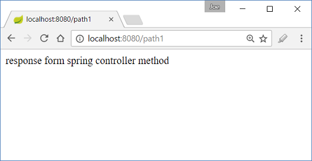
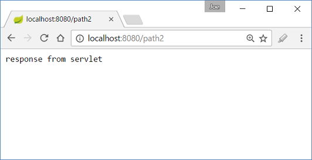

# Using Servlet Components: @WebServlet, @WebFilter and @WebListener in a Spring Boot Application

Spring boot's annotation @ServletComponentScan enables scanning of Servlet components. That means Servlet 3.0 annotations: @WebServlet, @WebFilter and @WebListener can be used along with Spring components. This is specially very useful when we are developing a jar project.

@ServletComponentScan imports an implementation of ImportBeanDefinitionRegistrar: ServletComponentScanRegistrar which performs package scanning and kicks off the servlet components registration process. By default Spring will scan the package of the class where this annotation is used. The scanning package can be altered by using one of the elements: value, backPackages or basePackageClasses of this annotation.

@ServletComponentScan will only be used when the application needs to run in embedded container. When deployed in an external container, this annotation has no effect, as Servlet container's built-in scanning mechanism (per Servlet specifications) takes care of discovering servlet components.

## Spring boot main class with @ServletComponentScan

```java
@ServletComponentScan
@SpringBootApplication
public class Main  {

  public static void main (String[] args) {
      SpringApplication sa = new SpringApplication(Main.class);
      sa.setLogStartupInfo(false);
      sa.setBannerMode(Banner.Mode.OFF);
      sa.run(args);
  }
}
```

## A Servlet component

```java
@WebServlet(urlPatterns = "/path2/*")
public class MyServlet extends HttpServlet {

  @Override
  protected void doGet (HttpServletRequest req, HttpServletResponse resp)
            throws ServletException, IOException {

      PrintWriter writer = resp.getWriter();
      writer.println("response from servlet ");
  }
}
```

## A Filter component

```java
@WebFilter(urlPatterns = "/*")
public class MyFilter implements Filter{
  
  @Override
  public void init (FilterConfig filterConfig) throws ServletException {

  }

  @Override
  public void doFilter (ServletRequest request,
                        ServletResponse response, FilterChain chain)
            throws IOException, ServletException {
      String url = request instanceof HttpServletRequest ?
                ((HttpServletRequest) request).getRequestURL().toString() : "N/A";
      System.out.println("from filter, processing url: "+url);
      chain.doFilter(request, response);
  }

  @Override
  public void destroy () {

  }
}
```

## A ServletContentListener

```java
@WebListener
public class MyServletListener implements ServletContextListener{
  
  @Override
  public void contextInitialized (ServletContextEvent sce) {
      System.out.println("from ServletContextListener: " +
                                   " context initialized");

  }

  @Override
  public void contextDestroyed (ServletContextEvent sce) {

  }
}
```

## A Spring Controller

```java
@Controller
public class MyController {

  @RequestMapping("/*")
  @ResponseBody
  public String handler () {
      return "response form spring controller method";
  }

}
```

## src/main/resources/application.properties

```shell
spring.mvc.view.prefix= /WEB-INF/pages/
spring.mvc.view.suffix= .jsp
server.servlet-path=/path1
```

'server.servlet-path' is the path of Spring DispatcherServlet.

## Output

During startup:

```shell
2017-01-31 01:50:03.791  INFO 7440 --- [           main] ationConfigEmbeddedWebApplicationContext : Refreshing org.springframework.boot.context.embedded.AnnotationConfigEmbeddedWebApplicationContext@70e8f8e: startup date [Tue Jan 31 01:50:03 CST 2017]; root of context hierarchy
2017-01-31 01:50:05.172  INFO 7440 --- [           main] s.b.c.e.t.TomcatEmbeddedServletContainer : Tomcat initialized with port(s): 8080 (http)
2017-01-31 01:50:05.182  INFO 7440 --- [           main] o.apache.catalina.core.StandardService   : Starting service Tomcat
2017-01-31 01:50:05.184  INFO 7440 --- [           main] org.apache.catalina.core.StandardEngine  : Starting Servlet Engine: Apache Tomcat/8.5.11
2017-01-31 01:50:05.264  INFO 7440 --- [ost-startStop-1] o.a.c.c.C.[Tomcat].[localhost].[/]       : Initializing Spring embedded WebApplicationContext
2017-01-31 01:50:05.265  INFO 7440 --- [ost-startStop-1] o.s.web.context.ContextLoader            : Root WebApplicationContext: initialization completed in 1477 ms
2017-01-31 01:50:05.423  INFO 7440 --- [ost-startStop-1] o.s.b.w.servlet.ServletRegistrationBean  : Mapping servlet: 'dispatcherServlet' to [/path1/*]
2017-01-31 01:50:05.424  INFO 7440 --- [ost-startStop-1] o.s.b.w.servlet.ServletRegistrationBean  : Mapping servlet: 'com.logicbig.example.MyServlet' to [/path2/*]
2017-01-31 01:50:05.426  INFO 7440 --- [ost-startStop-1] o.s.b.w.servlet.FilterRegistrationBean   : Mapping filter: 'characterEncodingFilter' to: [/*]
2017-01-31 01:50:05.427  INFO 7440 --- [ost-startStop-1] o.s.b.w.servlet.FilterRegistrationBean   : Mapping filter: 'hiddenHttpMethodFilter' to: [/*]
2017-01-31 01:50:05.427  INFO 7440 --- [ost-startStop-1] o.s.b.w.servlet.FilterRegistrationBean   : Mapping filter: 'httpPutFormContentFilter' to: [/*]
2017-01-31 01:50:05.427  INFO 7440 --- [ost-startStop-1] o.s.b.w.servlet.FilterRegistrationBean   : Mapping filter: 'requestContextFilter' to: [/*]
2017-01-31 01:50:05.427  INFO 7440 --- [ost-startStop-1] o.s.b.w.servlet.FilterRegistrationBean   : Mapping filter: 'com.logicbig.example.MyFilter' to urls: [/*]
from ServletContextListener:  context initialized
2017-01-31 01:50:05.705  INFO 7440 --- [           main] s.w.s.m.m.a.RequestMappingHandlerAdapter : Looking for @ControllerAdvice: org.springframework.boot.context.embedded.AnnotationConfigEmbeddedWebApplicationContext@70e8f8e: startup date [Tue Jan 31 01:50:03 CST 2017]; root of context hierarchy
2017-01-31 01:50:05.765  INFO 7440 --- [           main] s.w.s.m.m.a.RequestMappingHandlerMapping : Mapped "{[/*]}" onto public java.lang.String com.logicbig.example.MyController.handler()
2017-01-31 01:50:05.769  INFO 7440 --- [           main] s.w.s.m.m.a.RequestMappingHandlerMapping : Mapped "{[/error]}" onto public org.springframework.http.ResponseEntity<java.util.Map<java.lang.String, java.lang.Object>> org.springframework.boot.autoconfigure.web.BasicErrorController.error(javax.servlet.http.HttpServletRequest)
2017-01-31 01:50:05.769  INFO 7440 --- [           main] s.w.s.m.m.a.RequestMappingHandlerMapping : Mapped "{[/error],produces=[text/html]}" onto public org.springframework.web.servlet.ModelAndView org.springframework.boot.autoconfigure.web.BasicErrorController.errorHtml(javax.servlet.http.HttpServletRequest,javax.servlet.http.HttpServletResponse)
2017-01-31 01:50:05.797  INFO 7440 --- [           main] o.s.w.s.handler.SimpleUrlHandlerMapping  : Mapped URL path [/webjars/**] onto handler of type [class org.springframework.web.servlet.resource.ResourceHttpRequestHandler]
2017-01-31 01:50:05.797  INFO 7440 --- [           main] o.s.w.s.handler.SimpleUrlHandlerMapping  : Mapped URL path [/**] onto handler of type [class org.springframework.web.servlet.resource.ResourceHttpRequestHandler]
2017-01-31 01:50:05.834  INFO 7440 --- [           main] o.s.w.s.handler.SimpleUrlHandlerMapping  : Mapped URL path [/**/favicon.ico] onto handler of type [class org.springframework.web.servlet.resource.ResourceHttpRequestHandler]
2017-01-31 01:50:05.956  INFO 7440 --- [           main] o.s.j.e.a.AnnotationMBeanExporter        : Registering beans for JMX exposure on startup
2017-01-31 01:50:06.010  INFO 7440 --- [           main] s.b.c.e.t.TomcatEmbeddedServletContainer : Tomcat started on port(s): 8080 (http)
```

**/path1**



Console:

```shell
from filter, processing url: http://localhost:8080/path1
```

**/path2**



Console:

```shell
from filter, processing url: http://localhost:8080/path2
```
