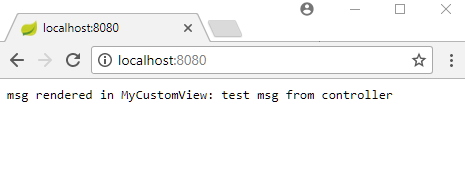

# BeanNameViewResolver Auto Registration

In Spring Boot, BeanNameViewResolver bean is registered by default, that means we can use a View's bean name as a view name by default. In a plain Spring MVC application we have to explicitly register this bean ourselves (example here).

We are going to create a custom View in this example.

## A custom View

```java
package com.logicbig.example;

import org.springframework.stereotype.Component;
import org.springframework.web.servlet.View;
import javax.servlet.http.HttpServletRequest;
import javax.servlet.http.HttpServletResponse;
import java.io.PrintWriter;
import java.util.Map;

@Component("myCustomView")
public class MyCustomView implements View {

  @Override
  public String getContentType() {
      return "text/html";
  }

  @Override
  public void render(Map<String, ?> map, HttpServletRequest httpServletRequest,
                     HttpServletResponse httpServletResponse) throws Exception {
      PrintWriter writer = httpServletResponse.getWriter();
      writer.write("msg rendered in MyCustomView: " + map.get("msg"));
  }
}
```

## A Controller

```java
@Controller
public class MyController {

  @GetMapping("/")
  public String handle(Model model) {
      model.addAttribute("msg", "test msg from controller");
      return "myCustomView";
  }
}
```

## Java Config and Main Class

```java
@SpringBootApplication
public class ExampleMain {

  public static void main(String[] args) throws InterruptedException {
      SpringApplication.run(ExampleMain.class, args);
  }
}
```

## Output


