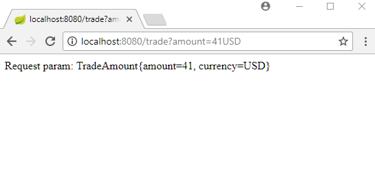

# Registering a Custom Formatter in Spring Boot

In this example we will see how to do application side Web MVC configuration in Spring boot (See also [Spring Boot Web MVC Auto Configuration](../09-mvc-auto-config/README.md).

We are going to create and register a custom MVC Formatter in this example.

## A custom Formatter

Following formatter parses a String to our helper object TradeAmount and vice versa. The parse() method expects an input string having integers as the amount followed by a valid Currency code e.g. 53USD.

```java
package com.logicbig.example;

import org.springframework.format.Formatter;
import java.math.BigDecimal;
import java.text.ParseException;
import java.util.Currency;
import java.util.Locale;
import java.util.regex.Matcher;
import java.util.regex.Pattern;

public class TradeAmountFormatter implements Formatter<TradeAmount> {
  private static final Pattern amountPattern = Pattern.compile("(\\d+)(\\w+)");

  @Override
  public TradeAmount parse(String text, Locale locale) throws ParseException {
      Matcher matcher = amountPattern.matcher(text);
      if (matcher.find()) {
          try {
              TradeAmount ta = new TradeAmount();
              ta.setAmount(new BigDecimal(Integer.parseInt(matcher.group(1))));
              ta.setCurrency(Currency.getInstance(matcher.group(2)));
              return ta;
          } catch (Exception e) {
          }
      }
      return new TradeAmount();
  }

  @Override
  public String print(TradeAmount tradeAmount, Locale locale) {
      return tradeAmount.getAmount().toPlainString() + tradeAmount.getCurrency().getSymbol(locale);
  }
}
```

```java
public class TradeAmount {
  private Currency currency;
  private BigDecimal amount;
    .............
}
```

## A Controller

```java
@Controller
@RequestMapping("/")
public class TradeController {

  @GetMapping("/trade")
  @ResponseBody
  public String handleRequest(@RequestParam TradeAmount amount) {
      return "Request param: "+ amount;
  }
}
```

## Boot main class

```java
@SpringBootApplication
public class BootMain {
    public static void main(String[] args) {
        SpringApplication.run(BootMain.class, args);
    }

    @Configuration
    static class MyConfig extends WebMvcConfigurerAdapter {
        @Override
        public void addFormatters(FormatterRegistry registry) {
            registry.addFormatter(new TradeAmountFormatter());
        }
    }
}
```

## Output

