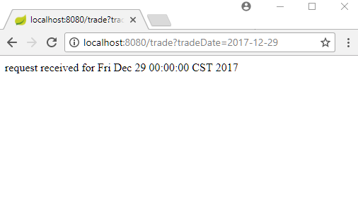

# Registering a Custom ConfigurableWebBindingInitializer as a Bean

In Spring MVC, we can use a custom ConfigurableWebBindingInitializer by directly extending WebMvcConfigurationSupport.

In Spring Boot application, we just need to register custom ConfigurableWebBindingInitializer as a bean which will replace the default one. If curious then you can see how that happens in getConfigurableWebBindingInitializer() method's source code of EnableWebMvcConfiguration which is a nested class of WebMvcAutoConfiguration.

## Spring MVC Controller

```java
@Controller
@RequestMapping("/")
public class TradeController {

  @GetMapping("/trade")
  @ResponseBody
  public String handleRequest(@RequestParam Date tradeDate) {
      return "request received for " + tradeDate;
  }
}
```

## Java Config and Spring Boot Main Class

In following example, we are adding back the DefaultFormattingConversionService so that the default conversion should work as it is. We are additionally adding a custom PropertyEditor. Also see the comments for additional configuration we can do:

```java
@SpringBootApplication
public class ExampleMain {

  @Bean
  public ConfigurableWebBindingInitializer getConfigurableWebBindingInitializer() {
      ConfigurableWebBindingInitializer initializer = new ConfigurableWebBindingInitializer();
      FormattingConversionService conversionService = new DefaultFormattingConversionService();
      //we can add our custom converters and formatters
      //conversionService.addConverter(...);
      //conversionService.addFormatter(...);
      initializer.setConversionService(conversionService);
      //we can set our custom validator
      //initializer.setValidator(....);

      //here we are setting a custom PropertyEditor
      initializer.setPropertyEditorRegistrar(propertyEditorRegistry -> {
          SimpleDateFormat dateFormatter = new SimpleDateFormat("yyyy-MM-dd");
          propertyEditorRegistry.registerCustomEditor(Date.class,
                  new CustomDateEditor(dateFormatter, true));
      });
      return initializer;
  }

  public static void main(String[] args) throws InterruptedException {
      SpringApplication.run(ExampleMain.class, args);
  }
}
```

## Output

