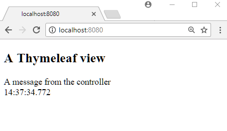

# Use Thymeleaf View

To use Thymeleaf in Spring Boot application, we just need to include spring-boot-starter-thymeleaf dependency and place the template file under src/main/resources/templates/ directory. The rest of the configurations is done automatically by Spring Boot. 

## Thymeleaf Template File

**/src/main/resources/templates/my-page.html**

```html
<!DOCTYPE html>
<html xmlns="http://www.w3.org/1999/xhtml"
      xmlns:th="http://www.thymeleaf.org">

<body>
<h2>A Thymeleaf view</h2>
<div th:text="${msg}"/>
<div th:text="${time}"/>
</body>
</html>
```

## Spring MVC Controller

```java
@Controller
@RequestMapping("/")
public class MyController {

  @RequestMapping
  public String handleRequest (Model model) {
      model.addAttribute("msg", "A message from the controller");
      model.addAttribute("time", LocalTime.now());
      return "my-page";
  }
}
```

## Spring boot main class

```java
@SpringBootApplication
public class ExampleMain {

  public static void main(String[] args) throws InterruptedException {
      SpringApplication.run(ExampleMain.class, args);
  }
}
```

## Output

