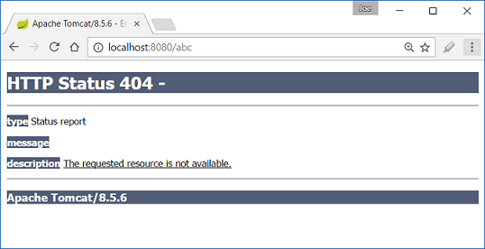

# Disabling Whitelabel error page

Spring boot uses a default 'whitelabel' error page in browser client if encountered a server error. In this tutorial we are going to see the behavior of whitelabel error page and different options to disable it.

## Create a controller

```java
@Controller
public class MyController {

  @RequestMapping("/")
  public String handler (Model model) {
      model.addAttribute("msg",
                         "a spring-boot example");
      return "myPage";
  }

  @RequestMapping("/test")
  public  void handler2 () {
     throw new RuntimeException("exception from handler2");
  }
}
```

## Main class

```java
@SpringBootApplication
public class Main extends SpringBootServletInitializer {

  @Override
  protected SpringApplicationBuilder configure (SpringApplicationBuilder builder) {
      return builder.sources(Main.class);
  }

  public static void main (String[] args) {
      SpringApplication.run(Main.class, args);
  }
}
```

## src/main/resources/application.properties

```apache
spring.mvc.view.prefix= /WEB-INF/pages/
spring.mvc.view.suffix= .jsp
```

## Output 

### Run as a Jar


Entering a URL which is not mapped by our controller, will return whitelabel page with 404


At URI /test, where the mapped handler method throws NullPointerException:


### Run as a War

The output will be the same if we package and deploy the war to the tomcat server.

## Disabling whitelabel

### Method 1: Using 'server.error.whitelabel.enabled=false'

**/src/main/resources/application.properties**

```
spring.mvc.view.prefix= /WEB-INF/pages/
spring.mvc.view.suffix= .jsp
server.error.whitelabel.enabled=false
```

#### Run as a Jar


As seen above the whitelabel page is not used, also the error is not even handled by the tomcat container's default error handling mechanism.

#### Deploy war to tomcat:

The above method is meant to be used in embedded container only, but let's deploy the war to tomcat server to see the behavior:

Run the locally installed tomcat server instance('<tomcat-home>/bin/startup.bat') and deploy the war:


As seen above the error is due to not finding 'error.jsp' page and the original error is hidden.

### Method2: Using exclude = ErrorMvcAutoConfiguration.class

Comment out the property, 'server.error.whitelabel.enabled' in application.properties

```
spring.mvc.view.prefix= /WEB-INF/pages/
spring.mvc.view.suffix= .jsp
#server.error.whitelabel.enabled=false
```

Exclude ErrorMvcAutoConfiguration (which auto configures error page and related classes):

```
@SpringBootApplication(exclude = ErrorMvcAutoConfiguration.class )
public class Main extends SpringBootServletInitializer {

    @Override
    protected SpringApplicationBuilder configure (SpringApplicationBuilder builder) {
        return builder.sources(Main.class);
    }

    public static void main (String[] args) {
        SpringApplication.run(Main.class, args);
    }
}
```

#### Output when running as Jar




#### Output when running in War

 

The error is handled by tomcat container in both cases.

## Conclusion:

If we want to disable whitelabel error page to let servlet container handle the error, use method 2: `@SpringBootApplication(exclude = ErrorMvcAutoConfiguration.class)`

To disable it when running in embedded container and we don't want to use container based error handling use method 1: `server.error.whitelabel.enabled=false`