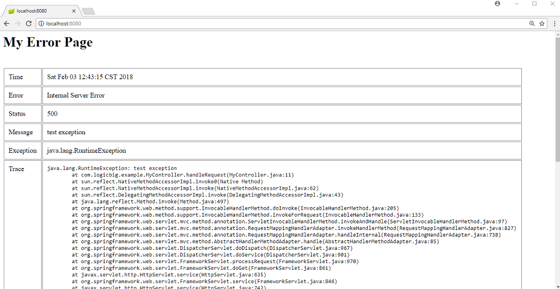
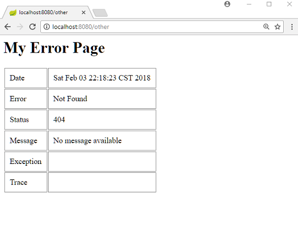
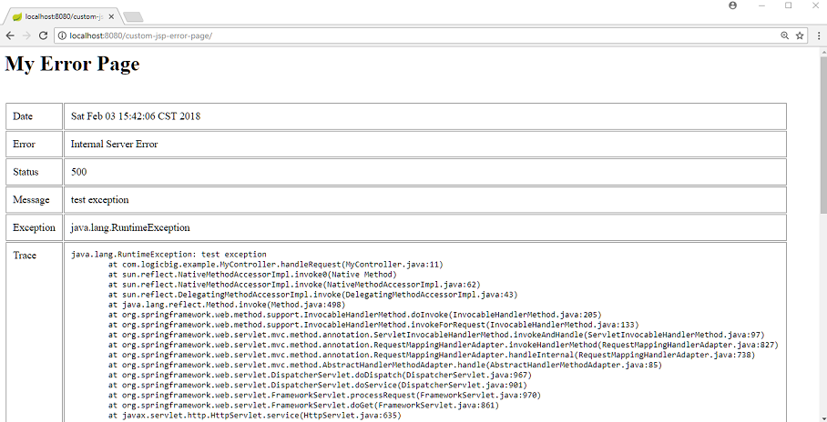

# Custom Error Page in JSP

This example shows how to replace the default whitelabel error page with a custom JSP error page in Spring Boot.

## Create a controller

```java
@Controller
public class MyController {

  @RequestMapping("/")
  public void handleRequest() {
      throw new RuntimeException("test exception");
  }
}
```

## A custom JSP error page

Spring Boot by default provides /error mapping where all exception/errors are forwarded, that means we can map errors to a JSP page with the name `error.jsp`.

Following attributes are available for our view to display: 

`timestamp`, `status`, `error`, `exception`, `message`, `trace`, `path`.

**src/main/webapp/WEB-INF/views/error.jsp**

```jsp
<%@ page language="java"
contentType="text/html; charset=ISO-8859-1"
pageEncoding="ISO-8859-1"%>
<html>
<head>
<style>
table td{
vertical-align:top;
border:solid 1px #888;
padding:10px;
}
</style>
</head>
<body>
    <h1>My Error Page</h1>
    <table>
        <tr>
            <td>Date</td>
            <td>${timestamp}</td>
        </tr>
        <tr>
            <td>Error</td>
            <td>${error}</td>
        </tr>
        <tr>
            <td>Status</td>
            <td>${status}</td>
        </tr>
        <tr>
            <td>Message</td>
            <td>${message}</td>
        </tr>
        <tr>
            <td>Exception</td>
            <td>${exception}</td>
        </tr>
        <tr>
            <td>Trace</td>
            <td>
                <pre>${trace}</pre>
            </td>
        </tr>
    </table>
</body>
</html>
```

## Spring Boot application.properties file

We have to disable the default whitelabel page for our jsp error page to work. We are additionally enabling the stacktrace to be included as expression attribute to our view.

**src/main/resources/application.properties**

```apache
spring.mvc.view.prefix= /WEB-INF/views/
spring.mvc.view.suffix= .jsp
server.error.whitelabel.enabled=false
server.error.include-stacktrace=always
```

The default value of `server.error.include-stacktrace` is `never`. Setting this attribute to `always` for default whitelabel page does not work because that view does not include `${trace}` expression (if interested see the source code of nested class WhitelabelErrorViewConfiguration of ErrorMvcAutoConfiguration).

## Main class

```java
@SpringBootApplication
public class SpringBootMain extends SpringBootServletInitializer {

  @Override
  protected SpringApplicationBuilder configure(SpringApplicationBuilder builder) {
      return builder.sources(SpringBootMain.class);
  }

  public static void main(String[] args) {
      SpringApplication.run(SpringBootMain.class);
  }
}
```

## Output

Accessing http:/localhost:8080/



Accessing unmapped URL, say http:/localhost:8080/other



### Deploying to Tomcat server:

Output:

Accessing the example app at http://localhost:8080/custom-jsp-error-page/


