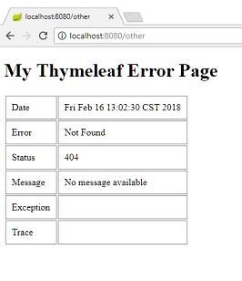

# Custom Error Page in Thymeleaf

This example shows how to replace the default whitelabel error page with a custom Thymeleaf error page in Spring Boot.

## Create a controller

```java
@Controller
public class MyController {

  @RequestMapping("/")
  public void handleRequest() {
      throw new RuntimeException("test exception");
  }
}
```

## A custom Thymeleaf error page

Spring Boot by default provides /error mapping where all exception/errors are forwarded. In case of Thymeleaf (or other template engines), we can map errors to a global custom template file by name `error` under `src/main/resources/templates/` directory.

**src/main/resources/templates/error.html**

```html
<!DOCTYPE html>
<html xmlns="http://www.w3.org/1999/xhtml"
      xmlns:th="http://www.thymeleaf.org">
<head>
    <style>
table td{
vertical-align:top;
border:solid 1px #888;
padding:10px;
}

    </style>
</head>
<body>
<h1>My Thymeleaf Error Page</h1>
<table>
    <tr>
        <td>Date</td>
        <td th:text="${timestamp}"/>
    </tr>
    <tr>
        <td>Path</td>
        <td th:text="${path}"/>
    </tr>
    <tr>
        <td>Error</td>
        <td th:text="${error}"/>
    </tr>
    <tr>
        <td>Status</td>
        <td th:text="${status}"/>
    </tr>
    <tr>
        <td>Message</td>
        <td th:text="${message}"/>
    </tr>
    <tr>
        <td>Exception</td>
        <td th:text="${exception}"/>
    </tr>
    <tr>
        <td>Trace</td>
        <td>
            <pre th:text="${trace}"/>
        </td>
    </tr>
</table>
</body>
</html>
```

## Spring Boot application.properties file

We are enabling the stacktrace to be included as expression attribute to our Thymeleaf view.

**src/main/resources/application.properties**

```
server.error.include-stacktrace=always
```

## Main class

```java
@SpringBootApplication
public class SpringBootMain extends SpringBootServletInitializer {

  @Override
  protected SpringApplicationBuilder configure(SpringApplicationBuilder builder) {
      return builder.sources(SpringBootMain.class);
  }

  public static void main(String[] args) {
      SpringApplication.run(SpringBootMain.class);
  }
}
```

## Output

Run as a Jar.

Accessing http:/localhost:8080/


Accessing unmapped URL, say http:/localhost:8080/other



Deploying to Tomcat server or running the Boot executable war also works without an problems.