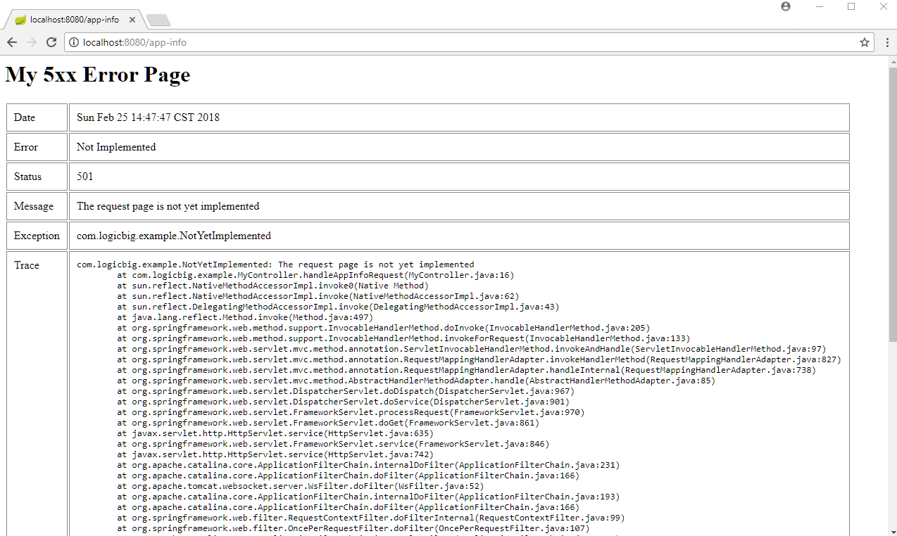
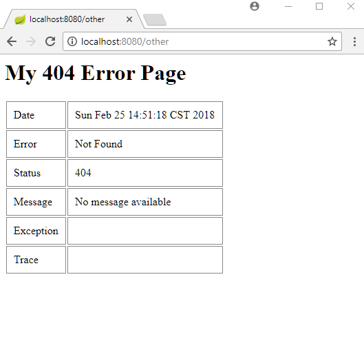
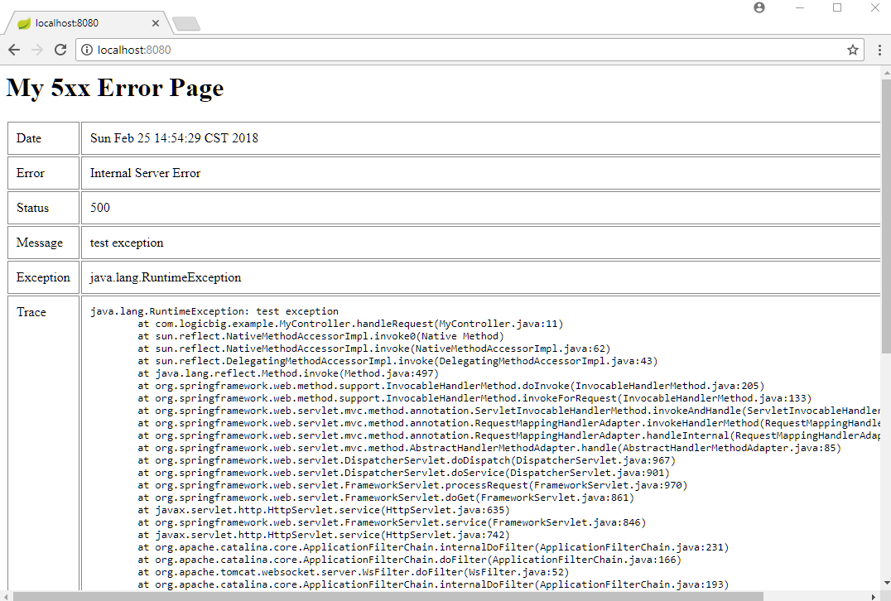
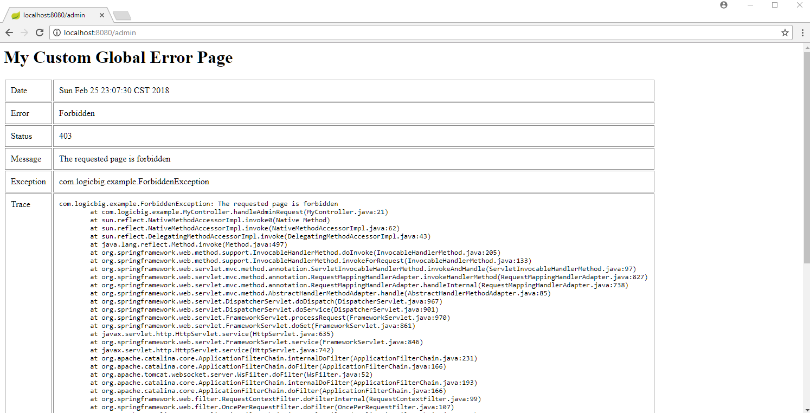

# Mapping HTTP Response Status Codes to Custom JSP Error Pages

Spring Boot can display a custom error page for a given status code given that a file named with the specific status code is provided to the `/error` folder. Status error pages can either be static HTML (i.e. added under any of the static resource folders) or built using JSP or other templates engines. The name of the file should be of the exact status code (e.g. 404.jsp, 404.html etc) or a series mask (e.g 3xx.jsp, 4xx.jsp, 5xx.jsp, 5xx.html etc).

In following example, we will map status codes to jsp pages only.

## Creating a controller

```java
@Controller
public class MyController {

  @RequestMapping("/")
  public void handleRequest() {
      throw new RuntimeException("test exception");
  }

  @RequestMapping("/app-info")
  public void handleAppInfoRequest() throws NotYetImplemented {
      throw new NotYetImplemented("The request page is not yet implemented");
  }

  @RequestMapping("/admin")
  public void handleAdminRequest() throws ForbiddenException {
      throw new ForbiddenException("The requested page is forbidden");
  }
}
```

Above method `handleRequest()` throws `RuntimeException` which will return the response code `500` (internal error). The other method `handleAppInfoRequest()` throws a custom error, let's bind that exception with a specific response status code.

## Specifying Status code on Custom Exception

```java
@ResponseStatus(HttpStatus.NOT_IMPLEMENTED)
public class NotYetImplemented extends Exception {
  public NotYetImplemented(String message) {
      super(message);
  }
}
```

The `NOT_IMPLEMENTED` will return the response status code of `501`.

Also our handler method `handleAdminRequest()` throws another custom error. Let's bind that exception with another specific response status code.

```java
@ResponseStatus(HttpStatus.FORBIDDEN)
public class ForbiddenException extends Exception {
  public ForbiddenException(String message) {
      super(message);
  }
}
```

The `FORBIDDEN` will return the response status code of `403`.

## Mappings of Status Codes to JSP Pages

**src/main/webapp/WEB-INF/views/error/5xx.jsp**

```jsp
<%@ page language="java"
contentType="text/html; charset=ISO-8859-1"
pageEncoding="ISO-8859-1"%>
<html>
<head>
    <style>
table td{
vertical-align:top;
border:solid 1px #888;
padding:10px;
}
</style>
</head>
<body>
<h1>My 5xx Error Page</h1>
<table>
    <tr>
        <td>Date</td>
        <td>${timestamp}</td>
    </tr>
    <tr>
        <td>Error</td>
        <td>${error}</td>
    </tr>
    <tr>
        <td>Status</td>
        <td>${status}</td>
    </tr>
    <tr>
        <td>Message</td>
        <td>${message}</td>
    </tr>
    <tr>
        <td>Exception</td>
        <td>${exception}</td>
    </tr>
    <tr>
        <td>Trace</td>
        <td>
            <pre>${trace}</pre>
        </td>
    </tr>
</table>
</body>
</html>
```

Above page will map to all status codes of pattern 5xx e.g. 500, 501 etc.

Let's also add a 404 (not found) global error page (we are including all error attributes e.g. timestamp, exception etc but not necessary all values will be available ).

**src/main/webapp/WEB-INF/views/error/404.jsp**

```jsp
<%@ page language="java"
contentType="text/html; charset=ISO-8859-1"
pageEncoding="ISO-8859-1"%>
<html>
<head>
    <style>
table td{
vertical-align:top;
border:solid 1px #888;
padding:10px;
}
</style>
</head>
<body>
<h1>My 404 Error Page</h1>
<table>
    <tr>
        <td>Date</td>
        <td>${timestamp}</td>
    </tr>
    <tr>
        <td>Error</td>
        <td>${error}</td>
    </tr>
    <tr>
        <td>Status</td>
        <td>${status}</td>
    </tr>
    <tr>
        <td>Message</td>
        <td>${message}</td>
    </tr>
    <tr>
        <td>Exception</td>
        <td>${exception}</td>
    </tr>
    <tr>
        <td>Trace</td>
        <td>
            <pre>${trace}</pre>
        </td>
    </tr>
</table>
</body>
</html>
```

Let's also add a global error page not mapped to any status code (check out our previous tutorial to know the details):

**src/main/webapp/WEB-INF/views/error.jsp**

```jsp
<%@ page language="java"
contentType="text/html; charset=ISO-8859-1"
pageEncoding="ISO-8859-1"%>
<html>
<head>
<style>
table td{
vertical-align:top;
border:solid 1px #888;
padding:10px;
}
</style>
</head>
<body>
    <h1>My Custom Global Error Page</h1>
    <table>
        <tr>
            <td>Date</td>
            <td>${timestamp}</td>
        </tr>
        <tr>
            <td>Error</td>
            <td>${error}</td>
        </tr>
        <tr>
            <td>Status</td>
            <td>${status}</td>
        </tr>
        <tr>
            <td>Message</td>
            <td>${message}</td>
        </tr>
        <tr>
            <td>Exception</td>
            <td>${exception}</td>
        </tr>
        <tr>
            <td>Trace</td>
            <td>
                <pre>${trace}</pre>
            </td>
        </tr>
    </table>
</body>
</html>
```

Since our URI `/admin` returns exception with `403` status code and we have not provided any 403.jsp or 4xx.jsp, our above global error page (`error.jsp`) will be mapped in that case.

## Spring Boot application.properties file

**src/main/resources/application.properties**

```apache
spring.mvc.view.prefix= /WEB-INF/views/
spring.mvc.view.suffix= .jsp
server.error.whitelabel.enabled=false
server.error.include-stacktrace=always
```

## Main class

```java
@SpringBootApplication
public class SpringBootMain extends SpringBootServletInitializer {

  @Override
  protected SpringApplicationBuilder configure(SpringApplicationBuilder builder) {
      return builder.sources(SpringBootMain.class);
  }

  public static void main(String[] args) {
      SpringApplication.run(SpringBootMain.class);
  }
}
```

## Output

Accessing http:/localhost:8080/app-info where our handler method (`handleAppInfoRequest()`) throws the custom exception will map to `501` status code:



Accessing unmapped URL, say http:/localhost:8080/other, will map to our `404.jsp` page:



Accessing http:/localhost:8080/, where we our handler method (`handleRequest()`) throws `RuntimeException` will return the response code `500` (Internal server error) :



Accessing http://localhost:8080/admin will not map to any custom status code error page (we did not add 403.jsp or 4xx.jsp pages) and will be redirected to our default global `error.jsp` page:



## Notes

Using `@ResponseStatus` on the controller's method will not map to our custom error page, for example:

```
    @RequestMapping("/some-info")
    @ResponseStatus(HttpStatus.NOT_IMPLEMENTED)
    public void handleSomeInfoRequest() {
    }
```

Above will return status code 501 but will show no content and will not be redirected to our 5xx.jsp page.

Also using @ResponseStatus and throwing exception from controller will always return internal error (500). For example:

```
    @RequestMapping("/some-info")
    @ResponseStatus(HttpStatus.NOT_IMPLEMENTED)
    public void handleSomeInfoRequest() {
       throw new RuntimeException("not yet implemented");
    }
```

Using `ResponseEntity` does not work as well. For example:

```
    @RequestMapping("/some-info")
    public ResponseEntity<?> handleSomeInfoRequest() {
     ResponseEntity<?> re = new ResponseEntity<>((Object)null, HttpStatus.NOT_IMPLEMENTED);
        return re;
    }
```

Above will return 501 status code but without any response body and will not map to our 5xx.jsp error page.