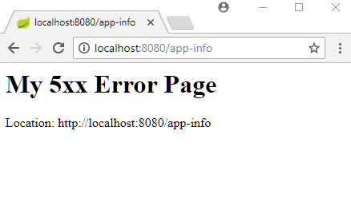
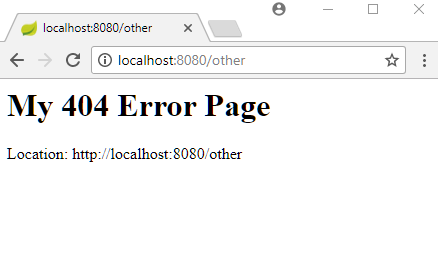
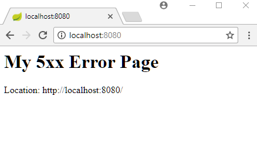

# Mapping HTTP Response Status Codes to Static HTML Pages

This example shows how to map static html error pages to HTTP Response Status codes. We can add our error pages at any of the static location as described [here](../../04-web-app/01-static-content/README.md).

## The Controller

```java
@Controller
public class MyController {

  @RequestMapping("/")
  public void handleRequest() {
      throw new RuntimeException("test exception");
  }

  @RequestMapping("/app-info")
  public void handleAppInfoRequest() throws NotYetImplemented {
      throw new NotYetImplemented("The request page is not yet implemented");
  }
}
Specifying Status code on Custom Exception
@ResponseStatus(HttpStatus.NOT_IMPLEMENTED)
public class NotYetImplemented extends Exception {
  public NotYetImplemented(String message) {
      super(message);
  }
}
```

The `NOT_IMPLEMENTED` will return the response status code of 501.

## Mappings of Status Codes to HTML Pages

**src/main/resources/static/error/5xx.html**

```html
<html>
<body>
<h1>My 5xx Error Page</h1>
<div id="locationDiv"></div>
<script>
     document.getElementById("locationDiv").innerHTML = "Location: " + window.location.href;
</script>
</body>
</html>
```

Above page will map to all status codes of pattern 5xx e.g. 500, 501 etc.

Let's also add a 404.html (not found) error page:

**src/main/resources/static/error/404.html**

```html
<html>
<body>
<h1>My 404 Error Page</h1>
<div id="locationDiv"></div>
<script>
     document.getElementById("locationDiv").innerHTML = "Location: " + window.location.href;
</script></body>
</html>
```

Note that we cannot map a static global page `error.html` to other status codes and exceptions (as we did in the last example by adding error.jsp).

## Main class

```java
@SpringBootApplication
public class SpringBootMain extends SpringBootServletInitializer {

  @Override
  protected SpringApplicationBuilder configure(SpringApplicationBuilder builder) {
      return builder.sources(SpringBootMain.class);
  }

  public static void main(String[] args) {
      SpringApplication.run(SpringBootMain.class);
  }
}
```

## Output

Accessing http:/localhost:8080/app-info where our handler method (`handleAppInfoRequest()`) throws the custom exception will map to `501` status code:



Accessing unmapped URL, say http:/localhost:8080/other, will map to our 404.html page:



Accessing http:/localhost:8080/, where we our handler method (`handleRequest()`) throws `RuntimeException` will return the response code `500` (Internal server error) :


