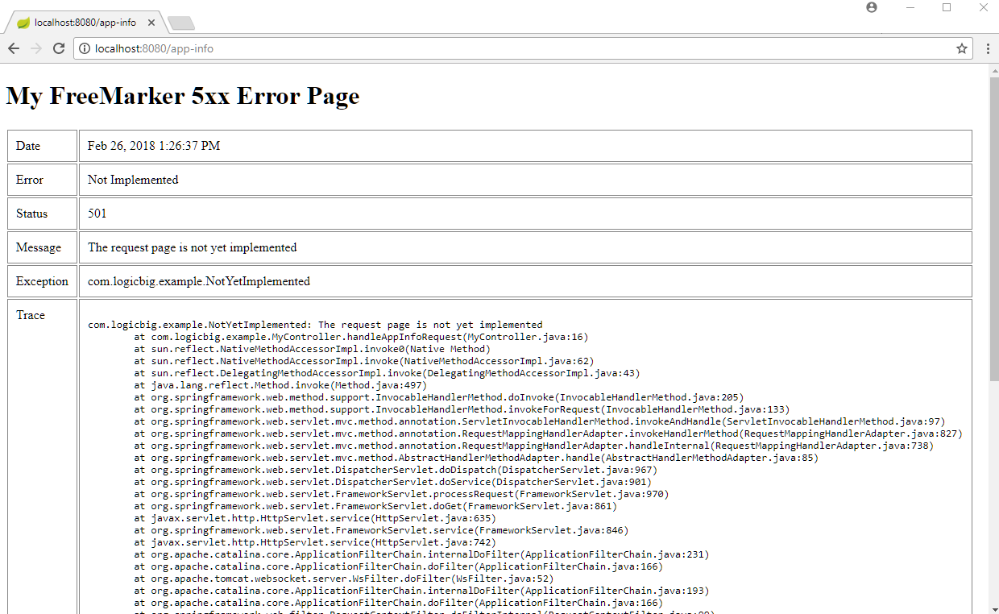
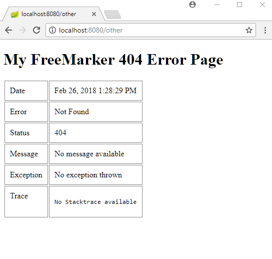
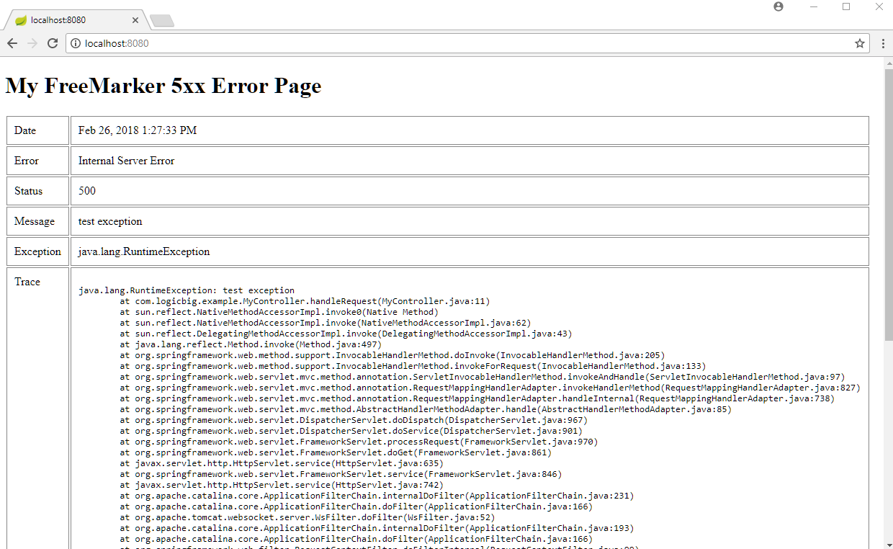
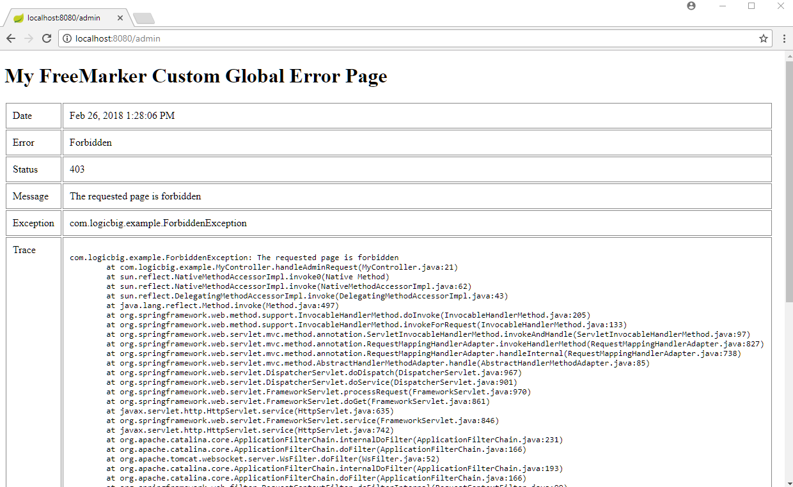

# Mapping HTTP Response Status Codes to a template engine like FreeMarker Pages

Following example shows how to map HTTP status codes to a template engine pages. We will use FreeMarker as the template engine. Also check out status code to JSP pages example to understand related details.

## Creating a controller

```java
@Controller
public class MyController {

  @RequestMapping("/")
  public void handleRequest() {
      throw new RuntimeException("test exception");
  }

  @RequestMapping("/app-info")
  public void handleAppInfoRequest() throws NotYetImplemented {
      throw new NotYetImplemented("The request page is not yet implemented");
  }

  @RequestMapping("/admin")
  public void handleAdminRequest() throws ForbiddenException {
      throw new ForbiddenException("The requested page is forbidden");
  }
}
```

The method `handleRequest()` throws `RuntimeException` with response code `500` (internal error). All exceptions thrown in Java code causes 500 response status code unless we specify other status code explicitly, for example via `@ResponseStatus`.

The method `handleAppInfoRequest()` throws a custom error. We will bind this exception to `501` status code.

## Specifying Status code on Custom Exception

```java
@ResponseStatus(HttpStatus.NOT_IMPLEMENTED)
public class NotYetImplemented extends Exception {
  public NotYetImplemented(String message) {
      super(message);
  }
}
```

Also the controller method `handleAdminRequest()` throws another custom error. Let's bind that exception with `403` status code.

```java
@ResponseStatus(HttpStatus.FORBIDDEN)
public class ForbiddenException extends Exception {
  public ForbiddenException(String message) {
      super(message);
  }
}
```

## Mappings of Status Codes to FreeMarker Pages

**src/main/resources/templates/error/5xx.ftl**

```html
<!DOCTYPE html>
<html lang="en">
<head>
    <style>
table td{
vertical-align:top;
border:solid 1px #888;
padding:10px;
}
</style>
</head>
<body>
<h1>My FreeMarker 5xx Error Page</h1>
<table>
    <tr>
        <td>Date</td>
        <td>${timestamp?datetime}</td>
    </tr>
    <tr>
        <td>Error</td>
        <td>${error}</td>
    </tr>
    <tr>
        <td>Status</td>
        <td>${status}</td>
    </tr>
    <tr>
        <td>Message</td>
        <td>${message}</td>
    </tr>
    <tr>
        <td>Exception</td>
        <td>${exception}</td>
    </tr>
    <tr>
        <td>Trace</td>
        <td>
            <pre>${trace}</pre>
        </td>
    </tr>
</table>
</body>
</html>
```

Above page will map to all status codes of pattern 5xx e.g. 500, 501 etc.

**404 (not found) error page** 

**src/main/resources/templates/error/404.ftl**

```html
<!DOCTYPE html>
<html lang="en">
<head>
    <style>
table td{
vertical-align:top;
border:solid 1px #888;
padding:10px;
}
</style>
</head>
<body>
<h1>My FreeMarker 404 Error Page</h1>
<table>
    <tr>
        <td>Date</td>
        <td>${timestamp?datetime}</td>
    </tr>
    <tr>
        <td>Error</td>
        <td>${error}</td>
    </tr>
    <tr>
        <td>Status</td>
        <td>${status}</td>
    </tr>
    <tr>
        <td>Message</td>
        <td>${message}</td>
    </tr>
    <tr>
        <td>Exception</td>
        <td>${exception!"No exception thrown"}</td>
    </tr>
    <tr>
        <td>Trace</td>
        <td>
            <pre>${trace!"No Stacktrace available"}</pre>
        </td>
    </tr>
</table>
</body>
</html>
```

### Default custom error page

Let's also add a global error page which is not mapped to any status code:

**src/main/resources/templates/error.ftl**

```html
<!DOCTYPE html>
<html lang="en">
<head>
<style>
table td{
vertical-align:top;
border:solid 1px #888;
padding:10px;
}
</style>
</head>
<body>
    <h1>My FreeMarker Custom Global Error Page</h1>
    <table>
        <tr>
            <td>Date</td>
            <td>${timestamp?datetime}</td>
        </tr>
        <tr>
            <td>Error</td>
            <td>${error}</td>
        </tr>
        <tr>
            <td>Status</td>
            <td>${status}</td>
        </tr>
        <tr>
            <td>Message</td>
            <td>${message}</td>
        </tr>
        <tr>
            <td>Exception</td>
            <td>${exception!"No exception"}</td>
        </tr>
        <tr>
            <td>Trace</td>
            <td>
                <pre>${trace!"No trace"}</pre>
            </td>
        </tr>
    </table>
</body>
</html>
```

Since our URI `/admin` returns exception with `403` status code and we have not provided any 403.ftl or 4xx.ftl, our above global error page (`error.ftl` will be mapped in that case).

## Spring Boot application.properties file

**src/main/resources/application.properties**

```apache
server.error.include-stacktrace=always
```

## Main class

```java
@SpringBootApplication
public class SpringBootMain extends SpringBootServletInitializer {

  @Override
  protected SpringApplicationBuilder configure(SpringApplicationBuilder builder) {
      return builder.sources(SpringBootMain.class);
  }

  public static void main(String[] args) {
      SpringApplication.run(SpringBootMain.class);
  }
}
```

## Output

Accessing http:/localhost:8080/app-info where our handler method (`handleAppInfoRequest()`) throws the custom exception will map to `501` status code:



Accessing unmapped URL, say http:/localhost:8080/other, will map to our `404.ftl` page:



Accessing http:/localhost:8080/, where we our handler method (`handleRequest()`) throws `RuntimeException` will return the response code `500` (Internal server error) :



Accessing http://localhost:8080/admin will not map to any custom status code error page (we did not add 403.ftl or 4xx.ftl pages) and will be redirected to our default global `error.ftl` page:


