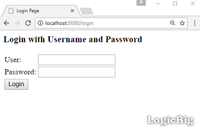
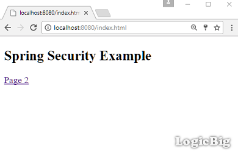
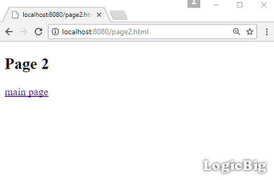

# Spring Security Quick Start

This is a quick start example of Spring security. We will see how to do in-memory authentication in a web application. This web application will run in a servlet container with static html pages. To keep it simple, we are not going to use Spring MVC or other spring modules in this example.

## Maven dependencies

**pom.xml**

```java
<dependency>
   <groupId>org.springframework.security</groupId>
   <artifactId>spring-security-web</artifactId>
   <version>4.2.3.RELEASE</version>
</dependency>
<dependency>
   <groupId>org.springframework.security</groupId>
   <artifactId>spring-security-config</artifactId>
   <version>4.2.3.RELEASE</version>
</dependency>
<dependency>
   <groupId>javax.servlet</groupId>
   <artifactId>javax.servlet-api</artifactId>
   <version>3.1.0</version>
</dependency>
```

javax.servlet-api dependency is needed because spring-security-web contains servlet filters and other servlet based infrastructure code.

## Java Config class

```java
@EnableWebSecurity
public class AppConfig extends WebSecurityConfigurerAdapter {

  @Override
  public void configure(AuthenticationManagerBuilder builder)
          throws Exception {
      builder.inMemoryAuthentication()
             .withUser("joe")
             .password("123")
             .roles("ADMIN");
  }
}
```

Above configuration will require authentication to every URL in our application. It will also generate a login form for us.

## Initializing Java Config

We have to extend Abstract Security Web Application Initializer to initialize our Java config class:

```java
public class AppSecurityInitializer extends AbstractSecurityWebApplicationInitializer {
  public AppSecurityInitializer() {
      super(AppConfig.class);
  }
}
```

Above code will also register necessary servlet filters for authentication process. Abstract Security Web Application Initializer is based on ServletContainerInitializer pattern.

## Static pages
**src/main/webapp/index.html**

```xml
<!DOCTYPE html>
<html lang="en">
<body>
<h2>Spring Security Example</h2>
<a href="page2.html">Page 2</a>
</body>
</html>
```

**src/main/webapp/page2.html**

```xml
<!DOCTYPE html>
<html lang="en">
<body>
<h2>Page 2</h2>
<a href="index.html">main page</a>
</body>
</html>
```

To try examples, run embedded tomcat (configured in pom.xml of example project below):

```shell
mvn tomcat7:run-war
```

## Output

Accessing any page first time will show Spring authentication form:



After submitting user name and password as we set up in our AppConfig class:



Click on Page 2 link:



The example application will require authentication again on the session expiration.
