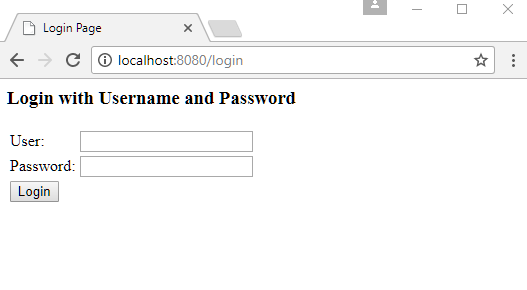
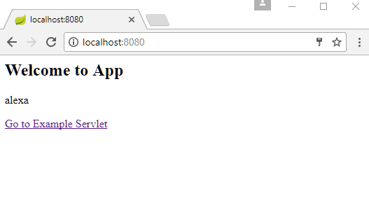
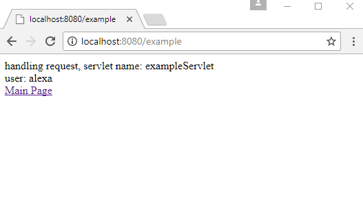

# Spring Security With Servlet and JSP Example

In this example, we will see how to use Spring security in a Java Servlet and JSP application. We will use Spring web security to do in-memory authentication. As this web application will run in a servlet container, JSP and Servlet can be used as usual. We will not use Spring MVC in this example.

## Gradle dependencies

```gradle
apply plugin: 'war'
apply plugin: 'eclipse-wtp'

war {
	baseName = 'mywebapp'
}

eclipse {
	wtp {
		component {
			contextPath = 'mywebapp'
		}
	}
}

sourceCompatibility = 1.8

repositories {
	mavenCentral()
}

dependencies {
	compile('org.springframework.security:spring-security-web:4.2.3.RELEASE')
	compile('org.springframework.security:spring-security-config:4.2.3.RELEASE')
	compile('javax.servlet:javax.servlet-api:3.1.0')
}
```

## Java Config class

```java
@EnableWebSecurity
public class AppConfig extends WebSecurityConfigurerAdapter {

@Override
public void configure(AuthenticationManagerBuilder builder)
          throws Exception {
      builder.inMemoryAuthentication()
             .withUser("alexa")
             .password("123")
             .roles("USER");
  }
}
```

## Initializing Java Config

```java
public class AppSecurityInitializer extends AbstractSecurityWebApplicationInitializer {
	public AppSecurityInitializer() {
   		super(AppConfig.class);
	}
}
```

## A JSP page

**src/main/webapp/index.jsp**

```xml
<html>
<body>
<h2>Welcome to App</h2>
 <p>
  <%=request.getUserPrincipal().getName().toString()%>
 </p>
 <a href="example">Go to Example Servlet</a>
</body>
</html>
```

## A Servlet

```java
@WebServlet(name = "exampleServlet", urlPatterns = {"example"})
public class ExampleServlet extends HttpServlet {
  @Override
  protected void doGet(HttpServletRequest req,
                       HttpServletResponse resp) throws ServletException, IOException {

      resp.setContentType("text/html");
      PrintWriter writer = resp.getWriter();
      String servletName = getServletConfig().getServletName();
      writer.println("handling request, servlet name: " + servletName);
      writer.println("<br/>");
      writer.println("user: "+req.getUserPrincipal().getName());
      writer.println( "<br/><a href=\"/index.jsp\">Main Page</a>");
  }
}
```

## Output

Accessing any resource for the first time will show Spring authentication form:



After submitting user name and password as we set up in our AppConfig class:



Clicking on the 'Go to Example Servlet' link:


